# LexiFlow AI — Master Development Roadmap (MDR)
### The Execution Plan Governing the Entire Software Development Lifecycle

**Document Class:** Master Development Roadmap (Execution Plan)
**Tier:** Level 4 — Delivery execution (governs code, sprint-by-sprint)
**Owner:** VP of Engineering / Delivery Director, LexiFlow AI
**Date of Record:** 2026-07-29
**Authority:** Execution only. This roadmap NEVER redesigns architecture, NEVER changes the stack, NEVER rewrites an engineering decision. The PRD, CEO Vision, Product Strategy, CTO Constitution, Domain Model, SAD, SDD, and ADR collection are the ONLY source of truth. Every module below is a delivery decomposition of decisions already made in those documents.

---

## Document Control

| Attribute | Value |
|---|---|
| Document type | Master Development Roadmap (module catalog + phase/dependency/sprint/release/governance plan) |
| Predecessors (immutable) | PRD, CEO Vision, Product Strategy, CTO Constitution, Domain Model, SAD, SDD, ADRs (ADR-001→060) |
| Stack (fixed) | Laravel 12 · PHP 8.4 · Vue 3 · Inertia.js · TypeScript · Tailwind · PostgreSQL · Redis · AWS · Docker |
| Architecture (fixed) | Modular Monolith, Clean/Hexagonal per module, selective CQRS, event-driven + transactional outbox, AI/Speech Gateway ACLs |
| Module count | **100 modules** across **24 phases** |
| Consumers | Arena AI, Claude Code, Cursor, GitHub Copilot, and every human developer — must follow this roadmap exactly |
| Forbidden outputs | No code, no DB schema, no API definitions, no architecture redesign. Execution plan only. |

---

## 0. How to Read This Roadmap

### 0.1 Purpose
This roadmap converts the approved architecture into a buildable sequence of **small, independently assignable modules**. Each module is sized so that an AI coding assistant (or a single engineer) can implement it safely without making architectural decisions — because every such decision is already captured in the ADRs and referenced per module.

### 0.2 The 21-Field Module Contract
Every module carries: (1) Number, (2) Name, (3) Purpose, (4) Business Value, (5) User Stories, (6) Features Included, (7) Features Excluded, (8) Dependencies, (9) Database Impact, (10) API Impact, (11) UI Impact, (12) AI Components, (13) Security, (14) Performance, (15) Acceptance Criteria, (16) Definition of Done, (17) Complexity, (18) Development Order, (19) Testing Scope, (20) Risks, (21) Future Extension Points.

### 0.3 Phase-Sequence Reconciliation (Execution Note)
The delivery phases below are **engineering-ordered** to honor the SAD §89 implementation sequence and dependency reality, while preserving the spirit of the feature-oriented phase template:

| Roadmap Phase | Realizes (immutable source) |
|---|---|
| Phase 1 Foundation & Engineering Platform | SAD §89 Phase 0; ADR-005/006/031/032/039/040/047 |
| Phase 2 Cross-Cutting Infrastructure | ADR-009/012/018/029/033/034/035/037; SDD §9/§35 |
| Phase 3 Identity & Authentication | Identity Context (Domain §5); ADR-024 |
| Phase 4 Authorization & RBAC | ADR-025/026; Domain §6/§16 |
| Phase 5 Content Import Pipeline | Content Import Context (Domain §5/§11/§15); ADR-004/023 |
| Phase 6 AI Gateway & Prompt Infra | ADR-013/014/015/019/058 |
| Phase 7–9 Translation / Vocabulary / Grammar Engines | **Linguistic Analysis Context** (Domain §5/§7/§13); ADR-015/019 |
| Phase 10 Learner Model | **Core Domain** (Domain §2/§11/§14/§16); ADR-001 |
| Phase 11 Spaced Repetition & Review | **Core Domain (Scheduling)**; ADR-002/007 |
| Phase 12 Flashcards | Learner Model + Scheduling (Domain §7/§11) |
| Phase 13 Quiz System | Linguistic Analysis + Learner Model (PRD §23) |
| Phase 14 Lesson Composition & Adaptive Surfacing | SAD §48; **NO AITutor service (ADR-003/004 guardrail)** |
| Phase 15 Dashboard & Progress | Learner Model read models (Domain §10) |
| Phase 16 Product Analytics | Product Strategy §14/15; ADR-035 |
| Phase 17 Subscription & Billing | Billing Context (Domain §4/§15); ADR-025/017 |
| Phase 18 Engagement & Notifications | Engagement Context (Domain §5/§8/§14); ADR-008 |
| Phase 19 Pronunciation & Speech | Pronunciation Context (Domain §5); ADR-016/017 (behind flag) |
| Phase 20 Curriculum Alignment | Curriculum Alignment Context (Domain §5/§17); ADR-002 |
| Phase 21 Classroom & Teacher | Classroom Context (Domain §5/§6/§16) |
| Phase 22 Mobile & Performance Hardening | ADR-057/058; Product Strategy §33 |
| Phase 23 Security Hardening & Compliance | ADR-025/041/043/044/056 |
| Phase 24 Production Release & Launch | SAD §89; CTO Constitution §40 |

### 0.4 Conflict Flag — "AI Tutor" (Binding)
Per ADR-003/004 and Domain Model §22, **"AI Tutor" is a cross-cutting experiential term, NOT a module, service, package, or aggregate.** Phase 14 therefore delivers the *integrated learner-facing experience* (composed Lesson + adaptive selection) by wiring together Learner Model + Scheduling + Linguistic Analysis. **No `AITutor*` class, namespace, or service is created at any point.** Any proposal to build one is rejected per the conflict protocol and requires superseding ADR-003/004. This roadmap enforces the guardrail; it does not silently absorb or reverse it.

### 0.5 Notation & Conventions
- **Complexity:** XS (<1 day) · S (1–2d) · M (3–5d) · L (1–2 wk) · XL (2+ wk). AI-assisted throughput assumed.
- **Dev Order:** global implementation priority (1 = first). Lower = earlier.
- **Module ID:** `M-NNN`. Phase prefix shown in each module's header.
- Every module references the ADR(s)/SAD sections that govern it — traceability is mandatory.

---

## 1. MVP Definition (MoSCoW)

Sourced from **Product Strategy §16/§20/§48** and **PRD §21**. This scope gates **Production v1** (Internal Alpha → Closed Beta → Open Beta → v1).

### Must Have (MVP — Production v1)
- YouTube + article/text content import (Product Strategy §16)
- Sentence/word-level breakdown with **Bangla translation on-request** (Domain Model §14 invariant)
- Word-level explanation with pronunciation audio (PRD §23)
- Vocabulary item extraction + flashcard generation
- **Real spaced-repetition scheduler (FSRS)** — non-negotiable (gates the North Star, Product Strategy §14)
- Basic progress view
- **Lightweight pronunciation v0 behind a feature flag** (ADR-017; binary scoring)
- Mobile-responsive web (single device) (Product Strategy §33)
- Identity (register/login), RBAC (learner), billing (single paid tier + free), basic notifications

### Should Have (V2 — Production v2)
- Podcast/MP3/MP4 import with transcription (PRD §22)
- Expanded pronunciation scoring (ADR-017 upgrade)
- IELTS/PTE band-aligned tracking as first-class (Curriculum Alignment depth)
- Teacher/classroom assignment tools
- Native mobile app push notifications

### Could Have (V3)
- Live AI conversation practice (new bounded context, Domain Model §20)
- Community/social features (small real groups)
- Browser extension
- PDF/EPUB import
- Second L1 language (Hindi) — ADR-059

### Won't Have (Permanent / Deferred Kills — Product Strategy §48)
- Fully open "any URL, any format" ingestion at launch (legal exposure)
- Multiple confusing subscription tiers at MVP
- Global leaderboard / public social feed (never)
- **Default automatic translation of everything** (permanent kill — Domain Model §14 invariant)
- **AI feedback tuned for flattery over honest assessment** (permanent kill — CEO Vision §10)
- Subject-agnostic tutoring expansion before English core is proven (CEO Vision §6/§20)
- Selling/licensing learner data in any form (CEO Vision §20)
- A literal "AI Tutor" service (ADR-003/004)

---

## 2. Phase Overview (24 Phases, 100 Modules)

| Phase | Modules | Theme | Critical Path? |
|---|---|---|---|
| 1 Foundation & Engineering Platform | M-001 → M-009 | Skeleton, scaffold, tests, CI, envs, IaC | **Yes — gates everything** |
| 2 Cross-Cutting Infrastructure | M-010 → M-018 | Event Bus, Outbox, Cache, Observability, Standards | **Yes — gates features** |
| 3 Identity & Authentication | M-019 → M-024 | Register, login, tokens, OAuth, privacy flows | Yes |
| 4 Authorization & RBAC | M-025 → M-027 | RBAC, Policies, tier-gate foundation | Yes |
| 5 Content Import Pipeline | M-028 → M-034 | ContentSource, eligibility, adapters, transcription, Transcript | Yes (MVP magic moment) |
| 6 AI Gateway & Prompt Infra | M-035 → M-040 | Gateway ACL, LLM provider, prompts, content cache, cost control | Yes |
| 7 Translation Engine | M-041 → M-044 | Bangla translation, on-request invariant, eval loop | Yes |
| 8 Vocabulary Engine | M-045 → M-048 | Vocabulary Items, difficulty, TTS | Yes |
| 9 Grammar Engine | M-049 → M-050 | Grammar pattern detection + explanation | Yes |
| 10 Learner Model (Core) | M-051 → M-055 | Mastery, honesty invariant, read models | **Yes — Core Domain** |
| 11 Spaced Repetition & Review | M-056 → M-059 | ReviewSession, FSRS, queue projection | **Yes — Core Domain** |
| 12 Flashcards | M-060 → M-061 | Decks, review UI | Yes |
| 13 Quiz System | M-062 → M-063 | Quiz generation + scoring | Parallel-capable |
| 14 Lesson Composition & Surfacing | M-064 → M-066 | Composed Lesson, adaptive selection (NO AI Tutor service) | Yes |
| 15 Dashboard & Progress | M-067 → M-068 | Learner dashboard, honest progress | Parallel-capable |
| 16 Product Analytics | M-069 → M-070 | North Star, funnels | Parallel-capable |
| 17 Subscription & Billing | M-071 → M-075 | Provider, subscription lifecycle, tier-gate, checkout | Yes (MVP) |
| 18 Engagement & Notifications | M-076 → M-080 | Streaks, scheduling, delivery, healthy-churn | Yes (MVP) |
| 19 Pronunciation & Speech (flag) | M-081 → M-084 | Speech Gateway, Shadowing, binary v0 | Behind flag |
| 20 Curriculum Alignment | M-085 → M-087 | Framework estimation, Learning Goals | Parallel-capable |
| 21 Classroom & Teacher | M-088 → M-091 | Roster, assignments, aggregated progress | V2-timing |
| 22 Mobile & Performance Hardening | M-092 → M-095 | Mobile audit, budgets, CDN, cache tuning | Pre-launch |
| 23 Security Hardening & Compliance | M-096 → M-098 | OWASP, privacy audit, backup/DR drills | Pre-launch |
| 24 Production Release & Launch | M-099 → M-100 | Staging validation, launch, observability ramp | Launch |

---

# Part I — Module Catalog

*(Each module below is a self-contained, AI-assistant-buildable unit. All 21 fields present.)*

---

## Phase 1 — Foundation & Engineering Platform

### M-001 — Modular Monolith Skeleton & Module Scaffold
**Purpose:** Establish the domain-first Laravel 12 skeleton and the `lexiflow:module` scaffold command that stamps the identical module shape (ADR-006, SDD §3/§4).
**Business Value:** Everything else depends on this; makes "how a module works here" learnable once and uniform everywhere (SAD §14).
**User Stories:** *(internal)* As a developer, I can scaffold a new bounded-context module with one command so it follows the canonical Domain/Application/Infrastructure shape.
**Features Included:** Domain-first `app/` layout; `SharedKernel/` + `Shared/`; `*Module.php` declaration pattern; scaffold command; root `AppServiceProvider` composition; base Inertia/Vue/Tailwind boot.
**Features Excluded:** Any feature logic; any DB tables beyond framework defaults; any provider integration.
**Dependencies:** None (first module). Governed by ADR-005/006/047.
**Database Impact:** None.
**API Impact:** None.
**UI Impact:** None (boot-only).
**AI Components:** None.
**Security:** No secrets in skeleton; `.env.example` only (ADR-040).
**Performance:** N/A (build-time tooling).
**Acceptance Criteria:** Scaffold command produces a module matching SDD §4 tree; architecture tests pass on the empty skeleton; local app boots.
**Definition of Done:** Merged to `main`; CI green; docs (module-template README) updated; staged verification.
**Complexity:** M · **Dev Order:** 1 · **Testing Scope:** Architecture tests verify scaffold output shape.
**Risks:** Skeleton drift from SDD §3 if hand-edited → mitigated by scaffold + M-002 tests.
**Future Extension Points:** Scaffold evolves to add optional projection/ACL sub-folders per module.

### M-002 — Architecture Test Suite & Dependency Linting
**Purpose:** Make the dependency rules (ADR-005) machine-checkable so architectural drift is caught in CI, not review.
**Business Value:** Protects the extraction seam (ADR-046) and Core Domain purity (ADR-001/003) automatically.
**User Stories:** *(internal)* As an engineer, a dependency-rule violation fails CI before review.
**Features Included:** Pest architecture tests (no `Illuminate\*` in Domain; no cross-module Domain/Infra imports; no cross-module table refs); PHPStan max + strict; namespace-grammar linter; exemption registry.
**Features Excluded:** Business-logic tests; performance tests.
**Dependencies:** M-001. Governed by ADR-005/047.
**Database Impact:** None.
**API Impact:** None.
**UI Impact:** None.
**AI Components:** None.
**Security:** None.
**Performance:** Fast (no DB) — runs on every push.
**Acceptance Criteria:** A planted violation fails CI; clean skeleton passes; all rules from SDD §5 encoded.
**Definition of Done:** Tests in CI (fail-fast stage); documented exemption process.
**Complexity:** M · **Dev Order:** 2 · **Testing Scope:** Self-validating (metamorphic tests).
**Risks:** Over-strict rules blocking valid patterns → mitigated by documented exemption + ADR path.
**Future Extension Points:** Dependency-graph visualization in CI (ADR-054).

### M-003 — Coding Standards Toolchain
**Purpose:** Automate formatting/static analysis so there is zero formatting debate in review (ADR-047, CTO §10).
**Business Value:** Consistent, AI-legible codebase; catches the silent-wrong-guess defect class (CTO §45).
**User Stories:** *(internal)* As a developer, Pint/PHPStan/ESLint run locally and in CI.
**Features Included:** Laravel Pint (preset laravel); PHPStan max + strict + larastan; ESLint + Prettier + Stylelint; TS strict; pre-commit hooks; Conflict C-2 resolution applied (ADR-047).
**Features Excluded:** Custom business lints (deferred to M-002/future).
**Dependencies:** M-001. Governed by ADR-047.
**Database Impact:** None.
**API Impact:** None.
**UI Impact:** None.
**AI Components:** None.
**Security:** SCA (software composition) hooks placeholder for M-049 dependency policy.
**Performance:** N/A.
**Acceptance Criteria:** CI fails on formatting/type violation; pre-commit runs subset; 100% type coverage enforced in Domain.
**Definition of Done:** Tooling in CI; contributor docs updated.
**Complexity:** S · **Dev Order:** 3 · **Testing Scope:** Toolchain self-tests (sample violations rejected).
**Risks:** Initial annotation burden → accepted; reduced over time.
**Future Extension Points:** Custom Ubiquitous-Language term linter (ADR-047 future).

### M-004 — CI/CD Pipeline
**Purpose:** Trunk-based CI/CD with staging auto-deploy and gated, rollback-capable production (ADR-031).
**Business Value:** Safe, frequent deploys; decouple deployment from release (CTO §14/§16).
**User Stories:** *(internal)* As a developer, merge to `main` runs the full suite and deploys to staging.
**Features Included:** Parallel fail-fast stages (lint/architecture → unit → integration → contract → feature); staging auto-deploy; gated production with rollback; build-once image promotion.
**Features Excluded:** Auto-production deploys (deferred until maturity, ADR-031).
**Dependencies:** M-002, M-003. Governed by ADR-031/032.
**Database Impact:** None.
**API Impact:** None.
**UI Impact:** None.
**AI Components:** None.
**Security:** No secrets in pipeline (OIDC to secrets manager, ADR-040); branch protection.
**Performance:** Pipeline <15 min target.
**Acceptance Criteria:** A merge runs full suite, auto-deploys staging; production deploy is gated + rollback-capable.
**Definition of Done:** Pipeline live; rollback drill documented.
**Complexity:** M · **Dev Order:** 4 · **Testing Scope:** Pipeline smoke (green build on sample change).
**Risks:** Slow/flaky CI eroding trunk-based flow → mitigated by fail-fast split + flaky-test rule (ADR-030).
**Future Extension Points:** Fully-auto production deploys when DORA metrics justify.

### M-005 — Local Development Environment
**Purpose:** Docker Compose full-stack local env so a contributor is productive within a day (ADR-032, CTO §18).
**Business Value:** Developer Experience First (CTO §2); realistic non-PII seed data.
**User Stories:** *(internal)* As a developer, `docker compose up` gives me app + Postgres + Redis + MinIO + mock providers.
**Features Included:** Docker Compose stack; seed-data generator (synthetic learners/content/mastery); mock AI/Speech providers for local.
**Features Excluded:** Real provider credentials in local (use sandbox/mocks, ADR-022).
**Dependencies:** M-001. Governed by ADR-032/022.
**Database Impact:** Seed schemas only.
**API Impact:** None.
**UI Impact:** None.
**AI Components:** Mock provider responses (deterministic).
**Security:** No real PII/secrets locally.
**Performance:** Fast cold-start (<2 min).
**Acceptance Criteria:** New contributor boots, runs migrations+seed, hits a seeded page within documented steps.
**Definition of Done:** README onboarding; seeded data realistic.
**Complexity:** S · **Dev Order:** 5 · **Testing Scope:** Boot test in CI.
**Risks:** Drift between local mock providers and real shapes → mitigated by contract tests (M-018).
**Future Extension Points:** Remote dev containers.

### M-006 — Shared Kernel & Domain Primitives
**Purpose:** Establish the deliberately-minimal SharedKernel (identifier VOs, `DomainEvent` contract, clock/randomness ports) (ADR-005, SDD §6).
**Business Value:** Enables cross-module reference-by-value without re-coupling; preserves extraction seams.
**User Stories:** *(internal)* As a developer, I use `LearnerId`, `ContentSourceId`, etc., as typed VOs across modules.
**Features Included:** `*Id` UUIDv7 VOs; `DomainEvent` marker + helpers; `Clock`/`Random` ports; `readonly final` VO discipline.
**Features Excluded:** Any business logic; any DTOs/services (SharedKernel stays starved, SAD §16).
**Dependencies:** M-001. Governed by ADR-005.
**Database Impact:** None (VOs only).
**API Impact:** None.
**UI Impact:** None.
**AI Components:** None.
**Security:** UUIDv7 time-ordered (index locality); no enumerable sequential IDs exposed.
**Performance:** VO equality/hash cheap.
**Acceptance Criteria:** VOs immutable + self-validating; SharedKernel has zero business logic; growth requires 2-reviewer + ADR.
**Definition of Done:** Unit tests for VO equality/hash; doc stating growth gate.
**Complexity:** S · **Dev Order:** 6 · **Testing Scope:** Unit (VO properties).
**Risks:** SharedKernel creep → mitigated by documented growth gate (ADR-005).
**Future Extension Points:** Additional identifier types as modules arrive (each via the gate).

### M-007 — Configuration Management & Catalog
**Purpose:** Named, documented, env-overridable config with a root catalog (ADR-039, CTO §17).
**Business Value:** No scattered magic values; fail-fast on misconfig; secrets separated.
**User Stories:** *(internal)* As a developer, every config value is in the catalog with purpose/default/sensitivity.
**Features Included:** Per-module `config/*.php`; root `docs/configuration-catalog.md`; typed config wrapper (boot validation); CI catalog↔config drift check.
**Features Excluded:** Secrets (M-008).
**Dependencies:** M-001. Governed by ADR-039.
**Database Impact:** None.
**API Impact:** None.
**UI Impact:** None.
**AI Components:** None.
**Security:** `config/` references secret keys, never values; no `env()` outside config files.
**Performance:** Config cached in prod.
**Acceptance Criteria:** Typed wrapper validates at boot; CI flags catalog drift; no `env()` outside `config/`.
**Definition of Done:** Catalog current; CI check live.
**Complexity:** S · **Dev Order:** 7 · **Testing Scope:** Boot-validation tests.
**Risks:** Catalog drift → mitigated by CI check.
**Future Extension Points:** Dynamic config service at scale.

### M-008 — Secrets Management Integration
**Purpose:** AWS Secrets Manager integration; runtime injection; least-privilege; no secrets in VCS (ADR-040, CTO §19).
**Business Value:** Minimized breach blast radius; no committed secrets; rotation path.
**User Stories:** *(internal)* As a developer, secrets are injected at runtime, scoped per module.
**Features Included:** Secrets Manager binding; per-module boot fetch; pre-commit + CI secret scanning; rotation hooks.
**Features Excluded:** Self-hosted Vault (rejected at MVP, ADR-040).
**Dependencies:** M-007, M-009. Governed by ADR-040.
**Database Impact:** None.
**API Impact:** None.
**UI Impact:** None.
**AI Components:** None.
**Security:** Least-privilege IAM per module; leaked-secret → rotation + blameless review (CTO §19).
**Performance:** Boot fetch cached.
**Acceptance Criteria:** No secret in VCS (CI scan clean); a module accesses only its secrets; rotation demo.
**Definition of Done:** Scanning in CI; least-privilege policies reviewed (ADR-056).
**Complexity:** M · **Dev Order:** 8 · **Testing Scope:** Secret-scan tests; IAM scoping review.
**Risks:** Over-broad IAM → mitigated by per-module policy review (ADR-056).
**Future Extension Points:** Dynamic secret injection (SPIFFE) at multi-service scale.

### M-009 — Infrastructure-as-Code Foundation
**Purpose:** Terraform baseline for AWS (VPC, RDS Postgres, ElastiCache Redis, S3, ECS/Fargate, networking) so environments are reproducible (ADR-032, SAD §65).
**Business Value:** Reproducible/recoverable environments (ADR-044); staged scaling executable (ADR-045).
**User Stories:** *(internal)* As a platform engineer, I provision dev/staging/prod from Terraform with variable diffs.
**Features Included:** Terraform modules; remote state; per-environment variables; RDS (multi-AZ), ElastiCache, S3, ECS Fargate, ALB, secrets wiring.
**Features Excluded:** Multi-region (deferred to 1M+, ADR-045); Kubernetes (EKS) unless needed (ADR-032).
**Dependencies:** M-008. Governed by ADR-032/040.
**Database Impact:** Provisions Postgres/Redis.
**API Impact:** None.
**UI Impact:** None.
**AI Components:** None.
**Security:** Least-privilege IAM; security groups; TLS everywhere; private subnets for data stores.
**Performance:** Managed services sized for MVP.
**Acceptance Criteria:** `terraform apply` creates a working env; dev/staging/prod differ by variables; state remote + locked.
**Definition of Done:** IaC in VCS; plan/apply in CI for staging.
**Complexity:** L · **Dev Order:** 9 · **Testing Scope:** `terraform plan` validation; env-boot smoke.
**Risks:** State drift → mitigated by remote state + CI plan/apply discipline.
**Future Extension Points:** Multi-region modules (1M+).

---

## Phase 2 — Cross-Cutting Infrastructure

### M-010 — Event Bus Abstraction
**Purpose:** Transport-agnostic Event Bus interface (`Shared\Bus\EventBus`) so modules publish/consume without knowing in-process vs broker (ADR-012, SAD §21).
**Business Value:** Extraction-readiness without premature distributed-systems complexity.
**User Stories:** *(internal)* As a developer, I publish/consume Domain Events via one interface.
**Features Included:** `EventBus` interface; in-process dispatch backed by outbox relay; subscription registry generated from module declarations.
**Features Excluded:** A real distributed broker (deferred to extraction, ADR-012); bespoke pub/sub framework.
**Dependencies:** M-006, M-011. Governed by ADR-008/011/012.
**Database Impact:** Reads outbox (via M-011).
**API Impact:** None.
**UI Impact:** None.
**AI Components:** None.
**Security:** Event payloads are domain-only (ACL-isolated, ADR-011).
**Performance:** In-process dispatch (negligible).
**Acceptance Criteria:** A published event reaches registered consumers; interface hides transport; registry matches module declarations.
**Definition of Done:** Tests for publish/consume; doc on adding events (catalog).
**Complexity:** M · **Dev Order:** 11 · **Testing Scope:** Unit (dispatch) + integration (consumer receipt).
**Risks:** Abstraction leak (module reaching past Bus) → mitigated by interface contract + review.
**Future Extension Points:** Broker swap at extraction (contained).

### M-011 — Transactional Outbox & Relay
**Purpose:** Eliminate the dual-write problem; guarantee state/event atomicity (ADR-009, SAD §22/§76).
**Business Value:** Core Domain integrity (no lost Mastery reconciliation events); broker-ready.
**User Stories:** *(internal)* As a developer, events my handler publishes are delivered exactly-once-in-effect.
**Features Included:** `outbox` table; `UnitOfWork` (tx + outbox flush); `OutboxRelay` worker; at-least-once + idempotency-key support.
**Features Excluded:** CDC/Debezium (future option, ADR-009).
**Dependencies:** M-006, M-009 (DB). Governed by ADR-009.
**Database Impact:** `outbox` table (append, partial index on `dispatched_at IS NULL`).
**API Impact:** None.
**UI Impact:** None.
**AI Components:** None.
**Security:** Outbox rows may contain event payloads — redaction-aware (M-013).
**Performance:** Relay poll interval tuned; outbox depth monitored (M-014).
**Acceptance Criteria:** A crash between save and publish loses no event; replay is safe (idempotent consumers); relay monitored.
**Definition of Done:** Outbox + relay + worker; integration test for crash-recovery; depth alert.
**Complexity:** L · **Dev Order:** 10 · **Testing Scope:** Integration (tx atomicity, relay delivery, idempotency).
**Risks:** Non-idempotent consumer shipped → mitigated by idempotency tests (M-002 suite + per-consumer).
**Future Extension Points:** CDC relay at extreme scale.

### M-012 — Caching Wrappers (Content + Learner)
**Purpose:** Two strictly-separated cache wrappers with distinct key builders (ADR-018, SDD §33).
**Business Value:** The cost flywheel (content cache) + fast personalized reads (learner cache), correctly separated.
**User Stories:** *(internal)* As a developer, I use `ContentCache`/`LearnerCache` and cannot conflate them.
**Features Included:** `ContentCache` (content-keyed, versioned, long TTL); `LearnerCache` (learner-keyed, short TTL, event-invalidated); distinct key builders; linter flagging `learner_id` in content keys.
**Features Excluded:** In-process tier (future); embedding cache (future).
**Dependencies:** M-009 (Redis). Governed by ADR-018/019.
**Database Impact:** None (Redis only).
**API Impact:** None.
**UI Impact:** None.
**AI Components:** None.
**Security:** Learner cache never shared across learners (isolation, Domain §16).
**Performance:** Sub-ms hits; content cache in front of providers (ADR-013).
**Acceptance Criteria:** A content hit returns cached VO; a learner cache miss queries then caches; version bump invalidates content; conflation impossible.
**Definition of Done:** Unit + integration tests; linter rule live.
**Complexity:** M · **Dev Order:** 12 · **Testing Scope:** Unit (key correctness) + integration (hit/miss/invalidate).
**Risks:** Conflation bug → mitigated by linter + distinct builders.
**Future Extension Points:** Two-tier cache; embedding cache (same pattern).

### M-013 — Structured Logging & RedactingLogger
**Purpose:** Structured JSON logging with architectural redaction (ADR-034, SAD §59).
**Business Value:** Privacy invariant unbreakable by accident (minors'/payment data); debuggable logs.
**User Stories:** *(internal)* As an engineer, I correlate a request across logs via `request_id`.
**Features Included:** Fixed-schema JSON logger; `RedactingLogger` (strips secrets/PII/audio/full-transcripts by key+pattern); severity set; `request_id` middleware; separate audit-log sink.
**Features Excluded:** Log-volume sampling (future, ADR-034).
**Dependencies:** M-006. Governed by ADR-034/041.
**Database Impact:** None.
**API Impact:** None.
**UI Impact:** None.
**AI Components:** None.
**Security:** Architectural redaction (impossible to log a secret); audit log stricter retention/access.
**Performance:** Async/queued flushing where heavy.
**Acceptance Criteria:** A planted secret/PII in a log call is redacted; `request_id` propagates; audit sink separate.
**Definition of Done:** Redaction rule set + tests; audit sink configured.
**Complexity:** M · **Dev Order:** 13 · **Testing Scope:** Unit (redaction) + integration (correlation).
**Risks:** New PII field not in redaction rules → mitigated by same-PR rule + review.
**Future Extension Points:** Sampling; per-field retention.

### M-014 — Metrics & Tracing Foundation
**Purpose:** Three-pillar observability baseline (ADR-033/035); per-module metrics required before production-readiness.
**Business Value:** Determine *why* without local reproduction; extraction-safe tracing.
**User Stories:** *(internal)* As an engineer, every module exposes latency/error/cost metrics + traces.
**Features Included:** Metrics pipeline (Prometheus-class); distributed tracing (correlated by `request_id`/`event_id`); per-module baseline gauges/histograms; in-process tracing.
**Features Excluded:** ML-anomaly alerting (future, ADR-036).
**Dependencies:** M-013. Governed by ADR-033/035/036.
**Database Impact:** None.
**API Impact:** Metrics/health endpoints (internal).
**UI Impact:** None (dashboards external).
**AI Components:** None.
**Security:** Metrics carry no PII (correlation IDs only).
**Performance:** Instrumentation overhead budgeted.
**Acceptance Criteria:** A module without baseline metrics isn't production-ready (gate); traces span cross-module flows.
**Definition of Done:** Baseline metrics per module; tracing wired; dashboards exist.
**Complexity:** M · **Dev Order:** 14 · **Testing Scope:** Integration (metric emission, trace span).
**Risks:** Metric cardinality explosion → mitigated by label discipline.
**Future Extension Points:** Multi-region trace aggregation (1M+).

### M-015 — Exception Hierarchy & Renderer
**Purpose:** Typed exception model + single renderer producing the standard error response (ADR-037, SDD §19/§29).
**Business Value:** Predictable, honest error UX; no swallowed defects.
**User Stories:** *(internal)* As a developer, I throw a typed domain exception and the renderer maps it to the right status/shape.
**Features Included:** `LexiFlowException` hierarchy (Domain/Application/Infrastructure); exception→HTTP matrix; central renderer; honest-but-safe messages.
**Features Excluded:** Error-code external versioning (future).
**Dependencies:** M-006. Governed by ADR-037.
**Database Impact:** None.
**API Impact:** Standard error envelope (with M-016).
**UI Impact:** None.
**AI Components:** None.
**Security:** 500s generic (no internals); no stack traces to client.
**Performance:** N/A.
**Acceptance Criteria:** Matrix test (exception→status→payload) passes; no untyped `\Exception` in Domain/Application.
**Definition of Done:** Hierarchy + renderer + matrix test.
**Complexity:** M · **Dev Order:** 15 · **Testing Scope:** Unit (matrix).
**Risks:** Unmapped exception → 500 → mitigated by renderer default + matrix test.
**Future Extension Points:** Versioned error codes for external API.

### M-016 — Response & Error Response Standards
**Purpose:** Consistent success envelope + error envelope + pagination (ADR-029, SDD §28/§29).
**Business Value:** Uniform client parsing; AI-assistant-legible contracts.
**User Stories:** *(internal)* As a developer, every endpoint returns the standard envelope.
**Features Included:** Success envelope (`data`/`meta`/`pagination`); error envelope (`code`/`message`/`fields`); cursor pagination; Inertia prop typing; `Responds` helper + base controller.
**Features Excluded:** GraphQL shaping (rejected at MVP, ADR-028).
**Dependencies:** M-015. Governed by ADR-027/029.
**Database Impact:** None.
**API Impact:** Every endpoint conforms.
**UI Impact:** Vue consumes generated prop types.
**AI Components:** None.
**Security:** No internal leakage in `details`.
**Performance:** Envelope overhead negligible.
**Acceptance Criteria:** Contract test verifies every endpoint returns the envelope; empty list → `[]`.
**Definition of Done:** Helper + contract tests.
**Complexity:** S · **Dev Order:** 16 · **Testing Scope:** Contract (envelope conformance).
**Risks:** Inconsistent ad-hoc responses → mitigated by helper + contract tests.
**Future Extension Points:** Public-API consumer variants.

### M-017 — UnitOfWork & Transaction-Boundary Helper
**Purpose:** Encapsulate "begin tx → load → invoke → persist → outbox → commit/rollback" uniformly (SDD §9, ADR-009/076).
**Business Value:** One-aggregate-per-transaction discipline; consistent handler shape.
**User Stories:** *(internal)* As a developer, my handler uses `UnitOfWork` for tx+outbox uniformly.
**Features Included:** `UnitOfWork` (tx + outbox flush + event release); retry-on-optimistic-lock helper.
**Features Excluded:** Multi-aggregate transactions (forbidden, ADR-076/Domain §21).
**Dependencies:** M-011. Governed by ADR-009.
**Database Impact:** Wraps `DB::transaction()`.
**API Impact:** None.
**UI Impact:** None.
**AI Components:** None.
**Security:** N/A.
**Performance:** One tx per aggregate.
**Acceptance Criteria:** Handler five-step shape enforced; optimistic-lock conflict retried or honestly failed.
**Definition of Done:** Helper + tests.
**Complexity:** S · **Dev Order:** 17 · **Testing Scope:** Integration (tx success/rollback/retry).
**Risks:** Misuse (multi-aggregate tx) → mitigated by review + architecture awareness.
**Future Extension Points:** Saga coordination if ever needed (not anticipated).

### M-018 — OpenAPI Tooling & Codegen Pipeline
**Purpose:** OpenAPI 3.1 as contract source; generate TS types; contract-test server conformance (ADR-029).
**Business Value:** Zero client/server contract drift; safe parallel AI+human work.
**User Stories:** *(internal)* As a developer, I edit OpenAPI first; TS types generate; a spec/code mismatch fails CI.
**Features Included:** `openapi/` spec home; TS codegen; contract test (server↔spec); CI diff gate on generated types.
**Features Excluded:** Partner SDK generation (future, ADR-029).
**Dependencies:** M-016. Governed by ADR-027/029.
**Database Impact:** None.
**API Impact:** Contract authority.
**UI Impact:** Vue types generated.
**AI Components:** None.
**Security:** Spec reviewed for over-exposure.
**Performance:** N/A.
**Acceptance Criteria:** Generated TS types used everywhere; contract test passes; orphan diff fails CI.
**Definition of Done:** Codegen in CI; contract tests.
**Complexity:** M · **Dev Order:** 18 · **Testing Scope:** Contract (spec conformance).
**Risks:** Spec/code divergence → mitigated by contract tests + CI gate.
**Future Extension Points:** Partner SDKs from same spec.

---

## Phase 3 — Identity & Authentication

### M-019 — Identity Module Foundation
**Purpose:** Identity bounded-context skeleton (Domain ports, repository, events) per Domain Model §5/§8; library-based auth (ADR-024).
**Business Value:** Sole source of truth for "who is this" (SAD §44); foundation for all personalized features.
**User Stories:** As a new user, I can register and become a Learner with an initialized (empty) Learner Model.
**Features Included:** Identity module (Domain/Application/Infrastructure); `Learner` auth-identity entity; `LearnerRegistered` event; Sanctum wiring; minors-tagging field.
**Features Excluded:** Social OAuth (M-022); home-grown crypto (forbidden, ADR-024).
**Dependencies:** M-001, M-010, M-011. Governed by ADR-024.
**Database Impact:** `users` (auth identity), `oauth_accounts` (later).
**API Impact:** Auth endpoints scaffolded.
**UI Impact:** Minimal auth pages.
**AI Components:** None.
**Security:** argon2id hashing; no home-grown auth; short-lived access + refresh rotation.
**Performance:** Auth endpoints rate-limited (brute-force protection, ADR-056).
**Acceptance Criteria:** Registration creates identity + publishes `LearnerRegistered` (consumed by Learner Model in Phase 10); tokens issued/rotated.
**Definition of Done:** Module per scaffold; events via outbox; auth tests.
**Complexity:** M · **Dev Order:** 19 · **Testing Scope:** Unit (identity) + feature (register/login).
**Risks:** Premature Learner Model coupling → mitigated by event-only integration.
**Future Extension Points:** Enterprise SSO (Year 4).

### M-020 — Registration & Email Verification
**Purpose:** Self-service registration with verification (PRD §34, ADR-024).
**Business Value:** Top-of-funnel conversion; verified identity for trust features.
**User Stories:** As a visitor, I register with email and verify to start learning.
**Features Included:** Registration form/request validation; verification email + signed link; `LearnerRegistered` emission; minors self-declare (tagged).
**Features Excluded:** Parental-consent flow (Phase 23, legal-gated).
**Dependencies:** M-019. Governed by ADR-024/041.
**Database Impact:** Verification tokens.
**API Impact:** `POST /v1/auth/register`, verification endpoint.
**UI Impact:** Register + verify pages.
**AI Components:** None.
**Security:** Rate-limited; verification required before sensitive actions.
**Performance:** Sub-1s ack.
**Acceptance Criteria:** Verified learner can authenticate; unverified is gated; `LearnerRegistered` fires once.
**Definition of Done:** Feature tests; email delivery verified in staging.
**Complexity:** S · **Dev Order:** 20 · **Testing Scope:** Feature (register/verify flows).
**Risks:** Email deliverability in target market → mitigated by Delivery module (Phase 18) + reputable provider.
**Future Extension Points:** Phone/OTP registration.

### M-021 — Login & Token Model
**Purpose:** Login with short-lived access + refresh rotation (ADR-024, SAD §44).
**Business Value:** Secure, low-friction session; mobile/resilient (Product Strategy §33).
**User Stories:** As a learner, I log in and stay logged in safely across sessions.
**Features Included:** Login endpoint; access/refresh issuance + rotation; reuse-detection revocation; logout.
**Features Excluded:** Long-lived tokens (rejected, ADR-024).
**Dependencies:** M-019. Governed by ADR-024.
**Database Impact:** Token store.
**API Impact:** `POST /v1/auth/login`, refresh, logout.
**UI Impact:** Login page; token refresh interceptor.
**AI Components:** None.
**Security:** httpOnly cookies (XSS mitigation); refresh rotation; brute-force rate limit.
**Performance:** Sub-1s.
**Acceptance Criteria:** Login issues tokens; refresh rotates; reuse revokes; logout invalidates.
**Definition of Done:** Feature tests; rotation/reuse tests.
**Complexity:** S · **Dev Order:** 21 · **Testing Scope:** Feature (login/refresh/reuse).
**Risks:** Token theft via XSS → mitigated by httpOnly cookies + CSP.
**Future Extension Points:** Passkeys/WebAuthn.

### M-022 — OAuth Social Login
**Purpose:** Google (and Bangladesh-relevant) social login for low-friction mobile onboarding (Product Strategy §33, ADR-024).
**Business Value:** Lower conversion friction in mobile-first market.
**User Stories:** As a learner, I sign up/in with Google.
**Features Included:** OAuth client integration; account linking; `LearnerRegistered` for new.
**Features Excluded:** Niche providers beyond GTM-justified set.
**Dependencies:** M-019, M-020. Governed by ADR-024.
**Database Impact:** `oauth_accounts`.
**API Impact:** OAuth callback endpoints.
**UI Impact:** "Continue with Google" button.
**AI Components:** None.
**Security:** Provider token handling per OAuth best practice; CSRF state.
**Performance:** Sub-2s.
**Acceptance Criteria:** New OAuth user → identity + `LearnerRegistered`; returning → linked login.
**Definition of Done:** Feature tests; sandbox provider in staging.
**Complexity:** M · **Dev Order:** 22 · **Testing Scope:** Feature (OAuth new/returning).
**Risks:** Provider outage → mitigated by email fallback.
**Future Extension Points:** Additional providers per market.

### M-023 — Password Reset Flow
**Purpose:** Signed, short-lived reset links (ADR-024, PRD §34).
**Business Value:** Account recovery; trust.
**User Stories:** As a learner, I reset a forgotten password via email link.
**Features Included:** Reset request (rate-limited); signed short-lived token; reset endpoint.
**Features Excluded:** Security-question recovery (insecure pattern).
**Dependencies:** M-019. Governed by ADR-024.
**Database Impact:** Reset tokens.
**API Impact:** Reset request + reset endpoints.
**UI Impact:** Forgot/reset pages.
**AI Components:** None.
**Security:** Rate-limited; tokens expire; single-use.
**Performance:** N/A.
**Acceptance Criteria:** Reset link works once within TTL; rate-limited; invalid tokens rejected.
**Definition of Done:** Feature tests.
**Complexity:** S · **Dev Order:** 23 · **Testing Scope:** Feature (reset happy/abuse).
**Risks:** Reset-endpoint user enumeration → mitigated by generic responses + rate limit.
**Future Extension Points:** None anticipated.

### M-024 — Account Deletion & Data Export
**Purpose:** Privacy-right flows: complete deletion + data export (CTO §32, ADR-041, Domain §9 commands).
**Business Value:** Compliance; trust; supports the "we never sell your data" promise.
**User Stories:** As a learner, I can export my data or delete my account completely.
**Features Included:** `RequestDataExport` (queued job producing CSV/PDF); `RequestAccountDeletion` (complete cross-module deletion).
**Features Excluded:** Partial/selective deletion (out of MVP scope).
**Dependencies:** M-019, M-042 (retention), most data-owning modules (deletion fans out) — wire fully as modules land; stub initially.
**Database Impact:** Deletion removes a learner's rows across modules (designed-for, ADR-041).
**API Impact:** `POST /v1/account/export`, `DELETE /v1/account`.
**UI Impact:** Settings → export/delete.
**AI Components:** None.
**Security:** Identity-verified; audit-logged; irreversible deletion confirmed.
**Performance:** Async (queued).
**Acceptance Criteria:** Export produces complete data; deletion removes all traces (completeness test); audit logged.
**Definition of Done:** Deletion-completeness test across landed modules; export job.
**Complexity:** M · **Dev Order:** 24 · **Testing Scope:** Integration (deletion completeness — extended per module).
**Risks:** Orphaned data after deletion → mitigated by completeness test expanded each phase.
**Future Extension Points:** Jurisdiction-specific export formats.

---

## Phase 4 — Authorization & RBAC

### M-025 — RBAC Roles & Permissions Model
**Purpose:** Four-role RBAC (`learner`, `teacher`, `school_admin`, `platform_admin`) in token claims + DB (ADR-026).
**Business Value:** Enforceable, auditable access control matching the personas.
**User Stories:** As a learner, I can only access my own data; as a teacher, only my classrooms' aggregated data.
**Features Included:** Role assignment on identity; role-permission matrix (central, reviewed); token claims.
**Features Excluded:** ABAC (Year 4, ADR-026); per-feature micro-roles (rejected).
**Dependencies:** M-019. Governed by ADR-025/026.
**Database Impact:** Role/permission tables on identity.
**API Impact:** Roles flow in token; gate middleware (coarse, ADR-025).
**UI Impact:** Role-gated UI regions (later modules).
**AI Components:** None.
**Security:** Roles assigned server-side; never client-trusted (ADR-025).
**Performance:** Role lookup cached per session.
**Acceptance Criteria:** A learner cannot reach a teacher/admin endpoint; matrix is central + documented.
**Definition of Done:** Matrix doc; feature tests for role boundaries.
**Complexity:** S · **Dev Order:** 25 · **Testing Scope:** Feature (role isolation).
**Risks:** Role-permission drift → mitigated by central matrix reviewed in ADR-054.
**Future Extension Points:** ABAC layer (Year 4).

### M-026 — Application-Layer Policy Framework
**Purpose:** Defense-in-depth authorization: every handler invokes a Policy as step 1 (ADR-025, SAD §45).
**Business Value:** No single point of authorization failure; privacy invariants structural.
**User Stories:** *(internal)* As a developer, every command/query handler has an explicit Policy check.
**Features Included:** Laravel Policies per resource; base Policy contract; best-effort static check for missing authz; handler-step-1 enforcement pattern.
**Features Excluded:** Gateway-only authz (rejected, ADR-025).
**Dependencies:** M-025. Governed by ADR-025.
**Database Impact:** None.
**API Impact:** 403s on denial.
**UI Impact:** None.
**AI Components:** None.
**Security:** Every request scoped to authenticated principal; client-supplied IDs verified.
**Performance:** Policy check cheap.
**Acceptance Criteria:** A handler without a Policy check fails review; a forged `learner_id` is rejected.
**Definition of Done:** Policy framework; review-gate in M-002/§governance.
**Complexity:** M · **Dev Order:** 26 · **Testing Scope:** Feature (authz positive/negative per role).
**Risks:** A handler missing its check → mitigated by static check + review + audit anomalies.
**Future Extension Points:** Policy-as-code evaluation engine.

### M-027 — Tier-Gating Foundation
**Purpose:** Subscription-tier feature gating enforced at each consuming module's boundary (Domain §15, ADR-025/017).
**Business Value:** Honest paywall (402); protects free-tier abuse / AI cost (CTO §22).
**User Stories:** As a free learner, I hit clear limits; as paid, I get unlimited imports + full SRS + pronunciation.
**Features Included:** Tier-state read (cached per learner); `TierGateException` (402); gate-check helper; wiring points for consumers (added as modules land).
**Features Excluded:** Multiple tiers at MVP (rejected, Product Strategy §27); actual provider checkout (Phase 17).
**Dependencies:** M-026. Governed by ADR-025; fed by Phase 17 Billing events.
**Database Impact:** Reads subscription state (Phase 17).
**API Impact:** 402 on gated action.
**UI Impact:** Upgrade prompts (honest, no dark patterns).
**AI Components:** None.
**Security:** Tier state server-authoritative.
**Performance:** Cached read.
**Acceptance Criteria:** A gated action on a free learner returns 402; on paid, succeeds; tier change (via Phase 17 event) re-evaluated.
**Definition of Done:** Helper + tests; consumer wiring documented.
**Complexity:** S · **Dev Order:** 27 · **Testing Scope:** Feature (gate free/paid).
**Risks:** Assuming pre-checked at consumer → mitigated by enforce-at-boundary rule.
**Future Extension Points:** Per-feature tier matrix configurability.

---

## Phase 5 — Content Import Pipeline

### M-028 — Content Import Module Foundation (ContentSource Aggregate)
**Purpose:** The ContentSource aggregate + explicit state machine (Submitted→Fetching→Transcribing→Analyzing→Ready|Failed) (Domain §11, SAD §24/§41).
**Business Value:** The entry point of the MVP "magic moment" (import → explanation); queryable status; retry-from-failed-step recovery.
**User Stories:** As a learner, I submit a YouTube/article source and track its processing status.
**Features Included:** ContentSource aggregate + state machine; repository (Data Mapper, ADR-010); `ContentSourceSubmitted` event; `GetContentSourceStatus` read model.
**Features Excluded:** Actual adapters/jobs (M-030–M-034).
**Dependencies:** M-006, M-010, M-011, M-017. Governed by ADR-004/010.
**Database Impact:** `content_sources`, `content_source_steps` (state machine rows).
**API Impact:** `POST /v1/content-sources` (202 async), `GET /v1/content-sources/{id}`.
**UI Impact:** Import form + status view (later).
**AI Components:** None.
**Security:** Eligibility check first (M-029); ownership-scoped.
**Performance:** Import ack <1s (SAD §54).
**Acceptance Criteria:** Submit creates aggregate in `Submitted`, returns 202; status queryable at each state; transitions owned only by the aggregate.
**Definition of Done:** Aggregate + state machine tests; outbox events; status read model.
**Complexity:** L · **Dev Order:** 28 · **Testing Scope:** Unit (state machine) + integration (aggregate persistence).
**Risks:** Implicit job chains → mitigated by explicit state machine (SAD §24).
**Future Extension Points:** New source-type adapters (M-030/M-031; future podcast/PDF).

### M-029 — Content Eligibility Policy (Copyright)
**Purpose:** Enforce the PRD-derived eligibility policy as the first ContentSource transition, before any cost (ADR-004/023, Domain §15, PRD §36).
**Business Value:** Legal-risk control + cost control (reject ineligible early).
**User Stories:** As the system, I reject ineligible sources (format/size/type) before processing.
**Features Included:** Domain policy object (rules sourced from PRD); first-transition enforcement; rejection → `ContentSourceFailed` → notify learner.
**Features Excluded:** Loosening rules without PRD re-check (forbidden, ADR-004).
**Dependencies:** M-028. Governed by ADR-004/023.
**Database Impact:** None (policy logic).
**API Impact:** 422 on ineligible submission.
**UI Impact:** Clear "unsupported source" message.
**AI Components:** None.
**Security:** Rules traceable to PRD copyright analysis.
**Performance:** Synchronous, sub-ms.
**Acceptance Criteria:** An ineligible source is rejected before any job/cost; rejection is honest + specific.
**Definition of Done:** Policy + tests; PRD-traceability doc.
**Complexity:** S · **Dev Order:** 29 · **Testing Scope:** Unit (policy table) + feature (rejection).
**Risks:** Rule drift from PRD → mitigated by traceability doc + ADR-004.
**Future Extension Points:** Additional source-type rules as formats expand.

### M-030 — YouTube Content Source Adapter
**Purpose:** YouTube import adapter (ACL/Conformist) — fetch metadata, rely on embed for playback (Domain §6/§18, ADR-023, SAD §79).
**Business Value:** Primary MVP import source (Product Strategy §16).
**User Stories:** As a learner, I paste a YouTube URL and it becomes a ContentSource.
**Features Included:** YouTube ACL adapter; metadata fetch; embed reference (no re-host); enqueue transcription.
**Features Excluded:** Downloading/re-serving video (forbidden, ADR-023/PRD §36).
**Dependencies:** M-028, M-029, M-032. Governed by ADR-023.
**Database Impact:** Source metadata.
**API Impact:** None (internal adapter).
**UI Impact:** YouTube URL input.
**AI Components:** None (transcription in M-032).
**Security:** Conform to YouTube ToS; ACL isolates provider shape (Domain §19).
**Performance:** Ack <1s; fetch async.
**Acceptance Criteria:** Valid YouTube URL → ContentSource `Fetching`→ transcription queued; invalid/unavailable → honest failure.
**Definition of Done:** Adapter + feature tests (sandbox/mock).
**Risks:** Platform API/ToS change (PRD §42) → mitigated by ACL isolation + monitoring (M-014).
**Complexity:** M · **Dev Order:** 30 · **Testing Scope:** Feature (import happy/fail) + contract (provider shape).
**Future Extension Points:** Additional content platforms.

### M-031 — Article/Text Content Source Adapter
**Purpose:** Article-URL + pasted-text import (no transcription needed) (Product Strategy §16, PRD §21).
**Business Value:** Second MVP import path; broadens accessible content.
**User Stories:** As a learner, I paste an article URL or text and it becomes a ContentSource with a Transcript.
**Features Included:** Article fetcher (HTML→text); pasted-text path; direct Transcript creation (skip transcription).
**Features Excluded:** PDF/EPUB (V3, Product Strategy §18).
**Dependencies:** M-028, M-029, M-033. Governed by ADR-023.
**Database Impact:** Source text.
**API Impact:** Internal adapter.
**UI Impact:** URL/text input.
**AI Components:** None.
**Security:** SSRF protection on URL fetch (allowlist/safe-fetch); size limits.
**Performance:** Sync if small; async if large.
**Acceptance Criteria:** Valid article/text → Transcript `Ready`; oversized/blocked → honest failure.
**Definition of Done:** Adapter + feature tests + SSRF tests.
**Complexity:** M · **Dev Order:** 31 · **Testing Scope:** Feature (import) + security (SSRF).
**Risks:** SSRF via malicious URL → mitigated by safe-fetch + allowlist.
**Future Extension Points:** PDF/EPUB adapters (V3).

### M-032 — Transcription Background Job
**Purpose:** Async ASR transcription job (Content Import → Transcript) (CTO §27, SAD §23, ADR-020).
**Business Value:** Enables YouTube/audio content (core to the thesis).
**User Stories:** As a learner, my YouTube source is transcribed async with progress.
**Features Included:** Queued transcription job (idempotent, retry, DLQ); ASR provider call (via an ACL, not the Speech Gateway — this is transcription, not pronunciation scoring); `TranscriptReady`/`ContentSourceFailed` events.
**Features Excluded:** Inline transcription (forbidden, blows latency budget); pronunciation scoring (separate, Phase 19).
**Dependencies:** M-020 (queue), M-028, M-033. Governed by ADR-020.
**Database Impact:** Advances state machine; creates Transcript (M-033).
**API Impact:** None (status via M-034).
**UI Impact:** Progress indication (polling).
**AI Components:** ASR provider (transcription).
**Security:** Audio/transcript retention per policy (M-042); no full copyrighted media storage.
**Performance:** Async; <budget for job throughput.
**Acceptance Criteria:** A queued source reaches `TranscriptReady` or `Failed`; retries idempotent; DLQ alerted.
**Definition of Done:** Job + integration tests (idempotency, retry, DLQ).
**Complexity:** L · **Dev Order:** 32 · **Testing Scope:** Integration (job lifecycle) + contract (ASR shape).
**Risks:** ASR provider volatility → mitigated by retry/DLQ + honest failure.
**Future Extension Points:** On-device/offline transcription.

### M-033 — Transcript Entity & Storage
**Purpose:** Immutable, versioned Transcript (Domain §11/§16, ADR-023/052).
**Business Value:** Integrity of all derived artifacts; reprocessing-safe.
**User Stories:** As the system, a Transcript is immutable; reprocessing creates a new version.
**Features Included:** Transcript entity (immutable once created); structured/timestamped storage; versioning on reprocess; object-storage reference for any media.
**Features Excluded:** In-place mutation (forbidden, Domain §16).
**Dependencies:** M-028, M-023 (storage). Governed by ADR-023/052.
**Database Impact:** `transcripts` (immutable, versioned).
**API Impact:** Consumed downstream (Linguistic Analysis).
**UI Impact:** None directly.
**AI Components:** None.
**Security:** Retention per M-042; no full copyrighted media stored.
**Performance:** Read-optimized for downstream segmentation.
**Acceptance Criteria:** A Transcript is immutable; reprocess → new version row; old derived artifacts unaffected.
**Definition of Done:** Entity + mapper + immutability tests.
**Complexity:** M · **Dev Order:** 33 · **Testing Scope:** Unit (immutability) + integration (persistence).
**Risks:** Accidental in-place edit → mitigated by aggregate guard + tests.
**Future Extension Points:** Richer transcript structure (speaker diarization, etc.).

### M-034 — Import Status & Progress Read Model
**Purpose:** Queryable import status for polling + future push (Domain §10, SAD §41).
**Business Value:** Honest async UX (the learner knows what's happening).
**User Stories:** As a learner, I see my import's current state and can resume when ready.
**Features Included:** `ContentSourceStatus` read model (current state, progress, error); event-fed updates; learner-keyed cache.
**Features Excluded:** WebSocket push (V2).
**Dependencies:** M-028, M-012. Governed by ADR-007.
**Database Impact:** Read projection (or direct read).
**API Impact:** `GET /v1/content-sources/{id}` enriched.
**UI Impact:** Status/progress UI.
**AI Components:** None.
**Security:** Ownership-scoped.
**Performance:** Cached read <100ms.
**Acceptance Criteria:** Status reflects the state machine accurately; cache invalidated on transitions.
**Definition of Done:** Read model + tests + cache invalidation.
**Complexity:** S · **Dev Order:** 34 · **Testing Scope:** Integration (event→status).
**Risks:** Stale status → mitigated by event-driven invalidation.
**Future Extension Points:** SSE/WebSocket push (V2).

---

## Phase 6 — AI Gateway & Prompt Infrastructure

### M-035 — AI Gateway ACL Foundation
**Purpose:** The single ACL for all text-LLM calls; provider-agnostic contract (ADR-013, SAD §33/§34).
**Business Value:** Single-point provider/cost control; ACL integrity; swap containment.
**User Stories:** *(internal)* As a developer, I call the Gateway in LexiFlow terms; never an LLM SDK elsewhere.
**Features Included:** Gateway component; domain-facing methods (`generateExplanation`, `generateTranslation`); ACL translation (provider ↔ LexiFlow VOs); streaming support; architecture test forbidding LLM SDKs outside the Gateway.
**Features Excluded:** Specific provider (M-036); prompt store (M-037); cache (M-038).
**Dependencies:** M-006, M-012, M-015. Governed by ADR-013.
**Database Impact:** None.
**API Impact:** None (internal).
**UI Impact:** None.
**AI Components:** Gateway is the AI integration point.
**Security:** Provider credentials from secrets manager only (ADR-040); ACL strips provider shapes.
**Performance:** Cache sits in front (M-038); streaming softens cache-miss latency.
**Acceptance Criteria:** A domain call routes through the Gateway; provider shape never crosses the boundary; SDK-outside-Gateway test fails CI.
**Definition of Done:** Gateway + ACL tests + architecture test.
**Complexity:** L · **Dev Order:** 35 · **Testing Scope:** Unit (ACL translation) + architecture (no-SDK-outside).
**Risks:** Gateway outage → mitigated by cache-only fallback (M-039).
**Future Extension Points:** Embedding/RAG methods (SAD §36).

### M-036 — LLM Provider Adapter & Strategy
**Purpose:** Primary provider + fallback adapter behind the Gateway (ADR-014, conditional on GTM data).
**Business Value:** Resilience to provider volatility; reversibility.
**User Stories:** *(internal)* As the system, a provider degradation falls back gracefully.
**Features Included:** Provider adapter(s); fallback routing; provider identity as config (ADR-039); Bangla-quality gating hook (M-044).
**Features Excluded:** Self-hosted models at MVP (future, ADR-014); final vendor lock (conditional).
**Dependencies:** M-035. Governed by ADR-014.
**Database Impact:** None.
**API Impact:** None.
**UI Impact:** None.
**AI Components:** Provider calls.
**Security:** Data-handling terms require no-training-on-inputs (ADR-041).
**Performance:** Tiered model selection (M-040).
**Acceptance Criteria:** Primary failure → fallback; both fail → honest failure; swap = config + adapter only.
**Definition of Done:** Adapter + fallback tests; config-driven identity.
**Complexity:** M · **Dev Order:** 36 · **Testing Scope:** Integration (primary/fallback) + contract (provider shape).
**Risks:** Vendor pricing/availability shock → mitigated by fallback + reversibility.
**Future Extension Points:** Self-hosted cheapest-tier model.

### M-037 — Prompt Versioning System
**Purpose:** Prompts as versioned, eval-gated, domain-tagged artifacts with cache-key coupling (ADR-015, SAD §35).
**Business Value:** Prevents silent Bangla-quality decay (trust-critical); cache correctness on changes.
**User Stories:** *(internal)* As a developer, a prompt change runs the Bangla eval set before merge.
**Features Included:** Versioned prompt store; template-id+version references; auto-derived version (hash) feeding cache keys; rollback (repoint version).
**Features Excluded:** Inline prompts (forbidden, ADR-015); provider-coupled templates.
**Dependencies:** M-035, M-038, M-044 (eval gate). Governed by ADR-015/019.
**Database Impact:** Prompt version store.
**API Impact:** None.
**UI Impact:** None.
**AI Components:** Prompts feed the Gateway.
**Security:** Prompt injection defenses (input sanitization, structured output).
**Performance:** Template lookup cached.
**Acceptance Criteria:** A prompt change is immutable-versioned; cache keys include version; rollback is instant+safe.
**Definition of Done:** Store + version tests + eval-gate wiring (M-044).
**Complexity:** M · **Dev Order:** 37 · **Testing Scope:** Unit (versioning) + integration (cache invalidation).
**Risks:** Forgetting version bump → mitigated by auto-derived version.
**Future Extension Points:** Automated prompt optimization.

### M-038 — Shared Explanation Cache (Content Cache)
**Purpose:** Content-keyed, versioned, long-TTL cache in front of the Gateway (ADR-019, SDD §33).
**Business Value:** The cost flywheel; sub-3s latency path (mostly hits).
**User Stories:** *(internal)* As the system, a repeat explanation is served from cache ($0 marginal cost).
**Features Included:** Cache integration (via M-012 `ContentCache`); key = `content_hash + L1 + prompt_version + model_version`; store-on-miss.
**Features Excluded:** Learner-keyed caching (separate, ADR-018).
**Dependencies:** M-012, M-035, M-037. Governed by ADR-018/019.
**Database Impact:** None (Redis).
**API Impact:** None.
**UI Impact:** None.
**AI Components:** None.
**Security:** Content cache carries no learner identity.
**Performance:** Hit ≪ 50ms.
**Acceptance Criteria:** Repeat request → cache hit (no provider call); version bump invalidates; cold-start mitigated by seed set.
**Definition of Done:** Cache wiring + hit/miss/version tests.
**Complexity:** M · **Dev Order:** 38 · **Testing Scope:** Integration (hit/miss/invalidate).
**Risks:** Lower-than-modeled hit rate → mitigated by week-one monitoring (M-095/ADR-058).
**Future Extension Points:** Two-tier cache; embedding cache.

### M-039 — Gateway Cost Control & Circuit Breaker
**Purpose:** Per-tier rate limiting + cost tracking + cache-only circuit breaker (ADR-013/058, SAD §38/§55).
**Business Value:** Protects unit economics; caps spend under anomaly/outage.
**User Stories:** As the system, a cost anomaly or provider outage degrades to cache-only, never fails open.
**Features Included:** Per-learner-tier rate limits at the Gateway; per-request cost tracking; cost-anomaly signal; cache-only circuit breaker.
**Features Excluded:** Pre-decided cache-hit threshold (set from data, ADR-058).
**Dependencies:** M-035, M-038, M-014, M-027. Governed by ADR-013/058.
**Database Impact:** None (metrics/counters).
**API Impact:** 429 on rate limit.
**UI Impact:** "Try again later" honest states.
**AI Components:** None.
**Security:** Free-tier abuse protection (CTO §22).
**Performance:** Rate check cheap.
**Acceptance Criteria:** Free tier capped below paid; anomaly trips cache-only; never unlimited spend.
**Definition of Done:** Limits + breaker + tests + alert wiring (M-014).
**Complexity:** M · **Dev Order:** 39 · **Testing Scope:** Integration (limit/breaker) + monitoring.
**Risks:** Wrong thresholds → mitigated by data-driven tuning (M-095).
**Future Extension Points:** Per-cohort cost attribution.

### M-040 — Tiered Model Selection
**Purpose:** Route simple calls to cheaper/faster models, nuanced idiom/grammar to stronger models (ADR-014, SAD §38).
**Business Value:** Real cost optimization without quality sacrifice.
**User Stories:** *(internal)* As the Gateway, I classify a request and pick the appropriate model tier.
**Features Included:** Request classifier; tier→model mapping (config); classification tests.
**Features Excluded:** Always-strongest / always-cheapest (rejected, ADR-014).
**Dependencies:** M-035, M-036. Governed by ADR-014.
**Database Impact:** None.
**API Impact:** None.
**UI Impact:** None.
**AI Components:** Classification logic.
**Security:** None.
**Performance:** Cheaper tiers for common calls.
**Acceptance Criteria:** Simple definition → cheap tier; nuanced grammar → strong tier; misclassification rate measured.
**Definition of Done:** Classifier + tests + eval-set pass per tier.
**Complexity:** S · **Dev Order:** 40 · **Testing Scope:** Unit (classification) + eval (quality per tier).
**Risks:** Misclassification (cost or quality) → mitigated by classification tests + eval.
**Future Extension Points:** Adaptive classification.

---

## Phase 7 — Translation Engine [Linguistic Analysis Context]

> **Context alignment:** This phase and Phases 8–9 realize the **Linguistic Analysis bounded context** (Domain Model §5). They are split for delivery sequencing, NOT new contexts. The on-request translation invariant (Domain Model §14/§16) is binding throughout.

### M-041 — Explanation/Translation Value Objects & Domain
**Purpose:** The `Explanation` and `Translation` VOs (Domain §13) — the cacheable, interchangeable units (ADR-019).
**Business Value:** Domain-correct caching foundation; Ubiquitous-Language-faithful.
**User Stories:** *(internal)* As a developer, I model Explanations/Translations as immutable VOs with value-hash equality.
**Features Included:** `Explanation`/`Translation` VOs (readonly final); equality/hash; L1-aware; domain exceptions.
**Features Excluded:** Generation logic (M-042); persistence detail (Infrastructure).
**Dependencies:** M-006. Governed by ADR-013/019.
**Database Impact:** None (Infrastructure mapping later).
**API Impact:** None.
**UI Impact:** None.
**AI Components:** None.
**Security:** None.
**Performance:** Hash cheap + stable.
**Acceptance Criteria:** Two identical explanations compare equal; hash stable; L1 included in equality.
**Definition of Done:** VOs + property tests.
**Complexity:** S · **Dev Order:** 41 · **Testing Scope:** Unit (VO equality/hash properties).
**Risks:** Hash instability breaking cache → mitigated by property tests.
**Future Extension Points:** Composite explanation components.

### M-042 — Translation Generation (Bangla-aware, On-Request)
**Purpose:** Generate Bangla-aware, idiom/register-aware Translations/Explanations via the Gateway, **only on request** (Domain §14/§16 invariant; ADR-015).
**Business Value:** The core Bangla-first differentiator (CEO Vision §7/§8); protects productive struggle.
**User Stories:** As a learner, I request a translation/explanation for a specific word/sentence and get an accurate, idiom-aware Bangla rendering.
**Features Included:** `RequestExplanation`/`RequestTranslation` commands; Gateway call (cache-first); on-request-only enforcement at command + API surface (no auto-translate path exists).
**Features Excluded:** Auto-translation on view (permanent kill, Domain §14); literal word-swap (quality failure).
**Dependencies:** M-035, M-037, M-038, M-041. Governed by ADR-015/019.
**Database Impact:** Cached explanations (via M-038).
**API Impact:** `POST /v1/content-sources/{id}/explanations`, `/translations` (on-request only).
**UI Impact:** Tap-to-explain/translate UI (no auto).
**AI Components:** LLM generation (Bangla-aware prompts).
**Security:** Input sanitization; rate-limited (tier-gate).
**Performance:** ≤3s (cache-first).
**Acceptance Criteria:** On-request returns accurate Bangla explanation ≤3s; no code path auto-translates on view; cache populated on miss.
**Definition of Done:** Commands + API + tests + on-request-invariant test (no auto-translate path).
**Complexity:** L · **Dev Order:** 42 · **Testing Scope:** Feature (on-request) + invariant (no auto-translate) + Bangla eval (M-044).
**Risks:** Drift toward auto-translate "for smoother UX" → mitigated by invariant test + ADR-004 review.
**Future Extension Points:** L1-aware parametrization for Hindi (ADR-059).

### M-043 — Translation Cache Integration
**Purpose:** Wire explanation/translation generation to the shared content cache (ADR-019).
**Business Value:** The flywheel — repeat explanations are $0 marginal.
**User Stories:** *(internal)* As the system, a second learner encountering the same sentence gets the cached explanation.
**Features Included:** Cache lookup on `RequestExplanation`; store-on-miss; version-coupled keys; metrics (hit/miss/provider-call).
**Features Excluded:** Learner-keyed variant (forbidden, ADR-018).
**Dependencies:** M-038, M-042. Governed by ADR-019.
**Database Impact:** None.
**API Impact:** None.
**UI Impact:** None.
**AI Components:** None.
**Security:** No learner identity in keys.
**Performance:** Hit ≪ budget.
**Acceptance Criteria:** Hit serves cached VO; miss generates+stores; metrics emitted; hit rate tracked.
**Definition of Done:** Integration + hit/miss tests + metrics.
**Complexity:** S · **Dev Order:** 43 · **Testing Scope:** Integration (cache behavior).
**Risks:** Key versioning gap → mitigated by auto-derived versions.
**Future Extension Points:** Two-tier cache.

### M-044 — Translation Quality Eval Set & Feedback Loop
**Purpose:** Native-speaker-validated Bangla eval set gating prompt/provider changes; correction feedback loop (ADR-015/030, SDD §40/§45).
**Business Value:** Protects the trust promise; objective quality gate.
**User Stories:** *(internal)* As an engineer, a prompt/provider change must pass the Bangla eval set before merge.
**Features Included:** Eval-set store (versioned); before/after comparison harness; CI gate on prompt/provider PRs; correction-feedback ingestion (from teachers, Phase 21) feeding eval-set growth.
**Features Excluded:** Fully automated LLM-as-judge (future, ADR-030).
**Dependencies:** M-037, M-036, M-042. Governed by ADR-015/030.
**Database Impact:** Eval-set store.
**API Impact:** None.
**UI Impact:** None.
**AI Components:** Eval harness (manual + scripted).
**Security:** None.
**Performance:** Eval runs in CI (per-change).
**Acceptance Criteria:** A prompt/provider PR with an eval regression is blocked; corrections expand the set.
**Definition of Done:** Eval set + harness + CI gate.
**Complexity:** M · **Dev Order:** 44 · **Testing Scope:** Eval harness self-tests; coverage growth.
**Risks:** Eval-set coverage gaps → mitigated by growth from real corrections.
**Future Extension Points:** Automated LLM-as-judge eval.

---

## Phase 8 — Vocabulary Engine [Linguistic Analysis Context]

### M-045 — Vocabulary Item Aggregate & Catalog
**Purpose:** The `VocabularyItem` entity/catalog (Domain §7/§12) — trackable units referenced by the Learner Model.
**Business Value:** The atomic unit of acquisition tracking; cross-learner catalog potential.
**User Stories:** As the system, I identify words/phrases in a Transcript as Vocabulary Items available to track.
**Features Included:** `VocabularyItem` entity + catalog repository; reference-by-ID semantics (not duplicated into Learner Model); content-hash identity.
**Features Excluded:** Mastery state (lives in Learner Model, Phase 10).
**Dependencies:** M-006, M-033 (Transcript). Governed by Domain §7/§12.
**Database Impact:** `vocabulary_items` (catalog, module-owned).
**API Impact:** None (internal).
**UI Impact:** None directly.
**AI Components:** None (extraction in M-046).
**Security:** None.
**Performance:** Lookup by content-hash indexed.
**Acceptance Criteria:** Items are identity-tracked, referenced (not duplicated) by Learner Model; content-hash lookup works.
**Definition of Done:** Entity + catalog repo + tests.
**Complexity:** M · **Dev Order:** 45 · **Testing Scope:** Unit (identity) + integration (persistence).
**Risks:** Duplication into Learner Model → mitigated by reference-by-ID rule.
**Future Extension Points:** Shared cross-learner catalog at scale.

### M-046 — Sentence Segmentation & Item Extraction
**Purpose:** Segment a Transcript into sentences + extract candidate Vocabulary Items (PRD §23, Domain §7).
**Business Value:** Turns raw content into structured, learnable units (feeds flashcards/SRS).
**User Stories:** As the system, a ready Transcript yields sentences + vocabulary candidates.
**Features Included:** Segmenter; candidate extraction (with frequency/salience heuristics); `VocabularyItemsGenerated` event → Learner Model.
**Features Excluded:** Full NLP pipeline (use pragmatic heuristics + optional LLM assist via Gateway).
**Dependencies:** M-033, M-045, M-035 (optional LLM assist), M-010. Governed by Domain §8.
**Database Impact:** Populates `vocabulary_items`.
**API Impact:** None (event-driven).
**UI Impact:** None.
**AI Components:** Optional LLM-assisted extraction (via Gateway).
**Security:** None.
**Performance:** Async job (ADR-020).
**Acceptance Criteria:** A `TranscriptReady` triggers extraction; `VocabularyItemsGenerated` fires with candidate items for the learner.
**Definition of Done:** Job + event + tests.
**Complexity:** M · **Dev Order:** 46 · **Testing Scope:** Integration (extraction + event).
**Risks:** Noisy extraction → mitigated by salience heuristics + learner curation later.
**Future Extension Points:** Embedding-based salience (future).

### M-047 — Difficulty Level Assignment
**Purpose:** Assign/recalibrate `DifficultyLevel` via the Difficulty Calibration Service on aggregated signal (Domain §17, SDD §10).
**Business Value:** Drives adaptive selection (right challenge per learner).
**User Stories:** As the system, each item has a difficulty enabling appropriate surfacing.
**Features Included:** `DifficultyLevel` VO; calibration service (aggregated/de-identified signal only); versioned calibration.
**Features Excluded:** Per-learner difficulty (global at MVP); LLM-assisted recalibration (future).
**Dependencies:** M-045, M-014 (aggregated metrics). Governed by Domain §17/§16.
**Database Impact:** `difficulty_assignments` (versioned).
**API Impact:** None.
**UI Impact:** None.
**AI Components:** None at MVP.
**Security:** Aggregated/de-identified only (privacy invariant, Domain §16).
**Performance:** Recompute async.
**Acceptance Criteria:** Items get a versioned difficulty; recalibration uses aggregates only; changes are versioned.
**Definition of Done:** Service + tests + aggregation-privacy test.
**Complexity:** M · **Dev Order:** 47 · **Testing Scope:** Unit (calibration) + privacy (aggregates only).
**Risks:** Granularity low until volume grows → accepted; improves over time.
**Future Extension Points:** LLM-assisted recalibration.

### M-048 — Vocabulary Pronunciation Audio (TTS)
**Purpose:** TTS audio for word pronunciation (PRD §23, Product Strategy §16).
**Business Value:** Pronunciation reference; core MVP feature.
**User Stories:** As a learner, I hear how a word is pronounced.
**Features Included:** TTS provider integration (via an ACL/Gateway path); audio generation + caching (content-cacheable, learner-independent); CDN reference.
**Features Excluded:** Pronunciation *scoring* (Phase 19, separate).
**Dependencies:** M-045, M-012, M-023, M-035. Governed by ADR-018/023.
**Database Impact:** Audio artifact reference.
**API Impact:** Audio URL on vocabulary view.
**UI Impact:** Pronunciation play button.
**AI Components:** TTS provider.
**Security:** Provider data-terms (ADR-041); retention per M-042.
**Performance:** Cached (learner-independent) ≪ budget.
**Acceptance Criteria:** A word's audio is generated once, cached, served fast; CDN-delivered.
**Definition of Done:** Integration + cache + tests.
**Complexity:** M · **Dev Order:** 48 · **Testing Scope:** Integration (generate/cache/serve).
**Risks:** TTS quality/variance → mitigated by provider selection + caching.
**Future Extension Points:** Multiple voice options.

---

## Phase 9 — Grammar Engine [Linguistic Analysis Context]

### M-049 — Grammar Pattern Detection
**Purpose:** Detect grammar patterns in sentences for targeted explanation + weak-pattern tracking (Domain §7, PRD §24).
**Business Value:** Enables grammar-focused review; feeds the "tutor notices patterns" promise (PRD §9).
**User Stories:** As the system, I identify grammar patterns (e.g., conditionals) in learner content.
**Features Included:** Pattern detector (heuristic + optional LLM via Gateway); pattern catalog; tagging of Vocabulary Items/sentences.
**Features Excluded:** Full syntactic parser (over-engineering at MVP).
**Dependencies:** M-033, M-045, M-035. Governed by Domain §7.
**Database Impact:** Pattern tags on items/sentences.
**API Impact:** None.
**UI Impact:** None directly.
**AI Components:** Optional LLM-assisted detection (via Gateway).
**Security:** None.
**Performance:** Async.
**Acceptance Criteria:** Common patterns detected + tagged; precision measured on a sample.
**Definition of Done:** Detector + sample-precision test.
**Complexity:** M · **Dev Order:** 49 · **Testing Scope:** Unit (pattern rules) + sample evaluation.
**Risks:** Over/under-detection → mitigated by sample evaluation + learner feedback loop.
**Future Extension Points:** Richer pattern taxonomy.

### M-050 — Grammar Explanation Generation
**Purpose:** Generate linguistically-grounded grammar explanations (paired with recall, per Product Strategy §8) via the Gateway (ADR-013/015).
**Business Value:** "Explain, then require recall" — builds understanding (CEO Vision §9/§10).
**User Stories:** As a learner, I request a grammar explanation and get a clear, Bangla-aware breakdown.
**Features Included:** `RequestGrammarExplanation` command; Gateway call (cache-first); pairing hook with recall (quiz, Phase 13).
**Features Excluded:** Explanation without recall (incomplete per Product Strategy §8).
**Dependencies:** M-035, M-037, M-038, M-049. Governed by ADR-015.
**Database Impact:** Cached grammar explanations.
**API Impact:** On-request grammar explanation endpoint.
**UI Impact:** Grammar explanation view + recall prompt.
**AI Components:** LLM generation (Bangla-aware).
**Security:** Input sanitization; rate-limited.
**Performance:** ≤3s (cache-first).
**Acceptance Criteria:** On-request returns accurate grammar explanation ≤3s; cache populated; recall pairing exists.
**Definition of Done:** Command + API + tests + eval-gate (M-044).
**Complexity:** M · **Dev Order:** 50 · **Testing Scope:** Feature (on-request) + Bangla eval.
**Risks:** Quality variance → mitigated by eval gate (M-044).
**Future Extension Points:** Pattern-specific explanation templates.

---

## Phase 10 — Learner Model (Core Domain)

> **Core Domain (ADR-001).** Highest engineering rigor: pure Domain layer, deepest tests (property-based), elevated review (ADR-054/056). Provisional combined module with Scheduling per ADR-002.

### M-051 — Learner Model Aggregate Foundation
**Purpose:** The `LearnerModel` aggregate (root: `Learner`) — the moat (Domain §2/§11, ADR-001/002).
**Business Value:** The persistent model of what a learner knows — the company's durable IP.
**User Stories:** As the system, I maintain a single source of truth for a learner's competence state.
**Features Included:** Aggregate root; repository (Data Mapper, ADR-010); `LearnerRegistered` consumer initializes empty state; optimistic-lock versioning.
**Features Excluded:** Mastery mutation logic (M-052/M-053); read models (M-054).
**Dependencies:** M-006, M-010, M-011, M-017 (Phase 3 event). Governed by ADR-001/002/010.
**Database Impact:** `learners` (competence root), `mastery_records`, `weak_pattern_history`.
**API Impact:** None (internal; read via M-054).
**UI Impact:** None directly.
**AI Components:** None (pure Domain).
**Security:** Absolute Mastery isolation (no cross-learner access path); elevated review (ADR-056).
**Performance:** Per-learner transactional; sharding-friendly later.
**Acceptance Criteria:** Registration initializes empty Mastery; aggregate loads/saves via repository; version conflicts detected.
**Definition of Done:** Aggregate + repo + property tests + isolation tests.
**Complexity:** XL · **Dev Order:** 51 · **Testing Scope:** Unit (property-based) + integration (persistence/locking).
**Risks:** Boundary mis-design → mitigated by ADR-002 default + elevated review.
**Future Extension Points:** Sharding by learner_id (1M+).

### M-052 — Mastery Records & Honesty Invariant
**Purpose:** `MasteryRecord` entities + the structural honesty invariant (Domain §14/§16, CEO Vision §10).
**Business Value:** "Honesty over flattery" made structurally unbreakable — the trust foundation.
**User Stories:** *(invariant)* There is no code path that can inflate a learner's shown Mastery.
**Features Included:** `MasteryRecord` entities (value, FSRS stability/difficulty, due_at); `applyInteractionOutcome()` as the ONLY mutation path; DB guard + repo discipline; "no public setter" test.
**Features Excluded:** Any direct `setMastery()` (forbidden); any admin override of Mastery.
**Dependencies:** M-051. Governed by Domain §14/§16, ADR-001.
**Database Impact:** `mastery_records` columns + guard.
**API Impact:** None.
**UI Impact:** None directly.
**AI Components:** None.
**Security:** Elevated review (ADR-056); audit on any Mastery-touching path.
**Performance:** Per-review update within transaction.
**Acceptance Criteria:** Mastery changes only via interaction application; an attempted direct write fails (DB guard + test); no public setter exists.
**Definition of Done:** Records + invariant tests + DB guard + elevated-review sign-off.
**Complexity:** L · **Dev Order:** 52 · **Testing Scope:** Property (impossibility of direct-set) + integration.
**Risks:** A future "quick" path bypassing the invariant → mitigated by DB guard + architecture tests + elevated review.
**Future Extension Points:** Richer Mastery dimensions.

### M-053 — Interaction Outcome Application
**Purpose:** The sanctioned path: apply Review/Lesson/Pronunciation outcomes to Mastery (Domain §14, SDD §43).
**Business Value:** The mechanism by which genuine interaction history updates competence — the moat's growth engine.
**User Stories:** As the system, a completed review/lesson/pronunciation attempt updates the learner's Mastery honestly.
**Features Included:** `applyInteractionOutcome()` (review, lesson, pronunciation sources); uses Interval Calculator (Phase 11) for scheduling-state; emits `MasteryThresholdReached`.
**Features Excluded:** Bulk/admin Mastery edits (forbidden).
**Dependencies:** M-052, M-057 (Interval Calculator), M-011. Governed by Domain §14.
**Database Impact:** Updates `mastery_records`.
**API Impact:** None (event-driven from Phase 11/13/19).
**UI Impact:** None directly.
**AI Components:** None.
**Security:** Same elevated review.
**Performance:** Within the owning transaction.
**Acceptance Criteria:** Each interaction source updates Mastery correctly; thresholds emit events; concurrent updates safe (optimistic lock).
**Definition of Done:** Application logic + tests for each source + concurrency test.
**Complexity:** L · **Dev Order:** 53 · **Testing Scope:** Unit (outcome mapping) + integration (concurrency).
**Risks:** Concurrent double-application → mitigated by idempotency + optimistic lock.
**Future Extension Points:** Additional interaction sources.

### M-054 — Learner Model Read Models & Projections
**Purpose:** Selective CQRS read models (`LearnerMasterySummary`, `LearnerMasteryDetail`) as event-fed projections (Domain §10, ADR-007).
**Business Value:** Fast, divergent reads for dashboards/scheduling without reconstructing the aggregate.
**User Stories:** As the system, dashboards/queues read fast projections.
**Features Included:** Projection tables; event-fed updaters (idempotent); learner-keyed cache front.
**Features Excluded:** Projections for non-Core modules (YAGNI, ADR-007).
**Dependencies:** M-051, M-010, M-012. Governed by ADR-007.
**Database Impact:** `mastery_summary_projection` etc.
**API Impact:** Query handlers serve these.
**UI Impact:** None directly (consumed by Phase 12/15).
**AI Components:** None.
**Security:** Self-scoped queries (absolute isolation).
**Performance:** Cached read <100ms.
**Acceptance Criteria:** Projections reflect Mastery within event lag; cache invalidated on events; self-scoped only.
**Definition of Done:** Projections + idempotent updaters + tests.
**Complexity:** M · **Dev Order:** 54 · **Testing Scope:** Integration (event→projection) + idempotency.
**Risks:** Projection lag confusing users → mitigated by short refresh + cache invalidation.
**Future Extension Points:** Additional read models.

### M-055 — Weak Pattern History
**Purpose:** Track grammar/vocabulary weak patterns over time (Domain §7/§11, PRD §9 "tutor notices patterns").
**Business Value:** Enables proactive weak-point surfacing (the "why us vs ChatGPT" persistence, Product Strategy §12).
**User Stories:** As the learner, the system notices I keep missing conditionals and surfaces relevant review.
**Features Included:** `WeakPatternHistory` entity; derived from interaction outcomes; queryable for selection (Phase 14).
**Features Excluded:** Speculative pattern inference beyond interaction data.
**Dependencies:** M-052, M-053, M-049 (patterns). Governed by Domain §7/§11.
**Database Impact:** `weak_pattern_history`.
**API Impact:** None (internal read).
**UI Impact:** None directly (surfaced in Phase 14/15).
**AI Components:** None.
**Security:** Self-scoped.
**Performance:** Async derivation.
**Acceptance Criteria:** Weak patterns accumulate from outcomes; queryable for adaptive selection.
**Definition of Done:** Entity + derivation + tests.
**Complexity:** M · **Dev Order:** 55 · **Testing Scope:** Unit (derivation) + integration.
**Risks:** Noisy inference → mitigated by threshold tuning + learner feedback.
**Future Extension Points:** Predictive weak-point modeling.

---

## Phase 11 — Spaced Repetition & Review Sessions [Core Domain]

> **Core Domain (Scheduling), combined with Learner Model per ADR-002.** FSRS selected (ADR-002/007). Atomic completion invariant (Domain §16) binding.

### M-056 — Scheduling Module Foundation (ReviewSession Aggregate)
**Purpose:** The `ReviewSession` aggregate (Domain §11, ADR-002).
**Business Value:** The unit of the North Star behavior (a completed review, Product Strategy §14).
**User Stories:** As a learner, I start a review session from my due queue and complete it.
**Features Included:** `ReviewSession` aggregate (`InProgress→Completed`); repository; `StartReviewSession`/`CompleteReviewSession` commands; `ReviewSessionCompleted` event.
**Features Excluded:** Interval math (M-057); queue projection (M-059).
**Dependencies:** M-051, M-052, M-010, M-011, M-017. Governed by ADR-002/Domain §11/§16.
**Database Impact:** `review_sessions`, `reviewed_items`.
**API Impact:** `POST /v1/review-sessions`, `…/complete` (idempotent).
**UI Impact:** Review session screens (Phase 12).
**AI Components:** None.
**Security:** Self-scoped; idempotent complete.
**Performance:** Review interaction <500ms (ADR-057).
**Acceptance Criteria:** A session starts from the queue; completes atomically; `ReviewSessionCompleted` only after full consistency.
**Definition of Done:** Aggregate + commands + atomic-completion tests.
**Complexity:** L · **Dev Order:** 56 · **Testing Scope:** Unit (lifecycle) + integration (atomic completion).
**Risks:** Mid-session event leak → mitigated by atomic-completion invariant test.
**Future Extension Points:** Session variants (mixed, timed).

### M-057 — FSRS Interval Calculator (Domain Service)
**Purpose:** Stateless FSRS v5 interval computation (ADR-002/007, Domain §17, PRD §20).
**Business Value:** Research-grade retention modeling; the retention engine behind the North Star.
**User Stories:** As the system, a review outcome yields the next due time per FSRS.
**Features Included:** Pure Domain Service; inputs (grade, stability, difficulty, clock); outputs (next-due, updated stability/difficulty); global default parameters (per-learner tuning deferred, ADR-002).
**Features Excluded:** SM-2 primary (fallback only); per-learner optimization (V2).
**Dependencies:** M-006 (Clock port). Governed by ADR-002/007.
**Database Impact:** None (pure).
**API Impact:** None.
**UI Impact:** None.
**AI Components:** None.
**Security:** None.
**Performance:** Pure computation, sub-ms.
**Acceptance Criteria:** Property tests pass (determinism: identical inputs→identical schedule; monotonicity: harder grade→longer interval; boundaries).
**Definition of Done:** Service + property-based tests (deepest investment, ADR-030).
**Complexity:** L · **Dev Order:** 57 · **Testing Scope:** Property-based (determinism/monotonicity/boundaries).
**Risks:** Parameter mis-tuning → mitigated by validated defaults + deferred per-learner tuning.
**Future Extension Points:** Per-learner FSRS optimization (V2).

### M-058 — Review Session Lifecycle & Atomic Completion
**Purpose:** Wire ReviewSession completion to Mastery application + event release within one transaction (Domain §16, ADR-002/076, SDD §42).
**Business Value:** Guarantees Mastery updates are loss-free and consistent (the moat's integrity).
**User Stories:** *(invariant)* A completed review atomically updates Mastery + schedules next review + emits events.
**Features Included:** `complete()` orchestration (uses M-053 + M-057); atomic finalize; event release post-consistency.
**Features Excluded:** Partial-completion event emission (forbidden).
**Dependencies:** M-053, M-056, M-057, M-011. Governed by Domain §16.
**Database Impact:** Updates Mastery + session within one tx.
**API Impact:** None (via complete endpoint).
**UI Impact:** None.
**AI Components:** None.
**Security:** Elevated review (Core Domain).
**Performance:** One transaction.
**Acceptance Criteria:** Complete is atomic; `ReviewSessionCompleted` only post-consistency; concurrent completes safe.
**Definition of Done:** Orchestration + atomicity + concurrency tests.
**Complexity:** L · **Dev Order:** 58 · **Testing Scope:** Integration (atomicity, concurrency, idempotency).
**Risks:** Race on concurrent completes → mitigated by optimistic lock + idempotency.
**Future Extension Points:** None anticipated.

### M-059 — Review Queue Projection
**Purpose:** `ReviewQueueForLearner` CQRS projection (Domain §10, ADR-007).
**Business Value:** Fast "what's due" query powering the daily habit loop.
**User Stories:** As a learner, I open the app and see my due reviews instantly.
**Features Included:** Projection (event-fed, idempotent); learner-keyed cache; query handler.
**Features Excluded:** Reconstructing aggregate on read (use projection).
**Dependencies:** M-054, M-010, M-012. Governed by ADR-007.
**Database Impact:** `review_queue_projection`.
**API Impact:** `GET` review queue.
**UI Impact:** Due-review count/queue UI.
**AI Components:** None.
**Security:** Self-scoped.
**Performance:** Cached <100ms; partial index on due items.
**Acceptance Criteria:** Queue reflects due items within event lag; invalidated on completion; self-scoped.
**Definition of Done:** Projection + tests + cache.
**Complexity:** M · **Dev Order:** 59 · **Testing Scope:** Integration (event→queue) + idempotency.
**Risks:** Stale queue post-review → mitigated by event invalidation.
**Future Extension Points:** Interleaving policy in queue composition.

---

## Phase 12 — Flashcards [Learner Model + Scheduling]

### M-060 — Flashcard / Deck Composition
**Purpose:** Compose flashcards/decks from Vocabulary Items + learner state (PRD §23, Domain §7).
**Business Value:** The tangible review artifact learners interact with; Anki-export-ready (PRD §32).
**User Stories:** As a learner, I have a personal deck of flashcards drawn from what I've imported/studied.
**Features Included:** Deck/flashcard read model (composed from Vocabulary Items + Mastery); active-recall orientation (production over recognition, PRD §20); Anki-compatible export hook.
**Features Excluded:** Shared/public decks (V3 community); recognition-only cards.
**Dependencies:** M-045, M-054, M-059. Governed by Domain §7.
**Database Impact:** Read model (composed).
**API Impact:** Deck/flashcard endpoints.
**UI Impact:** Deck view.
**AI Components:** None.
**Security:** Self-scoped.
**Performance:** Composed on demand; cached.
**Acceptance Criteria:** A learner's deck reflects their items + due state; export produces Anki-compatible format.
**Definition of Done:** Composition + export + tests.
**Complexity:** M · **Dev Order:** 60 · **Testing Scope:** Feature (composition/export).
**Risks:** Composition cost → mitigated by caching.
**Future Extension Points:** Shared decks (V3); spaced custom study.

### M-061 — Flashcard Review UI
**Purpose:** The interactive flashcard review flow feeding ReviewSessions (PRD §20, Product Strategy §14).
**Business Value:** The core daily habit-loop surface (North Star).
**User Stories:** As a learner, I review flashcards with active recall and grade my recall.
**Features Included:** Card flip/reveal; grade input (feeds FSRS); session start/complete via Phase 11; mobile-responsive.
**Features Excluded:** Gamification chrome (deferred to Engagement Phase 18 streaks).
**Dependencies:** M-056, M-058, M-060, M-059. Governed by ADR-057.
**Database Impact:** None (uses ReviewSession).
**API Impact:** Uses review-session endpoints.
**UI Impact:** Review screens.
**AI Components:** None.
**Security:** Self-scoped; idempotent submit.
**Performance:** Interaction <500ms (ADR-057).
**Acceptance Criteria:** Review flows grade→FSRS→Mastery; completes a ReviewSession; <500ms interactions.
**Definition of Done:** UI + feature tests + perf budget check.
**Complexity:** M · **Dev Order:** 61 · **Testing Scope:** Feature (E2E review) + performance.
**Risks:** Latency on variable connectivity → mitigated by M-092/M-094.
**Future Extension Points:** Offline review (V3).

---

## Phase 13 — Quiz System [Linguistic Analysis + Learner Model]

### M-062 — Quiz Generation
**Purpose:** Generate quizzes (MCQ, fill-blank, listening comprehension) from content via the Gateway (PRD §23, Product Strategy §8).
**Business Value:** Retrieval practice (PRD §20); pairs with explanations (Product Strategy §8 "explain then recall").
**User Stories:** As a learner, I take a quiz generated from my content to test recall.
**Features Included:** Quiz-generation commands (MCQ/fill-blank/listening); Gateway call (cacheable by content); quiz read model.
**Features Excluded:** Community-shared quizzes (V3); hand-authored quizzes.
**Dependencies:** M-035, M-038, M-045, M-049. Governed by ADR-013/015.
**Database Impact:** Generated quizzes (cacheable).
**API Impact:** Quiz endpoints.
**UI Impact:** Quiz screens.
**AI Components:** LLM quiz generation.
**Security:** Input sanitization; rate-limited.
**Performance:** Generation async or cached; ≤3s cached.
**Acceptance Criteria:** Quizzes generated from content; quality measured on sample; cached by content.
**Definition of Done:** Generation + tests + sample-quality check.
**Complexity:** L · **Dev Order:** 62 · **Testing Scope:** Feature (generation) + quality sample.
**Risks:** Low-quality/distractor weakness → mitigated by sample eval + Gateway quality.
**Future Extension Points:** Adaptive difficulty.

### M-063 — Quiz Interaction & Scoring
**Purpose:** Score quiz interactions → Learner Model as an interaction outcome (Domain §14, PRD §23).
**Business Value:** Quizzes contribute to Mastery (active recall); closes the explain→recall loop.
**User Stories:** As a learner, my quiz performance updates what I'm due to review.
**Features Included:** Quiz answering/scoring; outcome → `applyInteractionOutcome` (M-053); feedback (honest, not flattering).
**Features Excluded:** Flattering feedback (permanent kill, CEO Vision §10).
**Dependencies:** M-053, M-062. Governed by Domain §14.
**Database Impact:** Updates Mastery (via M-053).
**API Impact:** Submit-quiz endpoint.
**UI Impact:** Results + honest feedback.
**AI Components:** None.
**Security:** Self-scoped; idempotent.
**Performance:** Submit <500ms.
**Acceptance Criteria:** Quiz outcomes update Mastery honestly; feedback is honest; idempotent submit.
**Definition of Done:** Scoring + outcome wiring + honesty tests.
**Complexity:** M · **Dev Order:** 63 · **Testing Scope:** Feature (scoring) + honesty (no flattery).
**Risks:** Feedback drift to flattery → mitigated by honesty invariant + review.
**Future Extension Points:** Richer item types.

---

## Phase 14 — Lesson Composition & Adaptive Surfacing

> **⚠ BINDING GUARDRAIL (ADR-003/004, Domain §22):** "AI Tutor" is NOT a service/module/aggregate. This phase delivers the *emergent tutor experience* by composing existing contexts. **No `AITutor*` class/namespace is created.** This is the conflict the roadmap enforces, not absorbs.

### M-064 — Lesson Composition Service
**Purpose:** Compose the `Lesson` read model at request time from Linguistic Analysis + Learner Model (Domain §7/§11, SAD §48).
**Business Value:** Personalized lessons without pre-generation waste; cache-correct.
**User Stories:** As a learner, I open "next lesson" and get a personalized session from my content.
**Features Included:** `GetNextLesson` query; Application-Service composition (declared read interfaces only); sequencing (comprehensible input); on-request explanation/translation hooks (not embedded).
**Features Excluded:** Pre-generating/storing Lessons (rejected, SAD §48); embedding explanations by default (invariant, Domain §14); a `Lesson` aggregate (it's a composed read model).
**Dependencies:** M-045, M-047, M-049, M-054. Governed by Domain §7/§11/§14.
**Database Impact:** None (composed read).
**API Impact:** `GET /v1/lessons/next`.
**UI Impact:** Lesson screen.
**AI Components:** None (composition; AI via on-request hooks).
**Security:** Self-scoped.
**Performance:** Composed on demand; ingredients cached.
**Acceptance Criteria:** Lesson composes from the learner's content + state; sequencing meaningful; no auto-explanation; deterministic for same inputs.
**Definition of Done:** Composition + tests; **explicit doc stating Lesson is a read model, not an aggregate/service.**
**Complexity:** L · **Dev Order:** 64 · **Testing Scope:** Feature (composition) + invariant (no auto-explain) + architecture (no AITutor class exists).
**Risks:** Temptation to pre-generate → mitigated by SAD §48 + tests.
**Future Extension Points:** Recommendation/embedding-based selection (future).

### M-065 — Adaptive Selection
**Purpose:** The Learner Model drives what to surface next (adaptive difficulty + weak patterns) — the "tutor decides" behavior (Domain §7/§24, PRD §24, Product Strategy §22).
**Business Value:** The persistence/personalization that differentiates from ChatGPT (Product Strategy §12).
**User Stories:** As a learner, the system surfaces content/review matching my weak points + level.
**Features Included:** Selection logic (Learner Model read + Difficulty + weak patterns); interleaving; goal-aware weighting hook (Phase 20).
**Features Excluded:** Black-box recommendation ML at MVP; speculative inference.
**Dependencies:** M-054, M-055, M-047, M-064. Governed by Domain §7.
**Database Impact:** None (uses read models).
**API Impact:** Feeds lesson/queue composition.
**UI Impact:** Surfaced content.
**AI Components:** None (heuristic selection; LLM optional assist via Gateway).
**Security:** Self-scoped.
**Performance:** Composition-time.
**Acceptance Criteria:** Selection reflects weak patterns + difficulty; interleaves; no flattery (honest difficulty).
**Definition of Done:** Selection logic + tests + honesty checks.
**Complexity:** L · **Dev Order:** 65 · **Testing Scope:** Unit (selection rules) + feature (adaptive behavior).
**Risks:** Selection feels random/weak → mitigated by tuning + learner feedback.
**Future Extension Points:** Embedding-based selection.

### M-066 — "AI Tutor Experience" Integration
**Purpose:** Wire the cross-cutting learner-facing experience (proactive surfacing, honest summaries) as emergent cooperation of Learner Model + Scheduling + Linguistic Analysis — **explicitly not a service** (ADR-003/004).
**Business Value:** Delivers the product's central promise (an AI tutor that remembers) without violating the architecture.
**User Stories:** As a learner, the app proactively surfaces the right review and gives honest progress summaries — the "tutor that knows me."
**Features Included:** Proactive-review triggers (via Engagement, Phase 18); honest progress summaries (Phase 15); cross-context wiring (events + read interfaces).
**Features Excluded:** **Any `AITutorService`/module (forbidden).** Centralized tutor orchestration object.
**Dependencies:** M-064, M-065, M-015 (Engagement), M-067. Governed by ADR-003/004.
**Database Impact:** None (wiring).
**API Impact:** None new.
**UI Impact:** Integrated experience surfaces.
**AI Components:** None (emergent).
**Security:** Self-scoped; honest (no flattery).
**Performance:** Composition/event-driven.
**Acceptance Criteria:** The experience emerges from cooperation; **architecture test confirms no `AITutor*` class/namespace exists.**
**Definition of Done:** Integration + **the no-AITutor-service architecture test** + doc reaffirming ADR-003/004.
**Complexity:** M · **Dev Order:** 66 · **Testing Scope:** Feature (experience) + architecture (no AITutor service).
**Risks:** Reification under product pressure → mitigated by the architecture test + ADR-003/004.
**Future Extension Points:** Conversational tutor (new context, V3, Domain §20).

---

## Phase 15 — Learner Dashboard & Progress

### M-067 — Learner Dashboard
**Purpose:** Learner-facing progress dashboard (Mastery summary, streaks, due) from read models (Domain §10, PRD §30).
**Business Value:** "Progress made visible" (Product Strategy §25) — retention driver.
**User Stories:** As a learner, I see my progress, streak, and what's due.
**Features Included:** Dashboard read model (composed); streak widget (Phase 18 supplies data); due-review count; mobile-responsive.
**Features Excluded:** Vanity metrics as primary (CEO Vision §19); global leaderboards (won't-have).
**Dependencies:** M-054, M-059, M-077 (streaks). Governed by Domain §10.
**Database Impact:** None (read composition).
**API Impact:** Dashboard endpoint.
**UI Impact:** Dashboard page.
**AI Components:** None.
**Security:** Self-scoped.
**Performance:** Cached read.
**Acceptance Criteria:** Dashboard shows honest progress + due + streak; mobile-responsive.
**Definition of Done:** Dashboard + tests.
**Complexity:** M · **Dev Order:** 67 · **Testing Scope:** Feature (dashboard) + responsiveness.
**Risks:** Dashboard encouraging time-in-app over outcomes → mitigated by outcome-framed metrics (CEO Vision §19).
**Future Extension Points:** Personalized insights.

### M-068 — Progress Visualization (Honest)
**Purpose:** Visualize progress against real goals (CEFR/IELTS hooks, content-mastery) honestly (Product Strategy §25, CEO Vision §10).
**Business Value:** Differentiated gamification (real progress, not vanity).
**User Stories:** As a learner, I see honest progress against my goal, not inflated numbers.
**Features Included:** Progress charts; goal-anchored framing (hooks to Phase 20 Curriculum); "you now understand X% of this content" type signals.
**Features Excluded:** Inflated/flattering progress (permanent kill); generic XP as primary.
**Dependencies:** M-067, M-085 (framework hooks, can stub initially). Governed by CEO Vision §10.
**Database Impact:** None (read).
**API Impact:** Progress endpoint.
**UI Impact:** Progress visualizations.
**AI Components:** None.
**Security:** Self-scoped.
**Performance:** Cached.
**Acceptance Criteria:** Progress is honest (no inflation paths); goal-anchored where a goal exists.
**Definition of Done:** Visualization + honesty tests.
**Complexity:** M · **Dev Order:** 68 · **Testing Scope:** Feature + honesty (no inflation).
**Risks:** Inflation creep for retention → mitigated by honesty invariant + review.
**Future Extension Points:** Deeper CEFR/IELTS band visuals (Phase 20).

---

## Phase 16 — Product Analytics

### M-069 — North Star & Funnel Metrics
**Purpose:** Track the North Star (weekly active learning sessions with ≥1 completed review) + funnels (Product Strategy §14/15).
**Business Value:** The metric that defines product health (resistant to vanity engagement).
**User Stories:** *(internal)* As a product leader, I see the North Star + conversion/retention funnels.
**Features Included:** North Star computation (from `ReviewSessionCompleted` events); D1/D7/D30 retention; free→paid conversion; event-sourced analytics (privacy-safe aggregates).
**Features Excluded:** Individual-learner analytics exposed to ad/marketing systems (forbidden, ADR-041).
**Dependencies:** M-011, M-014. Governed by Product Strategy §14/15, ADR-035/041.
**Database Impact:** Analytics aggregates (privacy-safe).
**API Impact:** Internal analytics endpoints.
**UI Impact:** Internal dashboards.
**AI Components:** None.
**Security:** Aggregates only; no PII to ad systems (structural, ADR-041).
**Performance:** Async aggregation.
**Acceptance Criteria:** North Star computed accurately from events; funnels correct; no PII leakage path.
**Definition of Done:** Metrics + tests + privacy review.
**Complexity:** M · **Dev Order:** 69 · **Testing Scope:** Integration (metric computation) + privacy.
**Risks:** Metric gaming by vanity features → mitigated by North Star's review-completion definition.
**Future Extension Points:** Cohort analysis.

### M-070 — Feature Usage Analytics
**Purpose:** Track feature usage funnels (PRD §30, Product Strategy §15).
**Business Value:** Data-driven prioritization; cost-per-active-learner tracking.
**User Stories:** *(internal)* As a product leader, I see which features drive engagement + their cost.
**Features Included:** Feature-usage events; funnel breakdowns; cost-per-active-learner (pairs with M-039 cost data).
**Features Excluded:** Cross-user PII exposure.
**Dependencies:** M-014, M-039. Governed by ADR-035/041.
**Database Impact:** Usage aggregates.
**API Impact:** Internal.
**UI Impact:** Internal dashboards.
**AI Components:** None.
**Security:** Aggregates only.
**Performance:** Async.
**Acceptance Criteria:** Usage funnels accurate; cost-per-active-learner computable.
**Definition of Done:** Analytics + tests.
**Complexity:** M · **Dev Order:** 70 · **Testing Scope:** Integration + privacy.
**Risks:** Over-instrumentation cost → mitigated by focused events.
**Future Extension Points:** A/B testing infra.

---

## Phase 17 — Subscription & Billing

### M-071 — Billing Module Foundation
**Purpose:** Billing bounded-context skeleton (Conformist to provider, Generic Domain) (Domain §4/§6, ADR-025/017).
**Business Value:** Monetization foundation; tier-gating source.
**User Stories:** As a learner, I can subscribe to the paid tier.
**Features Included:** Billing module (Domain/Application/Infrastructure); `Subscription` entity; `SubscriptionActivated`/`SubscriptionCanceled` events; tier-state read (feeds M-027).
**Features Excluded:** Multiple tiers at MVP (rejected, Product Strategy §27); provider checkout (M-072).
**Dependencies:** M-006, M-010, M-011. Governed by Domain §4/§15.
**Database Impact:** `subscriptions`, `invoices`, `payment_events`.
**API Impact:** Billing endpoints scaffolded.
**UI Impact:** None yet.
**AI Components:** None.
**Security:** Elevated review (payments, ADR-056); PCI-scope minimization (tokenize, don't store raw card data).
**Performance:** Webhook handling idempotent.
**Acceptance Criteria:** Subscription lifecycle + events; tier-state readable; idempotent webhooks.
**Definition of Done:** Module + lifecycle tests + idempotency.
**Complexity:** M · **Dev Order:** 71 · **Testing Scope:** Unit (lifecycle) + integration (webhook idempotency).
**Risks:** Webhook duplication → mitigated by idempotency.
**Future Extension Points:** Per-seat institutional pricing (V2).

### M-072 — Payment Provider Integration
**Purpose:** Integrate Bangladesh-relevant rails (bKash, Nagad) + cards (PRD §33, ADR-025).
**Business Value:** Convert in a payment-friction market; regional pricing (Product Strategy §29).
**User Stories:** As a learner, I pay via bKash/Nagad/card in BDT.
**Features Included:** Provider adapters (Conformist); webhook handling; regional pricing config.
**Features Excluded:** USD-global pricing as primary (rejected, Product Strategy §29).
**Dependencies:** M-071. Governed by Domain §6, ADR-025.
**Database Impact:** Payment events.
**API Impact:** Checkout/webhook endpoints.
**UI Impact:** Checkout flow.
**AI Components:** None.
**Security:** PCI scope minimized; webhook signature verification; elevated review.
**Performance:** Checkout responsive.
**Acceptance Criteria:** Payment succeeds via each rail; webhook verified + idempotent; pricing regional.
**Definition of Done:** Adapters + feature tests (sandbox) + security review.
**Complexity:** L · **Dev Order:** 72 · **Testing Scope:** Feature (payment) + security (webhook sig) + idempotency.
**Risks:** Provider reliability/rails variance → mitigated by idempotency + honest failure.
**Future Extension Points:** Additional rails per market.

### M-073 — Subscription Lifecycle & Events
**Purpose:** Full activate/cancel lifecycle emitting events consumed by tier-gating (Domain §8/§15, SAD §46).
**Business Value:** Decoupled tier-state propagation.
**User Stories:** As a learner, activating/cancelling changes my feature access.
**Features Included:** `ActivateSubscription`/`CancelSubscription`; event-driven tier re-evaluation (no sync cross-module calls at request time, SAD §46).
**Features Excluded:** Synchronous tier-check calls across modules (rejected, SAD §46).
**Dependencies:** M-071, M-027. Governed by Domain §8/§15.
**Database Impact:** Subscription state.
**API Impact:** Activate/cancel endpoints.
**UI Impact:** Manage subscription.
**AI Components:** None.
**Security:** Elevated review; audit.
**Performance:** Event-driven (eventual, brief).
**Acceptance Criteria:** Activation/cancellation emits events; consumers re-evaluate tier; no sync cross-module coupling.
**Definition of Done:** Lifecycle + event tests + consumer wiring.
**Complexity:** M · **Dev Order:** 73 · **Testing Scope:** Integration (event→tier) + idempotency.
**Risks:** Brief tier-lag after event → acceptable (designed-for).
**Future Extension Points:** Dunning/retry logic.

### M-074 — Tier-Gating Enforcement (Consumer Wiring)
**Purpose:** Wire tier-gate checks into consuming modules (imports, SRS, pronunciation) (Domain §15, ADR-025/017).
**Business Value:** Honest paywall (402); free-tier abuse protection.
**User Stories:** As a free learner, I hit import limits; as paid, unlimited.
**Features Included:** Per-consumer gate checks (import volume, full SRS, pronunciation); 402 responses; upgrade prompts (honest).
**Features Excluded:** Pre-checked-at-caller assumption (forbidden).
**Dependencies:** M-027, M-073. Governed by ADR-025.
**Database Impact:** None.
**API Impact:** 402 on gated actions.
**UI Impact:** Upgrade prompts (no dark patterns).
**AI Components:** None.
**Security:** Server-enforced.
**Performance:** Cached tier read.
**Acceptance Criteria:** Free learner gated per policy; paid not; gate enforced at each boundary.
**Definition of Done:** Wiring + tests across consumers.
**Complexity:** M · **Dev Order:** 74 · **Testing Scope:** Feature (gate per consumer).
**Risks:** Inconsistent gating across modules → mitigated by centralized gate helper.
**Future Extension Points:** Configurable tier matrix.

### M-075 — Checkout & Cancellation (No Dark Patterns)
**Purpose:** Low-friction, honest checkout + cancellation (CEO Vision §20, PRD §37).
**Business Value:** Trust; compliance with consumer-protection rules (PRD §37).
**User Stories:** As a learner, I can subscribe and cancel easily, clearly.
**Features Included:** Clear pricing disclosure; easy cancellation; annual discount (honest upfront trade).
**Features Excluded:** Dark patterns / cancellation friction (permanent kill, CEO Vision §20).
**Dependencies:** M-072, M-073. Governed by CEO Vision §20.
**Database Impact:** None.
**API Impact:** Checkout/cancel UX endpoints.
**UI Impact:** Checkout/cancel flows.
**AI Components:** None.
**Security:** Elevated review.
**Performance:** N/A.
**Acceptance Criteria:** Cancellation as easy as signup; pricing disclosed; no manipulative patterns.
**Definition of Done:** Flows + UX review against no-dark-patterns.
**Complexity:** S · **Dev Order:** 75 · **Testing Scope:** Feature + UX/no-dark-pattern review.
**Risks:** Pressure to add friction → mitigated by CEO Vision §20 guardrail.
**Future Extension Points:** Institutional checkout.

---

## Phase 18 — Engagement & Notifications

### M-076 — Engagement Module Foundation
**Purpose:** Engagement bounded-context skeleton — event consumer, owns timing/content, not competence (Domain §5, SAD §52).
**Business Value:** The retention loop (North Star) operationalized.
**User Stories:** As the system, I react to review/mastery/goal events with timely, meaningful notifications.
**Features Included:** Engagement module; event subscriptions (`ReviewSessionCompleted`, `MasteryThresholdReached`, etc.); timing/urgency policy (versioned).
**Features Excluded:** Querying competence detail directly (forbidden, Domain §5); manipulative notifications (kill, CEO Vision §20).
**Dependencies:** M-010, M-011. Governed by Domain §5/§8, ADR-008.
**Database Impact:** `streaks`, `notification_log`, `notification_schedule`.
**API Impact:** Notification preferences.
**UI Impact:** Notification settings.
**AI Components:** None.
**Security:** Self-scoped; honest content.
**Performance:** Async reaction.
**Acceptance Criteria:** Engagement reacts to events; owns timing; never queries competence internals.
**Definition of Done:** Module + subscription tests.
**Complexity:** M · **Dev Order:** 76 · **Testing Scope:** Integration (event→reaction).
**Risks:** Notification spam → mitigated by timing policy + preferences.
**Future Extension Paths:** Personalized timing.

### M-077 — Streak Engine
**Purpose:** Streaks tied to *meaningful* sessions (completed review), not app opens (Product Strategy §14/§24).
**Business Value:** Habit formation around the metric that matters.
**User Stories:** As a learner, my streak advances when I complete a review.
**Features Included:** Streak state (owned by Engagement); advances on `ReviewSessionCompleted`; honest display.
**Features Excluded:** Streak-on-app-open (rejected, Product Strategy §24); manipulative streak-loss pressure (kill).
**Dependencies:** M-076. Governed by Product Strategy §14/§24.
**Database Impact:** `streaks`.
**API Impact:** Streak data for dashboard.
**UI Impact:** Streak widget.
**AI Components:** None.
**Security:** Self-scoped.
**Performance:** Event-driven.
**Acceptance Criteria:** Streak advances only on completed reviews; resets honestly; no manipulation.
**Definition of Done:** Engine + tests.
**Complexity:** S · **Dev Order:** 77 · **Testing Scope:** Unit (streak rules) + integration.
**Risks:** Streak anxiety/manipulation → mitigated by honest design.
**Future Extension Points:** Streak-freeze (opt-in, honest).

### M-078 — Notification Scheduling & Policy
**Purpose:** Timing/urgency policy + scheduling (goal-aware) (Domain §5, Product Strategy §23).
**Business Value:** Well-timed SRS prompts (the retention mechanism).
**User Stories:** As a learner, I get a timely, meaningful review reminder.
**Features Included:** Scheduling engine; goal-aware urgency (hooks to Phase 20); quiet hours/timezone; versioned policy.
**Features Excluded:** Generic "open the app" reminders (rejected); dark patterns (kill).
**Dependencies:** M-076, M-059 (due items), M-079. Governed by Product Strategy §23.
**Database Impact:** `notification_schedule`.
**API Impact:** None (internal).
**UI Impact:** Notification preferences.
**AI Components:** None.
**Security:** Timezone/quiet-hours respected.
**Performance:** Scheduled dispatch.
**Acceptance Criteria:** Reminders tied to real due reviews; goal-aware; quiet hours respected.
**Definition of Done:** Scheduler + tests.
**Complexity:** M · **Dev Order:** 78 · **Testing Scope:** Unit (policy) + integration.
**Risks:** Over-notification → mitigated by policy + frequency caps.
**Future Extension Points:** ML-tuned timing.

### M-079 — Delivery Module
**Purpose:** Generic Delivery module (push/email) — "how," separate from Engagement's "what/when" (Domain §4/§5, SAD §52).
**Business Value:** Clean separation of business logic from delivery infra.
**User Stories:** As Engagement, I enqueue a notification; Delivery sends it.
**Features Included:** Delivery module (Conformist to provider); channels (email; push via web/V2-app); idempotent send.
**Features Excluded:** Engagement calling providers directly (forbidden, SAD §52).
**Dependencies:** M-076. Governed by Domain §4, ADR-020.
**Database Impact:** `delivery_attempts`.
**API Impact:** None (internal).
**UI Impact:** None.
**AI Components:** None.
**Security:** No learner data to ad-enabling providers (ADR-041 structural).
**Performance:** Queued; retry/DLQ.
**Acceptance Criteria:** A queued notification is delivered via the right channel; idempotent; failed sends DLQ'd.
**Definition of Done:** Module + tests + DLQ.
**Complexity:** M · **Dev Order:** 79 · **Testing Scope:** Integration (delivery) + idempotency.
**Risks:** Provider outage → mitigated by retry/DLQ + honest state.
**Future Extension Points:** Native push (V2 app).

### M-080 — Healthy Churn Flow
**Purpose:** Distinct `LearningGoalCompleted` flow ≠ cancellation/churn (Domain §14, ADR-008, Product Strategy §19).
**Business Value:** Correct retention KPIs; celebrates genuine success.
**User Stories:** As a learner who achieved their goal, I'm celebrated (not chased as churn).
**Features Included:** Distinct handler + analytics tags for `LearningGoalCompleted`; graceful exit / goal-evolution offer.
**Features Excluded:** Conflating goal-completion with churn (forbidden, Domain §14).
**Dependencies:** M-076, M-087 (goals). Governed by Domain §14.
**Database Impact:** Distinct flow records.
**API Impact:** None.
**UI Impact:** Celebration / goal-evolution screen.
**AI Components:** None.
**Security:** None.
**Performance:** Event-driven.
**Acceptance Criteria:** Goal-completion triggers the distinct flow; never tagged as churn in analytics.
**Definition of Done:** Flow + analytics-tag tests.
**Complexity:** S · **Dev Order:** 80 · **Testing Scope:** Feature (distinct flow) + analytics tagging.
**Risks:** Conflation in reporting → mitigated by distinct tags + tests.
**Future Extension Points:** Goal-evolution recommendations.

---

## Phase 19 — Pronunciation & Speech [Behind Feature Flag]

> **Isolated bounded context (Domain §5), separate Speech Gateway (ADR-016), v0 binary scope (ADR-017).** Entire phase ships behind a feature flag (ADR-038). Highest engineering-risk MVP item (CTO §0).

### M-081 — Speech Gateway ACL
**Purpose:** Isolated Speech Gateway — single ACL for ASR/pronunciation, scope-agnostic contract (ADR-016, SAD §40).
**Business Value:** Contains the most volatile external dependency; swappable; scope-agnostic.
**User Stories:** *(internal)* As a developer, pronunciation scoring goes through the Speech Gateway, never an ASR SDK elsewhere.
**Features Included:** Speech Gateway component; `scoreAttempt → PronunciationScore` contract (serves v0 + full); ACL translation (strips provider phoneme detail); circuit breaker + cost tracking.
**Features Excluded:** Coupling into the text Gateway (rejected, ADR-016); surfacing raw provider data to Domain (ACL leak).
**Dependencies:** M-012, M-014, M-015, M-038. Governed by ADR-016.
**Database Impact:** None.
**API Impact:** None (internal).
**UI Impact:** None.
**AI Components:** ASR/pronunciation provider.
**Security:** Audio retention per M-042; provider data-terms (ADR-041).
**Performance:** Async scoring (≤3s budget, CTO §25); graceful degradation.
**Acceptance Criteria:** Scoring routes through the Gateway; provider shape never crosses; contract works for v0; degrades gracefully.
**Definition of Done:** Gateway + ACL tests + architecture test (no ASR SDK outside).
**Complexity:** L · **Dev Order:** 81 · **Testing Scope:** Unit (ACL) + integration (provider) + architecture.
**Risks:** ASR quality on Bangla-accented English → mitigated by quality gating + v0 scope.
**Future Extension Points:** Full phoneme scoring (supersede ADR-017).

### M-082 — Shadowing Session Aggregate
**Purpose:** `ShadowingSession` aggregate (Domain §11, SAD §50).
**Business Value:** Low-stakes speaking practice (PRD §20, Product Strategy §12).
**User Stories:** As a learner, I repeat a spoken excerpt aloud for practice.
**Features Included:** `ShadowingSession` aggregate; sourced from a Transcript excerpt; attempts appended.
**Features Excluded:** Live conversation (new context, V3, Domain §20).
**Dependencies:** M-006, M-010, M-011, M-033. Governed by Domain §11.
**Database Impact:** `shadowing_sessions`.
**API Impact:** Shadowing endpoints.
**UI Impact:** Shadowing screen.
**AI Components:** None (scoring in M-083).
**Security:** Audio retention (short, M-042).
**Performance:** Audio upload async.
**Acceptance Criteria:** A session sources an excerpt; attempts appended; aggregate transitions valid.
**Definition of Done:** Aggregate + tests.
**Complexity:** M · **Dev Order:** 82 · **Testing Scope:** Unit (lifecycle) + integration.
**Risks:** Excerpt copyright (short excerpt refs only, ADR-023) → mitigated by eligibility/retention.
**Future Extension Points:** Conversation context (V3).

### M-083 — Pronunciation Attempt & Binary v0 Scoring
**Purpose:** `PronunciationAttempt` + binary/threshold v0 scoring behind a flag (ADR-017, Domain §13).
**Business Value:** Speaking-practice differentiator at manageable risk.
**User Stories:** As a learner, I record myself and get a simple "close enough / needs work" result.
**Features Included:** Attempt entity; binary v0 scoring via Speech Gateway; `PronunciationAttemptScored` → Learner Model (speech-production Mastery signal); feature-flag gating.
**Features Excluded:** Full phoneme scoring (deferred, ADR-017/050); granular feedback (harm-surface reduction).
**Dependencies:** M-081, M-082, M-053, M-038. Governed by ADR-017.
**Database Impact:** `pronunciation_attempts`.
**API Impact:** Attempt submission (async scoring).
**UI Impact:** Record + result (flag-gated).
**AI Components:** ASR scoring (v0 binary).
**Security:** Audio short-retention; provider data-terms.
**Performance:** Async ≤3s; degrades gracefully.
**Acceptance Criteria:** v0 returns binary score; feeds Mastery; flag-gated; degrades safely; logged as debt (ADR-050).
**Definition of Done:** Attempt + scoring + flag + tests + debt log.
**Complexity:** L · **Dev Order:** 83 · **Testing Scope:** Feature (v0) + integration (→Mastery) + graceful degradation.
**Risks:** Harmful feedback → mitigated by binary scope + flag + quality gating.
**Future Extension Points:** Full scoring (supersede ADR-017).

### M-084 — Pronunciation UI (Flag-Gated)
**Purpose:** The shadowing UI behind the feature flag (ADR-017/038, Product Strategy §16).
**Business Value:** The user-facing differentiator surface.
**User Stories:** As a learner (in an enabled cohort), I practice pronunciation from my content.
**Features Included:** Audio capture; attempt submission; result display; flag-gated access.
**Features Excluded:** Hard-launch (rejected, SAD §69); granular phoneme UI (deferred).
**Dependencies:** M-082, M-083, M-038. Governed by ADR-017/038.
**Database Impact:** None.
**API Impact:** Uses pronunciation endpoints.
**UI Impact:** Pronunciation screens (flag-gated).
**AI Components:** None.
**Security:** Microphone permission UX; audio handling.
**Performance:** Capture/upload responsive on mobile.
**Acceptance Criteria:** Cohort with flag on can practice; flag off hides entirely; mobile-functional.
**Definition of Done:** UI + flag + mobile tests.
**Complexity:** M · **Dev Order:** 84 · **Testing Scope:** Feature (flag on/off) + mobile.
**Risks:** Mobile audio variance → mitigated by M-092.
**Future Extension Points:** Full-scoring UI.

---

## Phase 20 — Curriculum Alignment

### M-085 — Curriculum Alignment Module
**Purpose:** Read-oriented Curriculum Alignment context (Domain §5, SAD §35).
**Business Value:** Maps progress to external frameworks (CEFR/IELTS) — exam-driven segment value (Product Strategy §3).
**User Stories:** As an exam-driven learner, I see my progress framed against CEFR/IELTS.
**Features Included:** Module skeleton; consumes Learner Model read models (Open Host Service); produces framework estimates (recomputed, not stored as truth).
**Features Excluded:** Owning competence state (forbidden, Domain §5/§17); exam logic leaking into Core Domain.
**Dependencies:** M-054, M-010. Governed by Domain §5/§6/§17.
**Database Impact:** Estimate cache (short-TTL).
**API Impact:** `GET /v1/curriculum/estimate`.
**UI Impact:** Framework-aligned progress.
**AI Components:** None.
**Security:** Self-scoped.
**Performance:** Recomputed/cached.
**Acceptance Criteria:** Estimates recomputed from Learner Model; never stored as competence truth; consumed via read contract.
**Definition of Done:** Module + tests + single-source-of-truth test.
**Complexity:** M · **Dev Order:** 85 · **Testing Scope:** Feature + invariant (no second truth).
**Risks:** Estimate becoming "the level" → mitigated by recompute-only design.
**Future Extension Points:** Additional frameworks.

### M-086 — Framework Estimation Service
**Purpose:** CEFR/IELTS band estimation as a versioned, reviewable mapping (Domain §17, SDD §10).
**Business Value:** Honest, exam-relevant progress (a learner trusts this for a real exam — high stakes).
**User Stories:** As a learner, I get an honest CEFR/IELTS estimate from my Mastery.
**Features Included:** Stateless Domain Service; versioned mapping (reviewable artifact); eval before mapping changes.
**Features Excluded:** Storing the estimate as the learner's level (forbidden); inflated estimates (kill, CEO Vision §10).
**Dependencies:** M-085, M-044 (eval pattern). Governed by Domain §17.
**Database Impact:** None (recomputed).
**API Impact:** Serves estimate endpoint.
**UI Impact:** Band display.
**AI Components:** None.
**Security:** None.
**Performance:** Recompute cheap; cached.
**Acceptance Criteria:** Estimates honest + versioned; mapping changes eval-gated; no inflation.
**Definition of Done:** Service + eval gate + honesty tests.
**Complexity:** M · **Dev Order:** 86 · **Testing Scope:** Unit (mapping) + eval + honesty.
**Risks:** Bad estimate trusted for exam (real harm) → mitigated by eval gate + honesty.
**Future Extension Points:** Per-skill band breakdown.

### M-087 — Learning Goal Lifecycle
**Purpose:** `LearningGoal` entity + lifecycle (set/updated/completed) (Domain §7/§8, Product Strategy §3).
**Business Value:** Goal-anchored experience (the organizing principle, Product Strategy §2).
**User Stories:** As a learner, I set a goal (e.g., IELTS 7.0 by date) and the app tunes urgency.
**Features Included:** `SetLearningGoal`/`UpdateLearningGoal`; `LearningGoalSet`/`LearningGoalCompleted` events; goal-aware urgency (Engagement, M-078).
**Features Excluded:** Goal-completion treated as churn (forbidden, Domain §14).
**Dependencies:** M-085, M-078, M-080. Governed by Domain §7/§8/§14.
**Database Impact:** `learning_goals`.
**API Impact:** `POST /v1/learning-goals`, update.
**UI Impact:** Goal setting/progress.
**AI Components:** None.
**Security:** Self-scoped.
**Performance:** N/A.
**Acceptance Criteria:** Goal set/updated; completion emits distinct event; urgency tuned; healthy-churn flow intact.
**Definition of Done:** Lifecycle + tests + healthy-churn wiring.
**Complexity:** M · **Dev Order:** 87 · **Testing Scope:** Feature (lifecycle) + distinct-flow.
**Risks:** Goal-completion/churn conflation → mitigated by M-080 + tests.
**Future Extension Paths:** Adaptive goal suggestions.

---

## Phase 21 — Classroom & Teacher Module

> **V2 timing (Product Strategy §17/§38).** The aggregated-only visibility invariant (Domain §6/§16) is binding throughout.

### M-088 — Classroom Aggregate & Rostering
**Purpose:** `Classroom` aggregate (roster + Teacher role) (Domain §11, PRD §25).
**Business Value:** Institutional channel foundation (B2B2C, Product Strategy §38/§40).
**User Stories:** As a teacher, I create a classroom and roster learners.
**Features Included:** `Classroom` aggregate; roster membership; Teacher role entity; `AssignLearnerToClassroom`.
**Features Excluded:** School-admin institution-wide views (later); per-item Mastery in classroom (forbidden, Domain §16).
**Dependencies:** M-006, M-010, M-026. Governed by Domain §11, ADR-025.
**Database Impact:** `classrooms`, `classroom_members`.
**API Impact:** Classroom/roster endpoints.
**UI Impact:** Teacher classroom management.
**AI Components:** None.
**Security:** Teacher scoped to own classrooms; minors' elevated handling (ADR-041/056).
**Performance:** N/A.
**Acceptance Criteria:** Teacher creates classroom + rosters; cannot access non-owned classrooms; roster membership enforced.
**Definition of Done:** Aggregate + tests + authz tests.
**Complexity:** M · **Dev Order:** 88 · **Testing Scope:** Feature (roster) + authz (scope).
**Risks:** Over-broad teacher access → mitigated by Policy scoping.
**Future Extension Points:** School-admin tier.

### M-089 — Assignment & Content Assignment
**Purpose:** `Assignment` entity + content assignment to classrooms (Domain §8, PRD §25).
**Business Value:** Teachers assign real content as homework (the channel value, Product Strategy §39).
**User Stories:** As a teacher, I assign content to my class; learners get notified.
**Features Included:** `CreateAssignment`; `AssignmentCreated` → Content Import (if needed) + Engagement (notify); worksheet/quiz generation hook (Phase 13).
**Features Excluded:** Auto-grading beyond quiz scoring.
**Dependencies:** M-028, M-062, M-088, M-076. Governed by Domain §8.
**Database Impact:** `assignments`.
**API Impact:** Assignment endpoints.
**UI Impact:** Assignment creation + learner view.
**AI Components:** Optional worksheet generation (Gateway).
**Security:** Teacher-scoped; content eligibility (M-029).
**Performance:** Async import if needed.
**Acceptance Criteria:** Assignment creates + imports-if-needed + notifies; learners see it.
**Definition of Done:** Feature + tests.
**Complexity:** M · **Dev Order:** 89 · **Testing Scope:** Feature (assign + notify).
**Risks:** Bulk import spikes → mitigated by queue (ADR-020).
**Future Extension Points:** Due dates, grading.

### M-090 — Aggregated Progress Read Model
**Purpose:** `TeacherClassroomProgressSummary` — **aggregated only**, privacy-filtered (Domain §6/§10/§16, SAD §51).
**Business Value:** Teacher visibility without privacy violation (minors!).
**User Stories:** As a teacher, I see class-level + per-student *aggregated* progress, never per-item Mastery.
**Features Included:** Aggregated read model; the **single** LearnerModel query Classroom may call (returns aggregates only); per-student summary (completion, weak areas) — not item detail.
**Features Excluded:** Per-item Mastery detail to Classroom (forbidden, Domain §16); Classroom caching raw Mastery.
**Dependencies:** M-054, M-088. Governed by Domain §6/§16, ADR-025.
**Database Impact:** Aggregated projection.
**API Impact:** `GET /v1/classrooms/{id}/progress`.
**UI Impact:** Teacher progress dashboard.
**AI Components:** None.
**Security:** Aggregated-only at the query interface (structural); elevated review (minors, ADR-056).
**Performance:** Aggregation async.
**Acceptance Criteria:** Teacher sees aggregates only; **no code path returns per-item Mastery to Classroom** (choke-point test).
**Definition of Done:** Read model + **choke-point test** + privacy review.
**Complexity:** L · **Dev Order:** 90 · **Testing Scope:** Feature + privacy (aggregation choke-point).
**Risks:** Per-item leak → mitigated by the single choke-point query + test.
**Future Extension Points:** Institution-wide aggregates.

### M-091 — Teacher Dashboard
**Purpose:** Teacher-facing dashboard (progress, engagement, flag/override translations) (PRD §25).
**Business Value:** Teacher productivity + translation-quality feedback loop (Product Strategy §39, SDD §45).
**User Stories:** As a teacher, I see who engaged and can flag a bad translation.
**Features Included:** Dashboard (aggregated); translation flag/override → feeds M-044 eval loop; worksheet export.
**Features Excluded:** Raw Mastery detail (forbidden).
**Dependencies:** M-090, M-044. Governed by Domain §6, ADR-025.
**Database Impact:** None (read + flags).
**API Impact:** Teacher dashboard endpoint.
**UI Impact:** Teacher dashboard.
**AI Components:** None.
**Security:** Teacher-scoped; minors' elevated.
**Performance:** Aggregated/cached.
**Acceptance Criteria:** Teacher sees aggregated engagement; flags feed quality loop; export works.
**Definition of Done:** Dashboard + flag→eval wiring + tests.
**Complexity:** M · **Dev Order:** 91 · **Testing Scope:** Feature + privacy.
**Risks:** Teacher overreach → mitigated by aggregated-only data.
**Future Extension Points:** Gradebook export.

---

## Phase 22 — Mobile & Performance Hardening

### M-092 — Mobile-Responsive Audit & Fixes
**Purpose:** Ensure mobile web is first-class (Product Strategy §33, CEO Vision §18 accessibility).
**Business Value:** Target persona is mobile-first; performance on low-end devices/variable connectivity.
**User Stories:** As a learner on a mid-range Android, the app is fast and usable.
**Features Included:** Responsive audit across screens; touch/interaction fixes; low-bandwidth modes; progressive enhancement.
**Features Excluded:** Native app (V2, Product Strategy §32); desktop app (deferred).
**Dependencies:** All UI modules. Governed by Product Strategy §33, ADR-057.
**Database Impact:** None.
**API Impact:** None.
**UI Impact:** Cross-screen mobile polish.
**AI Components:** None.
**Security:** None.
**Performance:** Mobile budget enforcement (ADR-057).
**Acceptance Criteria:** Key flows usable <budget on mid-range device; low-bandwidth mode works.
**Definition of Done:** Audit report + fixes + device-matrix tests.
**Complexity:** M · **Dev Order:** 92 · **Testing Scope:** E2E (device matrix) + performance.
**Risks:** Device fragmentation → mitigated by matrix testing.
**Future Extension Points:** Native app (V2).

### M-093 — Performance Budget Enforcement
**Purpose:** Enforce the per-interaction budgets (≤3s explanation, <1s import ack, <500ms review, ≤3s pronunciation) (ADR-057, CTO §25).
**Business Value:** The "magic moment" must feel instant (PRD §38).
**User Stories:** *(internal)* As an engineer, a budget regression fails CI or alerts.
**Features Included:** Budget regression tests; latency SLO dashboards; profile-driven fixes.
**Features Excluded:** Intuition-based optimization (rejected, CTO §25).
**Dependencies:** M-014, M-092. Governed by ADR-057.
**Database Impact:** None.
**API Impact:** None.
**UI Impact:** None.
**AI Components:** None.
**Security:** None.
**Performance:** This *is* the performance module.
**Acceptance Criteria:** Budgets met on key flows; regressions caught; hot paths optimized by profile.
**Definition of Done:** Budget tests + dashboards + fixes.
**Complexity:** M · **Dev Order:** 93 · **Testing Scope:** Performance (budget regression).
**Risks:** Pronunciation budget hard → mitigated by async path (M-083).
**Future Extension Points:** Per-device budgets.

### M-094 — CDN & Asset Optimization
**Purpose:** CDN for static + cached reusable media excerpts (SAD §78, ADR-023).
**Business Value:** Latency for variable connectivity + DDoS offload (SAD §62).
**User Stories:** As a learner, assets + audio load fast even on slow connections.
**Features Included:** CDN wiring; asset hashing/caching; cached reusable audio excerpts via CDN.
**Features Excluded:** CDN for full copyrighted media (forbidden, ADR-023).
**Dependencies:** M-023, M-048. Governed by SAD §78, ADR-023.
**Database Impact:** None.
**API Impact:** None.
**UI Impact:** Faster asset loads.
**AI Components:** None.
**Security:** DDoS edge absorption.
**Performance:** Major latency win.
**Acceptance Criteria:** Assets + reusable audio CDN-served; edge absorbs traffic spikes.
**Definition of Done:** CDN config + tests.
**Complexity:** S · **Dev Order:** 94 · **Testing Scope:** Integration (CDN delivery).
**Risks:** Cache-invalidation complexity → mitigated by content hashing.
**Future Extension Points:** Multi-CDN at scale.

### M-095 — Cache Hit Rate Tuning
**Purpose:** Tune the content cache + measure hit rate (the cost curve) from real data (ADR-058, ADR-019).
**Business Value:** The unit-economics lever; sets the cost-health threshold.
**User Stories:** *(internal)* As the team, we measure + tune cache hit rate from real usage.
**Features Included:** Hit/miss/cost dashboards; tuning (TTL, pre-seeding); threshold-setting from data (ADR-058 conditional → becomes a gate).
**Features Excluded:** Pre-decided threshold (rejected, ADR-058).
**Dependencies:** M-038, M-039, M-014. Governed by ADR-018/019/058.
**Database Impact:** None.
**API Impact:** None.
**UI Impact:** None.
**AI Components:** None.
**Security:** None.
**Performance:** Higher hit rate = lower cost + latency.
**Acceptance Criteria:** Hit rate measured + trending; threshold set from data; cost curve healthy.
**Definition of Done:** Dashboards + tuning + threshold ADR.
**Complexity:** M · **Dev Order:** 95 · **Testing Scope:** Monitoring validation.
**Risks:** Low hit rate (high content diversity) → mitigated by tuning + tier limits + tiered models.
**Future Extension Points:** Predictive pre-warming.

---

## Phase 23 — Security Hardening & Compliance

### M-096 — Security Hardening Pass
**Purpose:** OWASP Top 10 baseline + rate limiting + input hardening across the app (CTO §28, ADR-025/056).
**Business Value:** Pre-launch security gate (non-negotiable for minors'/payment data).
**User Stories:** *(internal)* As security, the app passes OWASP baseline + pen-test basics.
**Features Included:** OWASP checklist applied; rate limits on AI/auth endpoints; CSP; CORS; input sanitization sweep; dependency SCA.
**Features Excluded:** Security as pre-launch-only (rejected, CTO §28 — it's continuous).
**Dependencies:** All modules. Governed by ADR-025/049/056.
**Database Impact:** None.
**API Impact:** Hardened responses/headers.
**UI Impact:** CSP-compliant.
**AI Components:** None.
**Security:** This *is* the security module; elevated review.
**Performance:** Rate limits protect cost/availability.
**Acceptance Criteria:** OWASP baseline passes; rate limits effective; no high-severity SCA findings.
**Definition of Done:** Checklist + pen-test basics + remediations.
**Complexity:** L · **Dev Order:** 96 · **Testing Scope:** Security (OWASP, SCA, rate-limit).
**Risks:** Late-found vulnerabilities → mitigated by continuous per-decision security (ADR-056).
**Future Extension Points:** Scheduled pen-tests.

### M-097 — Privacy Audit
**Purpose:** Verify privacy invariants (minors', no-data-to-ads, data-subject rights) structurally (ADR-041, CEO Vision §18/§20).
**Business Value:** Compliance + trust (core to B2B2C).
**User Stories:** *(internal)* As privacy/legal, invariants hold and deletion is complete.
**Features Included:** Audit of data flows; minors' handling verification; ad-path no-read verification; deletion-completeness verification; (external) legal review for minors' basis.
**Features Excluded:** "Aggregated data OK to sell" (forbidden, CEO Vision §20).
**Dependencies:** M-024, M-041, M-096. Governed by ADR-041.
**Database Impact:** None.
**API Impact:** None.
**UI Impact:** Privacy disclosures.
**AI Components:** None.
**Security:** Structural invariant verification.
**Performance:** None.
**Acceptance Criteria:** Invariants hold (tests + audit); minors' handling reviewed; deletion complete; legal basis documented.
**Definition of Done:** Audit report + remediations + legal sign-off (minors).
**Complexity:** L · **Dev Order:** 97 · **Testing Scope:** Privacy (invariant + deletion completeness).
**Risks:** A flow leaking data to an ad-enabling path → mitigated by structural permission model + audit.
**Future Extension Points:** Jurisdiction-specific compliance.

### M-098 — Backup & DR Drills
**Purpose:** Tested backups + drilled DR (ADR-043/044, CTO §33/§37).
**Business Value:** Actually-restorable system; recovery path that works.
**User Stories:** *(internal)* As ops, I can restore from backup and execute DR per runbook.
**Features Included:** Automated backups (RDS snapshots, S3 versioning/cross-region); class-aware RPO/RTO; periodic restore drills; DR runbook + actual drill.
**Features Excluded:** Untested backups (rejected, CTO §33); tabletop-only DR (rejected, CTO §37).
**Dependencies:** M-009, M-032. Governed by ADR-043/044.
**Database Impact:** Backup config.
**API Impact:** None.
**UI Impact:** None.
**AI Components:** None.
**Security:** Backups encrypted; access-controlled.
**Performance:** Restore within RTO.
**Acceptance Criteria:** A restore drill succeeds within RTO/RPO; DR drill executes per runbook.
**Definition of Done:** Drills executed + documented; gaps remediated.
**Complexity:** M · **Dev Order:** 98 · **Testing Scope:** Operational (restore/DR drills).
**Risks:** A drill revealing an un-restorable backup → the *point* of drilling; treated as fix-item.
**Future Extension Points:** Multi-region DR (1M+).

---

## Phase 24 — Production Release & Launch

### M-099 — Staging Validation & Load Testing
**Purpose:** Validate the full system in staging (production mirror) + load test (ADR-032, SAD §67).
**Business Value:** Catches integration/capacity issues before real learners.
**User Stories:** *(internal)* As release mgmt, staging passes full validation + expected load.
**Features Included:** Staging validation (all integrations sandboxed); load test to expected peak; chaos/failure-injection basics.
**Features Excluded:** Skipping staging (forbidden, CTO §18).
**Dependencies:** All MVP modules. Governed by ADR-032/045.
**Database Impact:** None.
**API Impact:** None.
**UI Impact:** None.
**AI Components:** None.
**Security:** Staging uses sandboxed providers (no cost/real data).
**Performance:** Validates budgets under load.
**Acceptance Criteria:** Staging validates end-to-end; load test passes at expected peak; failure-injection degrades gracefully.
**Definition of Done:** Validation report + load results + sign-off.
**Complexity:** L · **Dev Order:** 99 · **Testing Scope:** Integration/load/chaos.
**Risks:** Capacity surprises → mitigated by load test + staged scaling readiness (ADR-045).
**Future Extension Paths:** Continuous load testing.

### M-100 — Production Launch & Observability Ramp
**Purpose:** Production v1 launch + observability/cost monitoring ramp (SAD §89, ADR-058).
**Business Value:** Real learners; the cost curve + North Star measured from day one.
**User Stories:** As the company, we launch to real learners and monitor health/cost/quality.
**Features Included:** Production deploy (gated, rollback-ready); Launch Readiness Review; observability dashboards live; cost-anomaly alerting active; gradual rollout (feature flags).
**Features Excluded:** Big-bang all-users launch (mitigated by flags + gradual).
**Dependencies:** M-099, all MVP modules. Governed by ADR-031/038/058.
**Database Impact:** Production data (real learners).
**API Impact:** Live.
**UI Impact:** Live.
**AI Components:** Live providers.
**Security:** Full security/privacy standards (ADR-056); secrets in manager.
**Performance:** Budgets monitored live.
**Acceptance Criteria:** Production live; LRR passed; cost/North Star/quality monitored; rollback path verified.
**Definition of Done:** Launch + LRR doc + monitoring live + on-call ramp.
**Complexity:** L · **Dev Order:** 100 · **Testing Scope:** Operational (launch + monitoring validation).
**Risks:** Launch incident → mitigated by flags, rollback, gradual rollout, on-call.
**Future Extension Paths:** v1.1 hardening, v2 features.

---

---

# Part II — Execution Plan

## 3. Dependency Graph

The graph below shows module-to-module dependencies (simplified to phase/module level). **Arrows = "depends on / must be built after."** Critical path is **bold**. Parallelizable streams are visible as branches.

```mermaid
graph TD
    %% Phase 1 Foundation (critical path)
    M001[M-001 Skeleton/Scaffold] --> M002[M-002 Arch Tests]
    M001 --> M003[M-003 Standards]
    M002 --> M004[M-004 CI/CD]
    M003 --> M004
    M001 --> M005[M-005 Local Env]
    M001 --> M006[M-006 SharedKernel]
    M006 --> M007[M-007 Config]
    M007 --> M008[M-008 Secrets]
    M008 --> M009[M-009 IaC]

    %% Phase 2 Cross-cutting (critical path)
    M006 --> M010[M-010 Event Bus]
    M006 --> M011[M-011 Outbox]
    M011 --> M010
    M009 --> M012[M-012 Cache Wrappers]
    M006 --> M013[M-013 Logging]
    M013 --> M014[M-014 Metrics/Tracing]
    M006 --> M015[M-015 Exceptions]
    M015 --> M016[M-016 Response Std]
    M011 --> M017[M-017 UnitOfWork]
    M016 --> M018[M-018 OpenAPI]

    %% Phase 3 Identity
    M010 --> M019[M-019 Identity]
    M019 --> M020[M-020 Registration]
    M019 --> M021[M-021 Login]
    M020 --> M022[M-022 OAuth]
    M019 --> M023[M-023 Password Reset]
    M019 --> M024[M-024 Delete/Export]

    %% Phase 4 Authz
    M019 --> M025[M-025 RBAC]
    M025 --> M026[M-026 Policies]
    M026 --> M027[M-027 Tier-Gate]

    %% Phase 5 Content Import
    M011 --> M028[M-028 ContentSource]
    M028 --> M029[M-029 Eligibility]
    M028 --> M030[M-030 YouTube Adapter]
    M028 --> M031[M-031 Article Adapter]
    M028 --> M032[M-032 Transcription Job]
    M028 --> M033[M-033 Transcript]
    M028 --> M034[M-034 Import Status]

    %% Phase 6 AI Gateway
    M012 --> M035[M-035 AI Gateway]
    M035 --> M036[M-036 LLM Provider]
    M035 --> M037[M-037 Prompt Versioning]
    M012 --> M038[M-038 Content Cache]
    M035 --> M039[M-039 Cost Control]
    M036 --> M040[M-040 Tiered Models]

    %% Phase 7 Translation
    M006 --> M041[M-041 Explanation VOs]
    M035 --> M042[M-042 Translation Gen]
    M038 --> M043[M-043 Translation Cache]
    M037 --> M044[M-044 Bangla Eval]

    %% Phase 8 Vocabulary
    M033 --> M045[M-045 Vocabulary Item]
    M045 --> M046[M-046 Segmentation]
    M045 --> M047[M-047 Difficulty]
    M045 --> M048[M-048 TTS Audio]

    %% Phase 9 Grammar
    M045 --> M049[M-049 Grammar Detect]
    M049 --> M050[M-050 Grammar Explain]

    %% Phase 10 Learner Model (CORE)
    M010 --> M051[M-051 LearnerModel]
    M051 --> M052[M-052 Mastery Honesty]
    M052 --> M053[M-053 Interaction Apply]
    M051 --> M054[M-054 Read Models]
    M052 --> M055[M-055 Weak Patterns]

    %% Phase 11 Scheduling (CORE)
    M052 --> M056[M-056 ReviewSession]
    M006 --> M057[M-057 FSRS]
    M056 --> M058[M-058 Atomic Complete]
    M054 --> M059[M-059 Review Queue]

    %% Phase 12 Flashcards
    M059 --> M060[M-060 Deck]
    M060 --> M061[M-061 Review UI]

    %% Phase 13 Quiz
    M035 --> M062[M-062 Quiz Gen]
    M062 --> M063[M-063 Quiz Scoring]

    %% Phase 14 Lesson/AI-Tutor (NO service)
    M054 --> M064[M-064 Lesson Compose]
    M064 --> M065[M-065 Adaptive Select]
    M065 --> M066[M-066 Tutor Experience]

    %% Phase 15 Dashboard
    M054 --> M067[M-067 Dashboard]
    M067 --> M068[M-068 Progress Viz]

    %% Phase 16 Analytics
    M011 --> M069[M-069 North Star]
    M069 --> M070[M-070 Feature Analytics]

    %% Phase 17 Billing
    M010 --> M071[M-071 Billing]
    M071 --> M072[M-072 Payment Provider]
    M071 --> M073[M-073 Subscription Lifecycle]
    M027 --> M074[M-074 Tier-Gate Wiring]
    M072 --> M075[M-075 Checkout/Cancel]

    %% Phase 18 Engagement
    M010 --> M076[M-076 Engagement]
    M076 --> M077[M-077 Streaks]
    M076 --> M078[M-078 Notification Sched]
    M076 --> M079[M-079 Delivery]
    M076 --> M080[M-080 Healthy Churn]

    %% Phase 19 Pronunciation (flag)
    M012 --> M081[M-081 Speech Gateway]
    M081 --> M082[M-082 Shadowing]
    M082 --> M083[M-083 v0 Scoring]
    M083 --> M084[M-084 Pronunciation UI]

    %% Phase 20 Curriculum
    M054 --> M085[M-085 Curriculum]
    M085 --> M086[M-086 Framework Estimate]
    M085 --> M087[M-087 Learning Goals]

    %% Phase 21 Classroom
    M026 --> M088[M-088 Classroom]
    M088 --> M089[M-089 Assignment]
    M054 --> M090[M-090 Aggregated Progress]
    M090 --> M091[M-091 Teacher Dashboard]

    %% Phase 22-24
    M061 --> M092[M-092 Mobile Audit]
    M014 --> M093[M-093 Perf Budgets]
    M009 --> M094[M-094 CDN]
    M038 --> M095[M-095 Cache Tuning]
    M092 --> M096[M-096 Security Pass]
    M096 --> M097[M-097 Privacy Audit]
    M009 --> M098[M-098 Backup/DR]
    M096 --> M099[M-099 Staging/Load]
    M099 --> M100[M-100 Launch]

    classDef core fill:#7f1d1d,color:#fff,stroke:#991b1b;
    classDef foundation fill:#1e3a8a,color:#fff,stroke:#1e40af;
    class M051,M052,M053,M056,M057,M058 core;
    class M001,M002,M006,M010,M011 foundation;
```

### 3.1 Parallelization Analysis

| Stream | Can run in parallel with | Notes |
|---|---|---|
| Foundation (M-001→M-009) | Nothing | Gates everything; must complete first |
| Cross-cutting (M-010→M-018) | Identity (M-019+) once M-006/M-010/M-011 land | Front-load Event Bus + Outbox early |
| Identity (M-019→M-024) | Content Import (M-028+) once M-010/M-011 land | Two independent streams post-foundation |
| Content Import (M-028→M-034) | AI Gateway (M-035→M-040) | Both depend only on foundation+cross-cutting |
| AI Gateway (M-035→M-040) | Content Import | Independent until Linguistic Analysis merges them |
| Translation/Vocab/Grammar (M-041→M-050) | — | Merge point: depends on Import + Gateway |
| Learner Model + Scheduling (M-051→M-059) | Translation/Vocab/Grammar | **Core Domain** — can proceed in parallel with Linguistic Analysis once foundation is in |
| Billing (M-071→M-075) | Engagement, Pronunciation | Independent streams post-cross-cutting |
| Engagement (M-076→M-080) | Billing, Pronunciation | Independent |
| Pronunciation (M-081→M-084) | Billing, Engagement | Independent (isolated by design, ADR-016) |
| Classroom (M-088→M-091) | — | V2-timing; needs Core + Linguistic complete |
| Curriculum (M-085→M-087) | Dashboard, Analytics | Needs Learner Model read models |

**Critical path:** M-001 → M-006 → M-011 → M-028 → M-035 → M-042 → M-051 → M-056 → M-058 → M-060 → M-061 → M-064 → M-092 → M-099 → M-100. Everything else branches off this spine or runs parallel.

---

## 4. Sprint Planning (2-Week Sprints)

Assumes a small core team (2–4 engineers) plus AI-assistant throughput. Each sprint lists its **goal** (the increment's user-visible outcome) and the modules targeted. Sprints are gated on the prior sprint's DoD + staging verification (CTO Constitution §40), never on calendar dates alone.

### Sprint 1 — Foundation Spine
**Goal:** A developer can scaffold modules and pass architecture tests in CI.
- M-001 Skeleton/Scaffold · M-002 Arch Tests · M-003 Standards · M-004 CI/CD · M-005 Local Env

### Sprint 2 — Shared Kernel + Cross-Cutting Core
**Goal:** Domain events + outbox + caching plumbing exist.
- M-006 SharedKernel · M-010 Event Bus · M-011 Outbox · M-012 Cache Wrappers · M-007 Config

### Sprint 3 — Observability + Standards + Infra
**Goal:** Logging/metrics/exceptions/response standards + IaC/secrets.
- M-013 Logging · M-014 Metrics · M-015 Exceptions · M-016 Response Std · M-017 UnitOfWork · M-018 OpenAPI · M-008 Secrets · M-009 IaC

### Sprint 4 — Identity & Auth
**Goal:** A learner can register, verify, log in, reset password.
- M-019 Identity · M-020 Registration · M-021 Login · M-023 Password Reset · M-024 Delete/Export (stub)

### Sprint 5 — Authorization + Content Import Foundation
**Goal:** RBAC enforced; a learner can submit a content source and track status.
- M-025 RBAC · M-026 Policies · M-027 Tier-Gate · M-028 ContentSource · M-029 Eligibility

### Sprint 6 — Import Adapters + Transcription
**Goal:** The MVP import paths work (YouTube + article) with async transcription.
- M-030 YouTube · M-031 Article · M-032 Transcription · M-033 Transcript · M-034 Import Status

### Sprint 7 — AI Gateway + Prompts + Cache
**Goal:** The AI Gateway works; explanations are generated and cached.
- M-035 AI Gateway · M-036 LLM Provider · M-037 Prompt Versioning · M-038 Content Cache · M-039 Cost Control

### Sprint 8 — Translation + Vocabulary
**Goal:** The MVP "magic moment" — on-request Bangla explanation + vocabulary extraction.
- M-040 Tiered Models · M-041 Explanation VOs · M-042 Translation Gen · M-043 Translation Cache · M-044 Bangla Eval · M-045 Vocabulary Item

### Sprint 9 — Vocabulary/Grammar Depth
**Goal:** Difficulty + TTS + grammar detection/explanation.
- M-046 Segmentation · M-047 Difficulty · M-048 TTS · M-049 Grammar Detect · M-050 Grammar Explain

### Sprint 10 — Learner Model (Core Domain) I
**Goal:** The moat exists — Mastery state with the honesty invariant.
- M-051 LearnerModel · M-052 Mastery Honesty · M-053 Interaction Apply · M-054 Read Models

### Sprint 11 — Scheduling (Core Domain) II + Flashcards
**Goal:** A learner can complete a review session that updates Mastery via FSRS.
- M-055 Weak Patterns · M-056 ReviewSession · M-057 FSRS · M-058 Atomic Complete · M-059 Review Queue

### Sprint 12 — Review UI + Quiz + Lesson
**Goal:** The daily habit loop (flashcard review) + quizzes + composed lessons.
- M-060 Deck · M-061 Review UI · M-062 Quiz Gen · M-063 Quiz Scoring · M-064 Lesson Compose

### Sprint 13 — Adaptive Experience + Dashboard + Analytics
**Goal:** The emergent tutor experience + dashboard + North Star tracking.
- M-065 Adaptive Select · M-066 Tutor Experience · M-067 Dashboard · M-068 Progress Viz · M-069 North Star

### Sprint 14 — Billing + Engagement
**Goal:** Subscriptions work; streaks + notifications drive retention.
- M-070 Feature Analytics · M-071 Billing · M-072 Payment · M-073 Subscription Lifecycle · M-074 Tier-Gate Wiring

### Sprint 15 — Engagement Depth + Checkout + Pronunciation (flag)
**Goal:** Notification scheduling/delivery + honest checkout + pronunciation v0 behind flag.
- M-075 Checkout/Cancel · M-076 Engagement · M-077 Streaks · M-078 Notification Sched · M-079 Delivery

### Sprint 16 — Pronunciation (flag) + Curriculum
**Goal:** Pronunciation v0 + curriculum alignment/goals.
- M-080 Healthy Churn · M-081 Speech Gateway · M-082 Shadowing · M-083 v0 Scoring · M-084 Pronunciation UI

### Sprint 17 — Curriculum Goals + Classroom
**Goal:** Learning goals + classroom/teacher (V2-track).
- M-085 Curriculum · M-086 Framework Estimate · M-087 Learning Goals · M-088 Classroom · M-089 Assignment

### Sprint 18 — Teacher Tools + Hardening
**Goal:** Aggregated teacher progress + mobile/perf/CDN/cache tuning.
- M-090 Aggregated Progress · M-091 Teacher Dashboard · M-092 Mobile Audit · M-093 Perf Budgets · M-094 CDN

### Sprint 19 — Security/Compliance + DR
**Goal:** OWASP pass + privacy audit + backup/DR drills.
- M-095 Cache Tuning · M-096 Security Pass · M-097 Privacy Audit · M-098 Backup/DR

### Sprint 20 — Staging Validation + Launch
**Goal:** Staging validates + production v1 launch.
- M-099 Staging/Load · M-100 Launch

> **Parallel-stream note:** Sprints 7–9, 10–11, and 14–16 can each be split across 2 engineers/streams (e.g., one on Linguistic Analysis, one on Core Domain) to compress the schedule. The critical path above assumes serial execution; with two streams, ~16 sprints (32 weeks) to MVP is realistic.

---

## 5. Release Plan

| Release | Scope | Gate / Exit Criteria | Modules |
|---|---|---|---|
| **Internal Alpha** | Foundation + Identity + Import + Translation (magic moment) end-to-end in staging | Engineers can import → explain; architecture tests green; staging stable | M-001→M-018, M-019→M-027, M-028→M-050 (subset) |
| **Closed Beta** | Core Domain (Learner Model + SRS) + Flashcards + Dashboard + Billing, to a small invited cohort | North Star measurable; cost curve monitored; honest progress; no P0 defects | Through M-075 + M-076→M-080 |
| **Open Beta** | Full MVP + pronunciation v0 (flag, opt-in cohort) + analytics | SLOs met; cache-hit threshold set; pronunciation cost/quality observed | Through M-084, M-085→M-087 |
| **Production v1** | Public MVP launch | LRR passed; rollback verified; monitoring/cost-alerting live; legal (minors) cleared before school features | M-088→M-091 excluded if minors' legal basis pending; M-092→M-100 |
| **Production v1.1** | Hardening + performance + mobile polish + curriculum depth | Budgets tightened; teacher tools stable; cache tuned | Re-entries of M-092→M-095; Classroom depth |
| **Production v2** | Podcast/audio import, expanded pronunciation (supersede ADR-017), IELTS/PTE first-class, native mobile app push | Per Product Strategy §17; pronunciation ADR resolved to full | New modules (podcast adapter, full scoring, native push) |

---

## 6. Engineering Governance

### 6.1 Branch Strategy (ADR-031, CTO §14)
- **Trunk-based.** Short-lived `feature/`/`fix/`/`chore/`/`refactor/` branches off always-deployable `main`, merged within days. No long-lived branches. Unfinished work ships behind a feature flag, not on a branch.

### 6.2 Pull Requests (CTO §13/§42)
- Small, single-purpose, linked to the governing module/ticket and any relevant ADR.
- No secrets, no commented-out dead code, no debug logging left in.
- PR description states: module ID, ADRs followed, migration plan (if data-shape change), and (for AI-assisted PRs) confirmation the AI rules (§7) were followed.

### 6.3 Code Review (ADR-055, SDD §52)
- Checklist-driven: correctness vs acceptance; standards adherence; risk-weighted test coverage (Core Domain deepest); security considered; docs updated in-same-change; AI constitution followed; no scope creep.
- **Core Domain changes** require behavior-matches-pedagogical-intent confirmation.
- AI-assisted changes reviewed with **equal-or-greater** rigor (ADR-048).

### 6.4 Documentation Updates (CTO §11)
- A PR that changes a contract/behavior without updating its doc/README/ADR is **incomplete** — blocked.
- Each module's README (purpose, contract, owner-boundary) is mandatory and kept current.

### 6.5 Architecture Validation (ADR-053/054, SDD §5)
- Architecture tests (M-002) run on every push (CI-blocking).
- Architecture review (ADR-054) triggered by boundary/dependency/aggregate/event/contract/scaling changes.
- Conflicts with immutable docs → explain, ADR, proceed (never silently absorb).

### 6.6 Testing (ADR-030, CTO §38/§40)
- Risk-weighted pyramid; Core Domain gets property-based tests + the honesty-invariant impossibility test.
- Every bug fix carries a regression test.
- Definition of Done (CTO §40): merged to `main`; tests pass; docs updated; staged + verified; no regressions.

### 6.7 Release Approval (ADR-031/032, CTO §16)
- Staging auto-deploys on merge; **production** is a deliberate, gated, auditable, instantly-rollback-capable action.
- Feature flags decouple deployment from release.
- A Launch Readiness Review (LRR) gates Production v1: tests green, budgets met, security/privacy sign-off, DR drilled, cost-alerting live, rollback verified.

---

## 7. AI Development Rules (Arena AI, Claude Code, Cursor, Copilot)

**Binding.** Derived from CTO Constitution §45 (the AI Coding Assistant Constitution) and ADR-048. Violations block merge.

1. **Never change the architecture.** The modular-monolith, Hexagonal-per-module, selective-CQRS, event-driven + outbox, AI/Speech-Gateway-ACL design is fixed (ADR-006/003/007/008/009/013/016). Propose changes via an ADR; never refactor toward a preference inside an unrelated task.
2. **Never rename domain terms or DB entities without approval.** Ubiquitous Language is fixed (Domain Model §7). `Learner` is never `User`; `VocabularyItem` is never `Card`. A rename is a deliberate, ADR'd, cross-team event.
3. **Never introduce breaking changes silently.** To a public API (ADR-027), an internal contract, or a Domain Event shape (ADR-011/051) — flag it in the PR and route through the versioning/review process.
4. **Never generate duplicate components.** Search for existing implementations (FSRS calc, cache-key builders, repositories, mappers) before writing new. A second drifting implementation is a critical defect class (CTO §45).
5. **Never violate the CTO Package / Constitution.** No Eloquent in the Domain (ADR-010/Conflict C-1); no provider SDK outside the Gateways; no cross-module table imports; no multi-aggregate transactions; no public setters on aggregates; no direct Mastery mutation.
6. **Never build an "AI Tutor" service.** ADR-003/004 — it is forbidden. The tutor experience is emergent composition (M-066). Any `AITutor*` class/namespace is rejected.
7. **Never silently touch auth, authz, payments, or PII code.** Flag for the elevated security review path (ADR-056).
8. **Never guess on ambiguity.** A blocked task with a question is always preferable to a shipped wrong guess (CTO §45). Resolve which immutable document governs before coding (CTO §41).
9. **Always update documentation in the same change** (CTO §11); **always follow existing ADRs**; **always explain trade-offs** when alternatives exist; **always propose a migration plan** for data-shape changes; **always read surrounding patterns** before generating code; **always prefer the smallest correct diff**.
10. **Every AI-authored/assisted change is human-reviewed with equal-or-greater rigor.** AI involvement is never grounds for a lighter review bar.

---

## 8. Recommendation — The Exact First Module to Build

### ➤ **Build M-001 — Modular Monolith Skeleton & Module Scaffold first. Before all others.**

### Why (the engineering rationale)

1. **Everything depends on it.** Every one of the remaining 99 modules is built *inside* the structure M-001 establishes. No other module can start meaningfully without the domain-first skeleton and the module scaffold (M-002 architecture tests, M-003 standards, M-004 CI/CD all mount onto it). It is the root of the dependency graph.

2. **It is what makes the architecture *real*, not aspirational.** The SAD/SDD describe the modular monolith; M-001 is where that description becomes a repo. The scaffold command (SDD §4) is the mechanism that guarantees the "identical module shape" property (SAD §14) mechanically — without it, the Hexagonal/Clean-Architecture layering degrades into conventional Laravel within the first few PRs (the dominant failure mode for Laravel DDD projects, ADR-010 Conflict C-1).

3. **It de-risks the highest-frequency decision: "where does this code go?"** An AI assistant (or engineer) building M-019 (Identity) without a fixed skeleton would have to decide the layout — and would almost certainly default to stock Laravel (`app/Models`, `app/Http/Controllers`), violating CTO Constitution §7 and the domain-first rule (ADR-005). M-001 removes that decision entirely: the scaffold answers it, and M-002's architecture tests enforce it.

4. **It is the enabling gate, not a feature.** M-001 ships no business value on its own — and that is exactly why it must come first. It is the "zeroth" deliverable that makes the next 99 buildable safely and consistently, which is the roadmap's entire purpose ("small enough that an AI coding assistant can build it safely without architectural confusion").

5. **It is low-risk and fast (Complexity: M, Dev Order: 1).** It carries no external dependencies, no provider integration, no schema — pure structure. It can be completed and verified (scaffold produces the SDD §4 tree; architecture tests pass on the empty skeleton; app boots) within days, immediately unlocking the parallel streams (Identity, Content Import, Cross-Cutting).

### Acceptance signal to proceed to M-002/M-006
The scaffold command produces a module matching the SDD §4 internal tree; the architecture test suite passes on the empty skeleton; the local app boots. **Once M-001 is green, M-002 (architecture tests) and M-006 (SharedKernel) follow immediately to harden the skeleton before any feature module begins.**

---

### Final Note from the VP of Engineering

This Master Development Roadmap is a delivery decomposition of decisions already made — it adds none and reverses none. It sequences 100 modules across 24 phases along a single critical path with clearly identified parallel streams, so a small team augmented by AI assistants can move fast without making architectural decisions in the moment (because every such decision is already an ADR, referenced per module).

Two guardrails are enforced *by the roadmap itself*, not by hope: the **"AI Tutor" non-service** rule (Phase 14 delivers the emergent experience; no `AITutorService` is ever created — verified by an architecture test in M-066), and the **on-request-translation / honesty-over-flattery invariants** (tested as impossibility paths in M-042/M-052). The MVP scope (§1) and release plan (§5) are anchored to the North Star (a completed spaced-repetition review), not to vanity engagement — consistent with the CEO Vision's "outcomes over engagement" principle.

The first action is unambiguous: **build M-001.** Then M-002 and M-006 to harden it. Then the parallel streams open. The plan is ready; execution may begin.

---

*End of Master Development Roadmap — LexiFlow AI (100 modules, 24 phases).*
