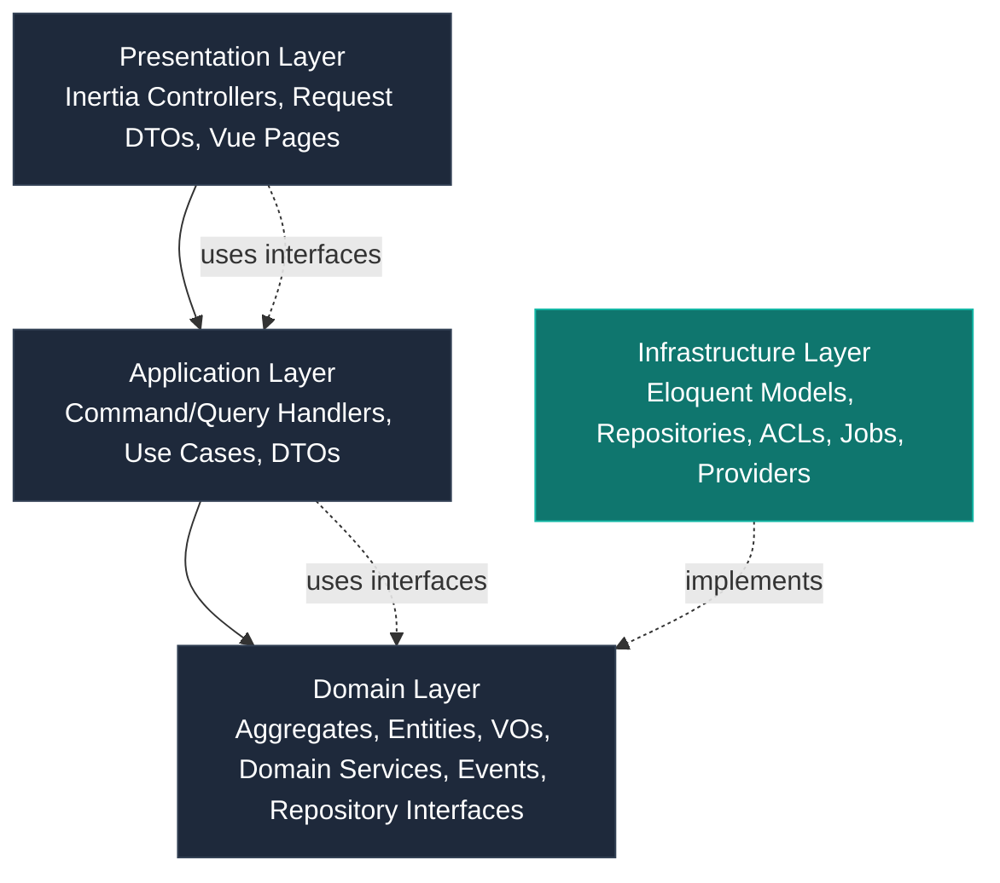
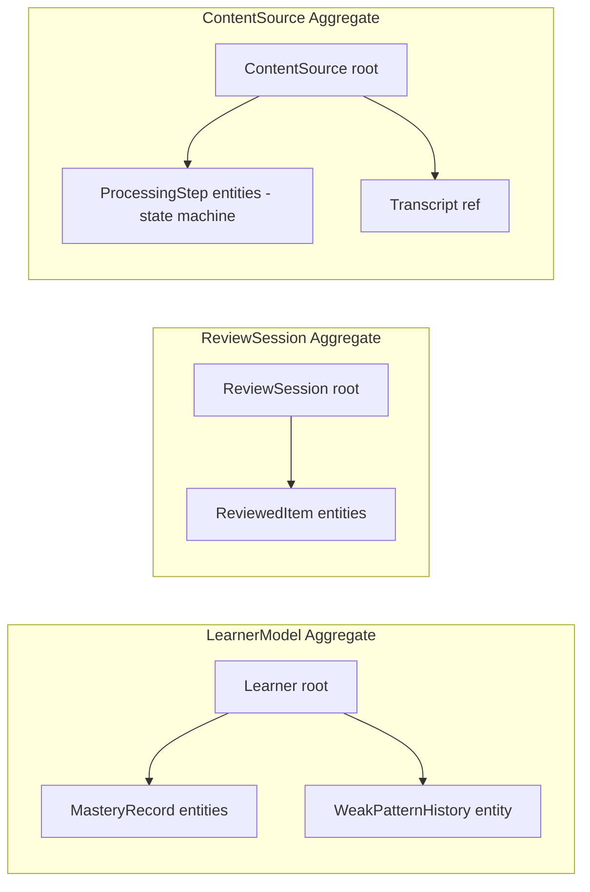
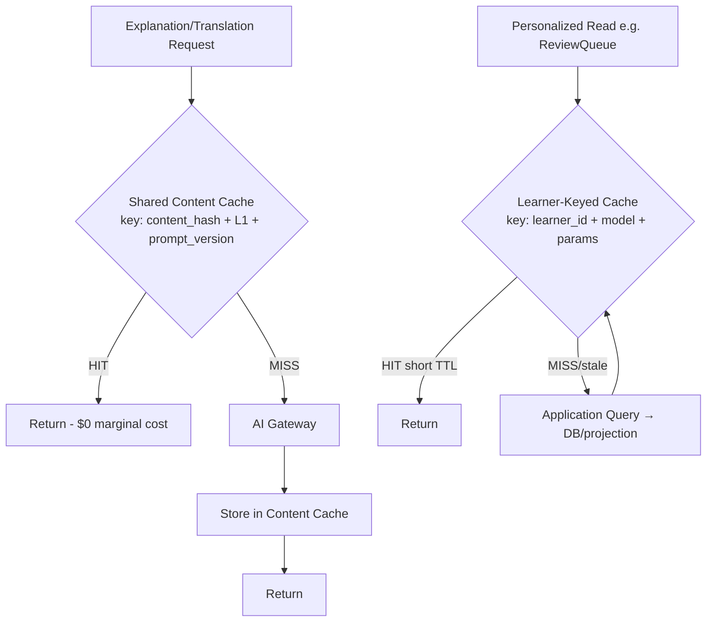

# LexiFlow AI — Software Design Document (SDD)
### Implementation Design for the Modular Monolith

**Document Class:** Implementation Design (Level 3)
**Governs:** How every module is *built* — not what the architecture *is*
**Status:** Authoritative for implementation
**Owner:** Chief Software Architect, LexiFlow AI

---

## Document Control

| Attribute | Value |
|---|---|
| Document type | Software Design Document (SDD) |
| Predecessor | Software Architecture Document (SAD) |
| Succeeds | ADR Set (the open ADRs the SAD §88 deferred are resolved here) |
| Audience | Senior engineers, AI coding agents, reviewers |
| Stack authority | Laravel 12, PHP 8.4, Vue 3, Inertia.js, TypeScript, Tailwind CSS, PostgreSQL, Redis, AWS |
| Review model | Every section must survive a human review and the §52 Review Checklist |
| Conflict protocol | Per CTO Constitution §12 — explain, recommend ADR, proceed on existing decision |

---

## 0. How to Read This Document

### 0.1 Relationship to the Immutable Source of Truth

This SDD is a **Level 3 document**. The hierarchy is fixed and non-negotiable:

```
   LEVEL 0 — Business Strategy    (PRD, CEO Vision, Product Strategy)
                 |
                 v
   LEVEL 1 — Engineering Law      (CTO Engineering Constitution)
                 |
                 v
   LEVEL 2 — Architecture         (Domain Model, Software Architecture Document)
                 |
                 v
   LEVEL 3 — Implementation       (THIS DOCUMENT — Software Design Document)
                 |
                 v
   LEVEL 4 — Code                 (Laravel/PHP/Vue/TS modules)
```

**Level 3 translates Level 2 into buildable engineering decisions.** It never redefines business scope, pricing, domain language, engineering standards, or architectural shape — all of which are already final in Levels 0–2. Where this document makes a concrete choice the upper levels left open (technology selection, file layout, naming, persistence mapping), it does so only because the upper levels **explicitly deferred** that choice to a later document, and this is that document.

### 0.2 The Mandate of This SDD

The Architecture Document (SAD) answers *"what is the system's shape?"* This SDD answers *"how is each module actually built inside that shape?"* — detailed enough that a senior engineer **or an AI coding agent** can implement LexiFlow AI without making any architectural decision of their own.

Nothing load-bearing is left ambiguous. Where a decision is genuinely still open (the five ADRs flagged across the Constitution, Domain Model, and SAD), this document **does not silently close it**; it continues assuming the existing provisional decision and records the open item in §59.

### 0.3 Conflict-Handling Protocol (Binding)

Per the CTO Constitution §12 and §45, if this SDD encounters any tension with a Level 0–2 document, it does **not** silently fix it. Instead it:

1. **Explains the conflict** in situ and in §58.
2. **Recommends an ADR** with the reasoning, alternatives, and consequences.
3. **Continues assuming the existing decision** until that ADR is human-approved.

This is the discipline the entire document series is built to enforce, and the SDD is the document where the pressure to "just pick something and move on" is highest — which is exactly why the discipline matters most here.

### 0.4 Detected Conflicts (Summary)

Two conflicts surfaced during design. Both are handled per §0.3; details appear where relevant.

| # | Conflict | Existing decision (held) | See |
|---|---|---|---|
| C-1 | Eloquent's Active Record model vs. SAD §25 "no ORM annotations in the Domain Layer" | SAD §25 wins → Domain Layer is framework-agnostic plain PHP; Eloquent confined to Infrastructure behind a Data Mapper repository | §13, §58, ADR-011 |
| C-2 | CTO Constitution §7's kebab-case file naming (written in a TS/React idiom) vs. Laravel/PHP PSR-4 conventions | Constitution §7's *intent* (domain-first, descriptive, co-located tests) is preserved; PHP class file casing follows PSR-4 (PascalCase), non-class asset files follow kebab-case | §8, §58, ADR-012 |

---

## Table of Contents

1. Design Principles
2. Layered Design
3. Project Structure
4. Module Structure
5. Dependency Rules
6. Package Structure
7. Namespace Convention
8. Coding Convention
9. Application Services
10. Domain Services
11. Repositories
12. Factories
13. Value Objects
14. Aggregates
15. Entities
16. DTO Design
17. Mapper Strategy
18. Validation Strategy
19. Exception Strategy
20. Logging Strategy
21. Configuration Design
22. Environment Design
23. Authentication Design
24. Authorization Design
25. API Design
26. REST Endpoint Design
27. Request Lifecycle
28. Response Standard
29. Error Response Standard
30. Database Design
31. Migration Strategy
32. Index Strategy
33. Caching Design
34. Queue Design
35. Event Design
36. Notification Design
37. File Storage Design
38. AI Provider Integration Design
39. Speech Provider Integration
40. Translation Engine Design
41. Lesson Generator Design
42. Review Scheduler Design
43. Learner Model Design
44. Curriculum Engine Design
45. Teacher Module Design
46. Billing Module Design
47. Monitoring Design
48. Deployment Design
49. Testing Design
50. Implementation Guidelines
51. Coding Checklist
52. Review Checklist
53. Performance Checklist
54. Security Checklist
55. Maintainability Checklist
56. Scalability Checklist
57. Future Extension Strategy
58. Known Risks
59. ADR Recommendations
60. Implementation Readiness Score

---

## 1. Design Principles

### Purpose
Establish the invariants that govern every implementation decision below the architecture line. These principles are the **operational bridge** between the CTO Constitution's principles (Level 1) and actual Laravel/PHP/Vue code (Level 4). They resolve the question *"when two valid implementations exist, which one?"* before it reaches a code review.

### Responsibilities
- Carry the Constitution's intent (SOLID, DRY, KISS, YAGNI, Clean Architecture, DDD, Security First, AI-Friendly) into concrete coding rules.
- Make the codebase legible to an AI coding agent with zero session memory (CTO Constitution §45).
- Preserve the single property the whole business depends on: that any Bounded Context can be extracted into its own service later **without a rewrite** (SAD §1).

### Dependencies
- CTO Constitution §2 (Engineering Principles), §45 (AI Coding Assistant Constitution).
- SAD §2 (Architecture Principles), §8 (Architecture Style), §15 (Bounded Context Architecture).

### Design Decisions

LexiFlow is implemented under **eight governing design principles**. They are ordered: an earlier principle defeats a later one when they collide.

**P1 — The Core Domain is sacred.** Learner Model and Scheduling (the Core Domain per Domain Model §2) receive the strictest engineering discipline: pure domain layer, deepest test investment, zero framework leakage, one-aggregate-per-transaction. A regression here is worse than a regression anywhere else (SAD §4 quality ranking). Every other principle defers to protecting this.

**P2 — Dependencies point inward, always.** The Dependency Rule of Clean/Hexagonal Architecture: the Domain layer depends on nothing in any outer layer; the Application layer depends only on Domain interfaces; Infrastructure depends on both. Laravel, Eloquent, Redis, AWS SDKs, and provider HTTP clients live only in Infrastructure. This is the rule that makes provider swaps, database swaps, and service extraction contained changes (SAD §2, §25–§27).

**P3 — Module autonomy, module isolation.** Each Bounded Context is a module with one sentence of responsibility (CTO Constitution §6). Modules communicate only through published Application-layer interfaces or Domain Events (SAD §9, §20). No module reads another module's tables, Eloquent models, or private classes — ever. This single rule is what keeps extraction (SAD §53) a deployment change rather than a logic change.

**P4 — Explicit over implicit.** Constructor injection, named configuration, versioned contracts, and written ADRs beat service locators, "magic" auto-resolution of intent, undocumented coupling, and tribal knowledge. The reader of any file is assumed to be an AI agent or a new engineer with no shared context (CTO Constitution §45).

**P5 — Cheap-and-shared is separated from expensive-and-personal.** The caching philosophy (CTO Constitution §26) is a first-class design principle, not an optimization footnote. Anything learner-independent (an Explanation for a given sentence) is cacheable at the content layer; anything learner-specific (a Mastery state, a review queue) is never shared. Conflating the two is treated as a correctness bug.

**P6 — Async by default for anything uncertain.** Transcription, pronunciation scoring, batch recalibration, and notification dispatch run on the queue, never inline in a request (CTO Constitution §27, SAD §23). The web tier serves fast, bounded-latency work only.

**P7 — Honest failure.** Errors are surfaced honestly and specifically to the user where possible and to the engineer always (CTO Constitution §24). Nothing is swallowed. An error a user experiences that engineering never sees is itself a defect.

**P8 — Build for the next real order of magnitude, not a speculative one.** YAGNI (CTO Constitution §2) governs implementation as strictly as architecture. No abstraction, plugin hook, or "we might need this" interface is built ahead of a funded requirement — but every *seam* required by the SAD's staged plan (§53) is preserved structurally, so the future path stays open without being paved prematurely.

### Trade-offs

| Decision | Gains | Costs |
|---|---|---|
| Pure-domain over Eloquent-everywhere | Testable Core Domain, provider/DB swap contained | More mapping code (Data Mappers); Eloquent's ergonomics are unavailable in Domain |
| Module isolation (no cross-module table joins) | Clean extraction seams, blast-radius containment | Some read models require projections (selective CQRS) instead of joins |
| Async-by-default | Bounded web-tier latency, resilience | Eventual consistency UX burden (status polling, progress indication) |
| YAGNI strictness | Simple, comprehensible codebase | Occasional "we now need this" refactors — accepted, logged as debt |

### Future Considerations
- When the SAD §53 extraction stage arrives (Pronunciation, then Content Import first), P3 must be auditable: a static check should verify no cross-module table/ORM reference exists. (See §49 for the tooling.)
- P5 will need a measurable cache-hit-rate target (SAD §87) before it can be treated as a binary health metric.

### Best Practices
- Write the domain test before the infrastructure implementation for any Core-Domain behavior.
- When tempted to add a shared helper to `shared-kernel/`, require two independent reviewers — anything there has system-wide blast radius (CTO Constitution §7).
- Phrase every module's responsibility as a sentence without the word "and." If you need "and," you have two modules.

### Anti-patterns
- **God modules.** A module whose responsibility cannot be stated in one sentence.
- **Anemic domain models.** Entities that are bags of getters/setters with all logic in services — violates DDD aggregate responsibility.
- **Lazy import of provider SDKs in Domain/Application.** A single `use OpenAI;` in Domain is a P2 violation, full stop.
- **Cross-module Eloquent relationship** (`hasMany` into another module's table) — destroys P3 silently.

### Implementation Notes
- These eight principles are encoded as machine-checkable rules wherever possible: PHPStan (P2, P3 via architecture rules), Laravel Pint (formatting), and a custom namespace-dependency linter (§5). What cannot be linted is enforced in §52 (Review Checklist).
- P1 is operationalized by the test-coverage bar: Core Domain modules carry a minimum coverage and property-based tests; other modules a lower bar (§49).

---

## 2. Layered Design

### Purpose
Fix the layer topology *inside* each module so that the SAD's three-layer model (Domain / Application / Infrastructure) plus the Presentation layer are realized identically across every Bounded Context. The SAD §9 establishes the layers; this section fixes their contents, their permitted collaborators, and their boundaries in a Laravel application.

### Responsibilities
- Define each layer's allowed inhabitants (classes, files).
- Define the *permitted dependency direction* and the *forbidden* edges.
- Map each layer to Laravel's building blocks (Controllers, Actions/Handlers, Eloquent, Events, Jobs) without leaking Laravel concepts across the wrong boundary.

### Dependencies
- SAD §9 (Logical Architecture), §25–§28 (layer architectures), §30 (Dependency Injection).
- CTO Constitution §9 (Code Organization Standards).

### Design Decisions

Every module is layered as follows. The arrows show the **only** permitted dependency direction (inward).



**Layer 1 — Domain Layer** (`App\<Module>\Domain\`). Pure PHP. Aggregates, Entities, Value Objects, Domain Services, Domain Events, and **Repository interfaces** (port). No `Illuminate\*` imports. No Eloquent. No HTTP. No file/Redis access. This is the only layer the Core Domain logic lives in, and it is the layer that must be unit-testable with zero infrastructure.

**Layer 2 — Application Layer** (`App\<Module>\Application\`). The use-case orchestrator. Command handlers and Query handlers (CQRS-style, §16), Application Services, DTOs. It depends only on Domain interfaces (Repository ports, Domain Service interfaces). It opens and owns the **transaction boundary** (one aggregate per transaction, SAD §76). It contains **no business rules** — it only sequences "load → invoke domain → persist → publish event" (SAD §26).

**Layer 3 — Infrastructure Layer** (`App\<Module>\Infrastructure\`). The adapter. Eloquent models + migrations, **concrete repository implementations** (the Data Mappers, §17), Anti-Corruption Layers for external providers, queued Jobs, cache implementations, and any framework-specific glue. **This is the only layer permitted to import Laravel, Eloquent, Redis, AWS, or provider SDKs.**

**Layer 4 — Presentation Layer** (`App\<Module>\Http\`, plus `resources/js/`). Inertia controllers translate HTTP into Application-layer commands/queries and back. Request validation objects (Form Requests) live here. The Vue 3 + Inertia.js + TypeScript front-end is the client side of this layer. **No business logic** lives here (CTO Constitution §9).

A fifth, cross-cutting concern — **the in-process Event Bus** (§35) — is owned by Infrastructure but exposes a Domain-level interface, so publishers and handlers can be written without knowing whether dispatch is in-process or brokered (SAD §21–§22).

#### Laravel building-block to layer mapping

| Laravel concept | Permitted layer | Notes |
|---|---|---|
| Controller (Inertia response) | Presentation | Thin; delegates to a handler |
| Form Request (validation rules) | Presentation | Authorization + input rules only |
| Action / Command Handler / Query Handler | Application | The use case unit |
| Domain Event class | Domain | Plain PHP object implementing a marker interface |
| Event Listener / Subscriber | Application or Infrastructure | Handlers react; heavy work is dispatched to a Job |
| Job (queued) | Infrastructure | Idempotent, retryable (§34) |
| Eloquent Model + migration | Infrastructure | Persistence detail, never Domain |
| Scheduled Task (`Console\Kernel`) | Infrastructure | Triggers Application handlers |
| Policy | Presentation/Application boundary | Authorizes a command/query (§24) |
| Service Provider | Composition root (root-level) | Wires interfaces to implementations (§9) |

### Trade-offs

| Decision | Gains | Costs |
|---|---|---|
| Four strict layers vs. Laravel's conventional "Model-Controller-Service" | Enforces Clean/Hexagonal; Core Domain is pure | More classes per feature; steeper onboarding for Laravel-purists |
| Repository interfaces in Domain, implemented in Infrastructure | Testable use cases; storage swap contained | Hand-written mappers instead of Eloquent's ergonomics |
| Event Bus interface in Domain, dispatch in Infrastructure | Provider/broker-agnostic publishing | Slight indirection for the common case |

### Future Considerations
- At extraction (SAD §53), Layer 3 of the extracted module becomes a network adapter; Layers 1–2 move with the service unchanged. The layering is the extraction's insurance.
- Selective CQRS projections (§74 of SAD) add an optional "Read Model" store populated by event handlers — still in Infrastructure, still behind an interface.

### Best Practices
- One file = one responsibility; a class that touches two layers is misplaced.
- Keep controllers under ~40 lines; if they grow, logic is leaking downward — it belongs in the Application layer.
- Name handlers after the use case (`CompleteReviewSessionHandler`), not the HTTP route.

### Anti-patterns
- **Fat controllers** doing validation + business logic + persistence.
- **Eloquent models used as Domain Entities** (the most common Laravel DDD failure — see Conflict C-1, §13).
- **Application handlers reaching into Infrastructure directly** (bypassing the Repository port).

### Implementation Notes
- A base namespace test (§49) asserts that `App\<AnyModule>\Domain\*` has zero `Illuminate\*` imports.
- The composition root (root `AppServiceProvider` + per-module `*ServiceProvider`) is the only place concrete implementations are bound to interfaces (§9).

---

## 3. Project Structure

### Purpose
Fix the top-level repository layout so that the CTO Constitution §7 rule — *organize by domain concept, not by technical layer, at the first level* — is realized concretely as a Laravel 12 + Inertia + Vue 3 monorepo. This is the physical answer to SAD §16's conceptual package structure.

### Responsibilities
- Define the repository root.
- Define the `app/` (PHP) domain-first module layout.
- Define the `resources/js/` (Vue/TS) client layout.
- Define where infrastructure-as-code, configuration, tests, and docs live.

### Dependencies
- CTO Constitution §7 (Folder Structure Standards), §8 (File Naming).
- SAD §16 (Package Structure), §65 (Infrastructure as Code).

### Design Decisions

```
lexiflow/                                  # repository root
├── app/                                   # PHP application (domain-first)
│   ├── SharedKernel/                      # minimal shared Value Objects + base types
│   │   └── Domain/
│   │       ├── LearnerId.php
│   │       ├── ContentSourceId.php
│   │       └── DomainEvent.php            # marker interface + helpers
│   ├── LearnerModel/                      # CORE DOMAIN (module)
│   │   ├── Domain/                        # Layer 1
│   │   ├── Application/                   # Layer 2
│   │   └── Infrastructure/                # Layer 3
│   ├── Scheduling/                        # CORE DOMAIN (module) — see §14/ADR-001
│   ├── ContentImport/                     # module
│   ├── LinguisticAnalysis/                # module
│   ├── Pronunciation/                     # module (isolated)
│   ├── CurriculumAlignment/               # module
│   ├── Classroom/                         # module
│   ├── Engagement/                        # module
│   ├── Identity/                          # module (Generic)
│   ├── Billing/                           # module (Generic)
│   ├── Delivery/                          # module (Generic)
│   ├── Storage/                           # module (Generic)
│   └── *ServiceProvider.php               # per-module composition (bound at root)
│   ├── Shared/                            # cross-cutting *framework* plumbing only
│   │   ├── Http/                          # base controllers, middleware
│   │   ├── Bus/                           # Event Bus interface + impl
│   │   ├── Logging/                       # structured logger, redactors
│   │   └── Exceptions/                    # exception renderer
│   └── Providers/                         # AppServiceProvider (composition root)
├── database/
│   ├── migrations/                        # one module per prefix (§31)
│   ├── seeders/                           # realistic, non-PII sample data
│   └── factories/                         # Eloquent factories (Infrastructure only)
├── resources/
│   └── js/                                # Vue 3 + TS + Inertia client
│       ├── Pages/                         # Inertia page components (route-shaped)
│       ├── Components/                    # reusable UI (domain-grouped)
│       ├── Layouts/
│       ├── Composables/                   # useReviewQueue(), useLesson(), etc.
│       ├── Stores/                        # Pinia stores (lightweight client state)
│       ├── Types/                         # generated TS types from OpenAPI (§25)
│       └── lib/                           # api client, fetchers
├── routes/                                # web.php, api.php, channels
├── tests/                                 # Pest — mirrors app/ structure (§49)
│   ├── Unit/                              # Domain-layer tests (no framework)
│   ├── Application/                       # use-case / handler tests
│   ├── Integration/                       # module + DB + queue
│   └── Feature/                           # HTTP/Inertia end-to-end
├── docs/
│   ├── architecture/                      # SAD, Domain Model, this SDD
│   └── adr/                               # ADR-001… (§59)
├── infrastructure/                        # IaC — Terraform/CloudFormation, Docker
│   ├── docker/
│   └── aws/
├── config/                                # Laravel config (env-driven, §21)
├── openapi/                               # OpenAPI 3.1 specs (§25)
└── .github/workflows/                     # CI/CD (§48)
```

**Why domain-first at `app/`'s top level, not Laravel's default `app/Http`, `app/Models`, etc.** Because the Constitution §7 forbids `controllers/`, `services/`, `models/` as the first level. The conventional Laravel skeleton is reorganized so the Bounded Context is the first namespace segment, which is also what PSR-4 makes natural (`App\LearnerModel\...`).

**Why `SharedKernel/` is separate from `Shared/`.** Per SAD §16, the *shared kernel* (the tiny set of genuinely shared Value Objects like identifiers) must be kept minimal and is treated as Domain-layer code. `Shared/` holds only *framework plumbing* (the Event Bus, logging wrappers, base HTTP concerns) — infrastructure-grade cross-cutting concerns, never business logic. The two must not merge: an oversized shared kernel is how modular monoliths quietly re-couple (SAD §16).

**Why tests mirror `app/` and use Pest.** Pest's expressive syntax and architecture-testing capabilities support the rule assertions in §5/§49. Mirroring the module structure keeps "what does this module's test suite cover" obvious.

### Trade-offs

| Decision | Gains | Costs |
|---|---|---|
| Domain-first `app/` over default Laravel skeleton | Aligns code to Bounded Contexts; matches Constitution §7 | Deviates from "stock Laravel" conventions → onboarding note required |
| Tests outside `app/` (mirrored) | Clear ownership; no accidental production-load of test code | Slight duplication of folder names |
| `SharedKernel/` vs `Shared/` split | Prevents shared-kernel bloat | Two similarly-named dirs need a doc note |

### Future Considerations
- At service extraction, an extracted module's `app/<Module>/` directory becomes its own repository; the layering inside it is unchanged.
- OpenAPI specs in `openapi/` are the contract source; TS types in `resources/js/Types/` are *generated*, never hand-edited (§25).

### Best Practices
- A new module = a new top-level namespace segment + its own ServiceProvider + its own `database/migrations/<module>_` prefix.
- Never create a "Utils" or "Helpers" dump; a cross-domain need is either a SharedKernel Value Object or a `Shared/` framework class, and that distinction is a review decision.

### Anti-patterns
- **`app/Models/`** with all Eloquent models in one folder — re-couples every domain.
- **`app/Services/`** as a catch-all — violates domain-first organization.
- **Hand-edited generated TS types** — drifts from the OpenAPI contract.

### Implementation Notes
- The Laravel skeleton is customized at project init via a documented scaffold script so every module starts identical (SAD §14 "shared architectural template").
- PSR-4 mapping in `composer.json` is standard (`App\\` → `app/`); no custom autoloaders needed because domain-first is expressed through namespaces, not directories outside `app/`.

---

## 4. Module Structure

### Purpose
Fix the *internal* structure of a single module so that "how does a module work here" is learned once and applies everywhere (SAD §14). This is the concrete realization of the SAD's identical-module-shape guarantee.

### Responsibilities
- Define the canonical internal directory tree of a module.
- Show the canonical contents of each layer for a representative module.
- Establish the "module template" that the scaffold produces.

### Dependencies
- SAD §9 (Logical Architecture), §14 (Module Architecture), §15 (Bounded Context Architecture).
- Domain Model §5 (Bounded Contexts).

### Design Decisions

Every module follows this exact internal shape. Example: the **Learner Model** module (Core Domain).

```
app/LearnerModel/
├── Domain/
│   ├── Aggregates/
│   │   └── LearnerAggregate.php            # aggregate root (entity: Learner)
│   ├── Entities/
│   │   └── MasteryRecord.php               # a tracked item's state
│   ├── ValueObjects/
│   │   ├── MasteryScore.php
│   │   ├── ForgettingCurvePosition.php
│   │   └── ConfidenceEstimate.php
│   ├── Events/
│   │   ├── LearnerRegistered.php
│   │   ├── MasteryThresholdReached.php
│   │   └── VocabularyItemsRegistered.php
│   ├── Services/                           # Domain Services (stateless)
│   │   └── MasteryProjector.php            # internal domain computation
│   ├── Repositories/                       # PORTS (interfaces)
│   │   ├── LearnerRepository.php
│   │   └── MasteryReadModelRepository.php
│   ├── Policies/
│   │   └── MasteryUpdatePolicy.php         # invariant: mastery only via interaction
│   └── Exceptions/
│       └── MasteryInvariantViolation.php
├── Application/
│   ├── Commands/
│   │   ├── RegisterVocabularyItems/
│   │   │   ├── RegisterVocabularyItemsCommand.php     # DTO
│   │   │   └── RegisterVocabularyItemsHandler.php     # use case
│   │   └── ApplyInteractionOutcome/
│   │       ├── ApplyInteractionOutcomeCommand.php
│   │       └── ApplyInteractionOutcomeHandler.php
│   ├── Queries/
│   │   ├── GetMasterySummary/
│   │   │   ├── GetMasterySummaryQuery.php
│   │   │   ├── GetMasterySummaryHandler.php
│   │   │   └── LearnerMasterySummaryViewModel.php     # read DTO
│   │   └── GetMasteryDetail/.../
│   ├── Policies/                           # application-tier authorization
│   │   └── LearnerMasteryPolicy.php
│   └── Services/                           # cross-use-case orchestration (thin)
│       └── LearnerModelEventPublisher.php
├── Infrastructure/
│   ├── Persistence/
│   │   ├── Eloquent/                       # Eloquent models (Infrastructure only)
│   │   │   ├── LearnerModelModel.php
│   │   │   └── MasteryRecordModel.php
│   │   ├── Mappers/                        # Data Mappers (§17)
│   │   │   ├── LearnerModelMapper.php
│   │   │   └── MasteryRecordMapper.php
│   │   ├── EloquentLearnerRepository.php   # implements Domain\LearnerRepository
│   │   └── EloquentMasteryReadModelRepository.php
│   ├── Projections/                        # selective CQRS read models
│   │   └── MasterySummaryProjection.php    # event-fed projection
│   └── DependencyInjection/
│       └── LearnerModelServiceProvider.php
├── LearnerModelModule.php                  # declares the module's public interface
└── README.md                               # purpose, contract, owner-boundary (§11 CTO Const.)
```

The module's **public boundary** is the set of Application-layer Commands, Queries, and the DTOs they exchange. Everything in `Domain/` and `Infrastructure/` is private to the module. The file `LearnerModelModule.php` (a thin declaration class) enumerates the module's published commands/queries — this is the explicit contract other modules may call, and the single place to look to know "what can I ask this module to do?" (CTO Constitution §6: narrow, intentional public interface).

### The Canonical Use-Case Shape

Every use case is one Command (or Query) + one Handler, in its own folder, with co-located read DTOs. The handler's body is always the same five-step shape (SAD §26):

```
handle(command):
    1. authorize               (Application-layer Policy)
    2. begin transaction
    3. load aggregate          (via Repository port)
    4. invoke domain logic     (aggregate method; enforces invariants)
    5. persist + publish events (within same transaction — outbox, §35)
    commit
```

For Queries, steps 2–5 collapse to "load read model → return ViewModel," with no transaction and no mutation (selective CQRS, SAD §74).

### Trade-offs

| Decision | Gains | Costs |
|---|---|---|
| One folder per use case | High locality; the entire use case is visible at a glance | More folders than a "Handlers/" dump |
| Co-located read DTOs (ViewModels) | No central DTO bag; ownership clear | Occasional near-duplicate DTOs across use cases (acceptable; DRY-with-judgment) |
| Module declaration class | Explicit, reviewable public contract | One extra file to maintain per module |

### Future Considerations
- When a module is extracted (SAD §53), the `LearnerModelModule.php` declaration becomes the interface a remote client calls; today it is an in-process interface — identical shape, different transport.
- Projections (`Infrastructure/Projections/`) are added only where SAD §74 says read/write asymmetry is genuine (Learner Model primarily); most modules have none.

### Best Practices
- A handler never instantiates an aggregate with `new` from raw data — it loads via the Repository (consistency, invariants enforced).
- ViewModel (read) DTOs never expose Domain Entities; they are flat, serializable shapes (§16).

### Anti-patterns
- **Application service with 40 methods** — split into one handler per use case.
- **Repository that returns Eloquent models** — returns Domain aggregates/Entities; mapping happens inside the repository (§11/§17).
- **Domain layer importing the module's own Application classes** — wrong direction.

### Implementation Notes
- The scaffold command `php artisan lexiflow:module <Name>` produces this tree plus a ServiceProvider stub, ensuring the identical-shape guarantee (SAD §14) mechanically.
- The README in each module is mandatory and is referenced by the Definition of Done (CTO Constitution §40); a PR that changes a module's public contract must update it in the same change.

---

## 5. Dependency Rules

### Purpose
Make the permitted and forbidden dependencies between layers, namespaces, and modules **machine-checkable**, so the architectural rules of §2 and the Constitution §5 are not left to reviewer memory. This section is the contract that the architecture-test suite (§49) enforces.

### Responsibilities
- Enumerate every permitted dependency edge.
- Enumerate every forbidden edge as a failing test.
- Provide the enforcement mechanism (PHPStan + Pest architecture tests).

### Dependencies
- SAD §5 (Architecture Principles), §20 (Internal Communication), §80 (Integration Architecture).
- CTO Constitution §28 (defense in depth).

### Design Decisions

#### 5.1 The Dependency Rule (canonical)

```
Presentation  ──►  Application  ──►  Domain  ◄──implements──  Infrastructure
     │                 │                                   │
     └─────────────────┴────────── (all depend inward) ────┘
```

Permitted edges:

| From | May depend on | May NOT depend on |
|---|---|---|
| Domain | PHP stdlib, `SharedKernel\Domain`, own module's Domain | Any Application, any Infrastructure, `Illuminate\*`, any other module |
| Application | own Domain, `SharedKernel`, other modules' **Application interfaces only** (prefer events) | Infrastructure, `Illuminate\*` (except bus/transaction abstractions declared as Domain ports) |
| Infrastructure | own Domain interfaces, Laravel, Eloquent, Redis, providers, `Shared\` plumbing | other modules' Domain or Infrastructure |
| Presentation | own Application, Laravel HTTP, Form Requests | Domain, Infrastructure |

#### 5.2 Cross-module rules (the extraction insurance)

- **R-1:** No module may import another module's `Domain\*` namespace. (Domain Model §6 Customer/Supplier is realized via Application interfaces/events, not direct domain access.)
- **R-2:** No module may import another module's `Infrastructure\*` namespace (no shared Eloquent models, no cross-module `hasMany`).
- **R-3:** No module may reference another module's database table (no cross-module query/join/migration FK into another module's table).
- **R-4:** A module's published contract is exactly the commands/queries declared in its `*Module.php` declaration class. Any other module may only call those.
- **R-5:** Shared mutable state across modules is forbidden; the only shared thing is `SharedKernel\Domain` (immutable Value Objects) and `Shared\` framework plumbing.

> **Note on foreign keys (R-3 elaboration).** Referencing another aggregate's *identifier* (e.g., storing a `LearnerId` as a scalar column) is permitted and necessary — identifiers are SharedKernel Value Objects, not relationships. What is forbidden is a *relational/ORM relationship* across the module boundary (a `learner_model_records.learner_id` column owned by Learner Model is fine; an Eloquent `belongsTo` from Classroom into a Learner Model table is not). Classroom references learners by `LearnerId` value, not by relationship. This preserves R-3 while keeping the data model workable.

#### 5.3 Enforcement

A Pest architecture test suite (`tests/Architecture/DependenciesTest.php`) asserts:

```
expect('App\LearnerModel\Domain')
    ->toOnlyDependOn([
        'App\SharedKernel\Domain',
        'App\LearnerModel\Domain',
    ])
    ->not->toUse('Illuminate\*');

expect('App\*')            // R-1
    ->not->toDependOnModulesDomainExceptOwn();

// (full set enumerated in the test file — see §49)
```

PHPStan with `phpstan-strict-rules` and a custom rule (`ForbiddenNamespaceDependencyRule`) covers what Pest's declarative checks cannot. CI fails on any violation (§48).

### Trade-offs

| Decision | Gains | Costs |
|---|---|---|
| Strict, linted namespace rules | Architectural drift caught in CI, not review | Some valid patterns require explicit exemption (logged) |
| Identify-by-value across modules (R-3) | Preserves extraction seams while keeping relational data | No DB-level FKs across modules → integrity enforced in code (acceptable per SAD §72) |

### Future Considerations
- At extraction, R-1/R-2/R-3 are what make a module's code portable: nothing outside it is coupled to its internals.
- A dependency-graph visualization (generated in CI) documents the actual module-to-module edges and is reviewed in architecture review (CTO Constitution §43).

### Best Practices
- When an Application handler genuinely needs data from another module, prefer subscribing to that module's events over a synchronous cross-module query; if synchronous is required, call only the other module's declared query interface and document the dependency in both modules' READMEs.
- Exempt a rule only via a written ADR; never via a `// @phpstan-ignore` without one.

### Anti-patterns
- **Service-locator / `app()` resolution** to dodge the dependency graph (P4 violation).
- **Reaching into another module's repository** "just to read one field."
- **Disabling an architecture test to get a build green.**

### Implementation Notes
- The architecture-test suite is fast (no DB, no Laravel boot) and runs on every push.
- Exemptions, when justified, are centralized in a single `arch_exemptions.php` so they are auditable at a glance.

---

## 6. Package Structure

### Purpose
Fix the *package granularity* of the system — how modules group into logical packages and how the Shared Kernel is bounded — concretely for this Laravel codebase. (SAD §16 described this conceptually; here it is made physical.)

### Responsibilities
- Enumerate the system's packages/modules with their Layer 0–2 provenance.
- Bound the Shared Kernel explicitly.
- State which package owns each Ubiquitous Language term and each Domain Event.

### Dependencies
- Domain Model §5–§6, §8.
- SAD §13 (Component Architecture), §15 (Bounded Context Architecture).

### Design Decisions

The system is one PHP namespace tree, one Composer package, but logically **fourteen modules** plus the Shared Kernel. (Module count = the Bounded Contexts from Domain Model §5, with the Core Domain's two contexts realized per ADR-001's default as two modules that share a transaction boundary but remain separately namespaced for the day ADR-001 resolves otherwise.)

| Package (namespace) | Domain tier | Owns Ubiquitous-Language terms | Publishes events (Domain Model §8) |
|---|---|---|---|
| `App\LearnerModel` | Core | Learner, Mastery, MasteryScore, Learning Memory | `MasteryThresholdReached` |
| `App\Scheduling` | Core | Review Session, Review Queue | `ReviewSessionCompleted` |
| `App\ContentImport` | Supporting | Content Source, Transcript | `ContentSourceSubmitted`, `TranscriptReady`, `ContentSourceFailed` |
| `App\LinguisticAnalysis` | Supporting | Vocabulary Item, Explanation, Translation, Difficulty Level, Lesson (composed) | `VocabularyItemsGenerated`, `LessonPresented` |
| `App\Pronunciation` | Supporting (isolated) | Shadowing Session, Pronunciation Attempt, Pronunciation Score | `PronunciationAttemptScored` |
| `App\CurriculumAlignment` | Supporting | Learning Goal, CEFR Band Estimate, IELTS Band Estimate | `LearningGoalSet`, `LearningGoalCompleted` |
| `App\Classroom` | Supporting | Classroom, Assignment (Teacher aggregate) | `AssignmentCreated` |
| `App\Engagement` | Supporting | Notification, Streak, Habit Loop | (consumes; publishes internal scheduling events only) |
| `App\Identity` | Generic | (auth identity) | `LearnerRegistered` |
| `App\Billing` | Generic | Subscription, Tier | `SubscriptionActivated`, `SubscriptionCanceled` |
| `App\Delivery` | Generic | (delivery primitives) | — |
| `App\Storage` | Generic | (media/transcript artifact refs) | — |
| `App\AiGateway` | Infrastructure ACL | (none — translates provider shapes) | — |
| `App\SpeechGateway` | Infrastructure ACL | (none — pronunciation ACL) | — |
| `App\SharedKernel` | Cross | `LearnerId`, `ContentSourceId`, `*Id`, `DomainEvent` | — |

> The AI Gateway and Speech Gateway are realized as **infrastructure-tier ACL modules** rather than Bounded Contexts, because they carry no domain semantics — they exist solely to translate external provider shapes into LexiFlow's Ubiquitous Language (Domain Model §19, SAD §34/§40). They are the two components the Constitution and SAD repeatedly name as "the only place provider logic lives."

**Shared Kernel boundary (strict).** `App\SharedKernel` contains *only*: identifier Value Objects (`LearnerId`, `ContentSourceId`, `VocabularyItemId`, etc.), the `DomainEvent` base contract, and clock/randomness abstractions. **No business logic, no DTOs, no services.** Anything proposed for SharedKernel requires two reviewers and an ADR (SAD §16). This is deliberately uncomfortable to grow.

### Trade-offs

| Decision | Gains | Costs |
|---|---|---|
| Two Core modules (LearnerModel, Scheduling) not one | Honors ADR-001 default while keeping the split cheap if ADR resolves otherwise | Two modules must coordinate a shared transaction (wired via a shared DB connection/outbox) |
| Gateway modules as Infrastructure ACLs (not contexts) | Provider swap contained; Domain Model §19 enforced | One more package to version when the contract changes |

### Future Considerations
- If ADR-001 resolves toward a single combined module, `Scheduling` collapses into `LearnerModel\Scheduling\`; if toward a strict split, the shared transaction wiring is removed and they communicate only by events.
- The two Gateway modules are the first things to externalize if provider traffic warrants its own scaling pool (SAD §38).

### Best Practices
- Each package has a single owner conceptually; cross-package changes touching more than two packages trigger architecture review (CTO Constitution §43).
- The event-ownership column above is the single source of truth for "who publishes what"; the Event Bus registry (§35) is generated from it.

### Anti-patterns
- **Shared Kernel as a junk drawer.**
- **A Gateway module that returns provider-shaped objects** (it must return LexiFlow-domain Value Objects only).
- **An "AI Tutor" package** — explicitly forbidden (ADR-003; Domain Model §7/§22).

### Implementation Notes
- The package table above is the authoritative index; the `*Module.php` declaration in each package must be consistent with it (a CI check verifies declared events match the table).

---

## 7. Namespace Convention

### Purpose
Fix the namespace grammar of the codebase so that namespaces are self-describing, consistent, and resistant to drift. Namespaces are the primary way an AI coding agent (CTO Constitution §45) and a new engineer navigate the system.

### Responsibilities
- Define the root namespace and the per-module segment grammar.
- Define sub-namespaces per layer.
- Define the convention for cross-cutting and test namespaces.

### Dependencies
- PSR-4 autoloading (Composer).
- CTO Constitution §7–§8.

### Design Decisions

**Root:** `App\` → `app/` (standard PSR-4 via Composer).

**Module segment grammar:** `App\<Module>\<Layer>\<Concern>\<ClassName>`

- `<Module>`: PascalCase, exactly matches a Domain Model Bounded Context or a Gateway (e.g., `LearnerModel`, `ContentImport`, `AiGateway`).
- `<Layer>`: exactly one of `Domain`, `Application`, `Infrastructure`.
- `<Concern>`: the sub-area (`Aggregates`, `Entities`, `ValueObjects`, `Events`, `Repositories`, `Services`, `Commands\<UseCase>`, `Queries\<UseCase>`, `Persistence`, `Projections`, etc.).
- `<ClassName>`: PascalCase, describes responsibility (never version numbers — CTO Constitution §8).

**Cross-cutting namespaces:**
- `App\SharedKernel\Domain\` — the bounded shared kernel.
- `App\Shared\` — framework plumbing only (Bus, Logging, Http, Exceptions).
- `App\Providers\` — composition root.

**Test namespaces mirror production:** `Tests\Unit\LearnerModel\Domain\…`, `Tests\Application\LearnerModel\…`, etc. (§49).

**Verbs and nouns convention:**
- Commands/Queries: `<VerbObject>` (`RegisterVocabularyItems`, `GetMasterySummary`).
- Handlers: `<VerbObject>Handler`.
- Domain Events: past-tense fact (`ReviewSessionCompleted`, `TranscriptReady`) — verbatim from Domain Model §8.
- Value Objects: the domain noun (`MasteryScore`, `ContentSourceId`).
- Repository interfaces: `<Entity>Repository`; implementations: `<Tech><Entity>Repository` (`EloquentLearnerRepository`).

### Trade-offs

| Decision | Gains | Costs |
|---|---|---|
| Layer always present in namespace | Layer membership obvious from the FQN | Slightly longer names |
| Verbatim domain-event names from Domain Model §8 | Ubiquitous Language preserved end-to-end | None — this is pure upside |

### Future Considerations
- If a module is extracted to its own repo, its `App\<Module>\` namespace becomes that service's root with no rename — namespaces are extraction-stable by design.

### Best Practices
- A class name should let you guess its namespace; a namespace should let you guess its layer.
- Never abbreviate module names (`LM` for LearnerModel is forbidden).

### Anti-patterns
- **Versioned namespaces** (`App\LearnerModel\V2\`) — versioning belongs in git and ADRs, not namespaces.
- **Layer-less namespaces** (`App\LearnerModel\Services\` — which layer?).
- **Renamed domain terms** (`User` instead of `Learner`, `Card` instead of `VocabularyItem`) — violates Ubiquitous Language (Domain Model §7).

### Implementation Notes
- A linter rejects any class whose namespace does not match the `Module\Layer\Concern` grammar.
- The domain-term vocabulary (§6 table) is cross-checked against class names; a class named `User` would fail CI.

---

## 8. Coding Convention

### Purpose
Fix the day-to-day coding standards for the Laravel/PHP/Vue/TS implementation — the concrete realization of CTO Constitution §10, adapted to this stack. This is the level where "comments explain why," "naming is descriptive," and "formatting is automated" become specific rules.

### Responsibilities
- Define PHP, Vue, and TypeScript conventions.
- Resolve Conflict C-2 (kebab-case vs. PSR-4 PascalCase) per the Constitution's intent.
- Define the automated enforcement toolchain.

### Dependencies
- CTO Constitution §8 (File Naming), §10 (Coding Standards).
- PSR-12 (PHP), Vue Style Guide, TS ESLint recommended.

### Design Decisions

#### 8.1 PHP
- **Standard:** PSR-12 baseline, extended by **Laravel Pint** (preset `laravel`) — formatting is non-negotiable and automated; zero formatting debate in review (CTO Constitution §10).
- **Static analysis:** **PHPStan** at `max` level with `phpstan-strict-rules` and `larastan`. Type coverage is effectively 100% for the Domain layer (mandatory) and the rest of the codebase follows.
- **Class file casing:** PascalCase, one class per file, filename = class name (PSR-4 / Conflict C-2 resolution — PHP mandates this; the Constitution §7 kebab-case rule is honored for *non-class asset files* below).
- **Value Objects & Entities:** immutable where possible (Value Objects always `readonly` final classes on PHP 8.4); constructors validate invariants; no public setters (mutate via intent-revealing methods that return a new state or apply within an aggregate).
- **Error handling:** typed exceptions (§19); never `throw new \Exception()` in Domain/Application.
- **Comments:** explain *why*, not *what* (CTO Constitution §10); public interfaces carry PHPDoc `@throws`, `@param`/`@return` for non-obvious domain types.

#### 8.2 Front-end (Vue 3 + TypeScript + Tailwind)
- **Components:** PascalCase, SFCs (`.vue`), `<script setup lang="ts">` exclusively.
- **Asset/component files:** PascalCase for components, kebab-case for non-component assets (`learner-progress-chart.vue` could be a component, but utilities stay kebab-case) — consistent with CTO Constitution §8's framework-convention rule.
- **TypeScript:** strict mode; types for all API contracts come from the OpenAPI-generated bundle (§25) — **no hand-written duplicate types** for server contracts.
- **Tailwind:** utility-first; component classes extracted via `@apply` only in clearly-bounded component styles; the design token set is centralized in `tailwind.config`.
- **State:** Inertia props are the primary state vehicle; Pinia only for ephemeral, client-only UI state (CTO Constitution §9 — keep client logic thin).
- **Linting/formatting:** ESLint (`@vue/eslint-config-typescript`, strict) + Prettier; Stylelint for any custom CSS.

#### 8.3 Conflict C-2 resolution (kebab-case vs. PSR-4)
The CTO Constitution §8 says non-component files are lowercase-kebab-case. This was written in a TS/React idiom. **Resolution:** the Constitution's *intent* — descriptive names, no version numbers in filenames, co-located tests — is preserved. PHP *class* files follow PSR-4 (PascalCase, mandatory). *Non-class asset files* (configs, openapi specs, IaC, scripts, front-end utilities) follow kebab-case. Tests are co-located under `tests/` mirroring the production structure. This is documented as **ADR-012** (§59) so the mapping is auditable and the Constitution is honored rather than contradicted.

#### 8.4 General conventions
- **Naming:** full words over abbreviations; domain terms verbatim from the Ubiquitous Language.
- **Magic values:** centralized constants/config (§21), never inline literals.
- **Exports/public interface first** within a file (CTO Constitution §9).
- **Error messages:** actionable — state what happened, what was expected, what to check (CTO Constitution §10).

### Trade-offs

| Decision | Gains | Costs |
|---|---|---|
| PHPStan `max` for Domain, strict for rest | Catches the silent-wrong-guess class of defect the Constitution §45 fears | Some initial annotation burden |
| OpenAPI-generated TS types only | Contract drift impossible | A codegen step in the build |

### Future Considerations
- A custom Pint/PHPStan rule could enforce Ubiquitous-Language term usage at the identifier level; deferred unless drift is observed.

### Best Practices
- `readonly` classes for all Value Objects; `final` for aggregates unless extension is genuinely modeled.
- Prefer named arguments and value-object constructors over boolean flags in method signatures.

### Anti-patterns
- **Public setters on aggregates** — bypasses invariant enforcement.
- **Hand-written TS types mirroring the API** — guaranteed drift.
- **Inline `\Illuminate\Support\Str` calls in Domain** — a P2 violation.

### Implementation Notes
- CI runs Pint (`--test`), PHPStan, ESLint, Prettier, and the architecture suite (§49) as parallel, fail-fast stages.
- Pre-commit hooks run Pint and a subset of PHPStan locally for fast feedback.

---

## 9. Application Services

### Purpose
Define how use cases are structured in the Application layer — the CQRS-style Command/Query handlers and the thin Application Services that orchestrate them. This is where the Domain Model's Commands (§9) and Queries (§10) become runnable code.

### Responsibilities
- Fix the Command/Query/Handler pattern.
- Fix the transaction + outbox discipline (SAD §76).
- Fix the authorization boundary (defense in depth, SAD §45).
- Distinguish Application *Handlers* (per use case) from Application *Services* (cross-handler orchestration, used sparingly).

### Dependencies
- SAD §26 (Application Layer), §30 (DI), §76 (Transaction Boundaries), §45 (Authorization).
- Domain Model §9 (Commands), §10 (Queries).

### Design Decisions

**Command/Query separation (selective CQRS).** Every use case is either a Command (mutating, one aggregate, transactional) or a Query (read, no transaction, returns a ViewModel). They share nothing but a marker interface. This is the in-process realization of SAD §74's selective CQRS — *not* a separate command bus vs query bus framework; both flow through the same in-process dispatch, but the discipline of "never mix reads and writes in one handler" is enforced by type and review.

**Handler anatomy (the canonical five steps, §4):**

```
final class CompleteReviewSessionHandler
{
    constructor(
        private ReviewSessionRepository $sessions,   // Domain port
        private LearnerMasteryPort $mastery,         // cross-module Application interface (prefer event)
        private EventBus $bus,                       // Domain-level interface
        private AuthorizeReviewCompletion $authz,    // Application Policy
        private UnitOfWork $uow,                     // transaction + outbox
    ) {}

    public function handle(CompleteReviewSessionCommand $cmd): ReviewSessionResult
    {
        1. $this->authz->assert($cmd);                       // defense in depth
        2. $this->uow->begin();
        try {
        3.     $session = $this->sessions->forId($cmd->sessionId);  // load aggregate
        4.     $session->complete($cmd->answers);              // DOMAIN logic + invariants
        5.     $this->sessions->save($session);                // persist aggregate
           foreach ($session->releaseEvents() as $e)
               $this->uow->queueEvent($e);                     // outbox — same tx (§35)
           $this->uow->commit();
        } catch (Throwable $t) { $this->uow->rollback(); throw $t; }

        $this->bus->flushOutbox();   // dispatch after commit (idempotent consumers)
        return ReviewSessionResult::from($session);
    }
}
```

**Authorization at the handler.** Every Command/Query handler invokes an Application-layer Policy as its first step — **never** trusting a Gateway-level "already authorized" flag (SAD §45, CTO Constitution §28). The Policy has access to the identity and the command to decide scope (e.g., a teacher may only complete reviews for *their own* classroom's learners — Classroom aggregate scope).

**Cross-module interaction.** A handler needing another module's data has two sanctioned paths, in priority order:
1. **Subscribe to the other module's Domain Event** (preferred, decoupled).
2. **Call the other module's declared Query interface** (synchronous, requires documenting the dependency in both READMEs).

A handler never imports another module's Domain or Infrastructure (R-1/R-2, §5).

**Application Services (the rarer beast).** An Application Service exists only when *several handlers share orchestration logic* that is itself use-case-shaped (e.g., composing a Lesson read model from Linguistic Analysis + Learner Model data — SAD §48 "composed at request time"). They remain thin, stateless, and orchestrate handlers/domain — they hold no business rules.

### Trade-offs

| Decision | Gains | Costs |
|---|---|---|
| One-handler-per-use-case folder | Trivial to locate, test, review | More files |
| Outbox pattern over plain `event()->dispatch()` | Eliminates dual-write (SAD §76) | Implementation care (§35) |
| Authorization in handler, not only Gateway | Defense in depth (CTO §28) | Slight duplication with middleware-level checks |

### Future Considerations
- At extraction, a handler's cross-module Query call becomes a network call; the Query interface is already the boundary, so only the adapter changes.
- The outbox (§35) is the component most affected by extraction (it becomes a real broker); designing it as an interface now keeps that future cheap.

### Best Practices
- Keep handlers free of branching business logic — branch belongs in the aggregate or a Domain Service.
- A handler returning more than one shape of result is two use cases.

### Anti-patterns
- **Handler doing domain math** (interval calculation belongs in Scheduling's Domain Service).
- **Calling a provider SDK from a handler** — that's the Gateway's job.
- **`event()` helper bypassing the outbox** — risks lost events on failure.

### Implementation Notes
- The `UnitOfWork` (transaction + outbox) is a `Shared\` abstraction injected into handlers; its Laravel implementation wraps `DB::transaction()` plus an outbox table flush (§35).
- Base handler classes are avoided in favor of the explicit five-step shape for legibility (P4); a handler that *can't* follow the shape is a signal the use case is mis-modeled.

---

## 10. Domain Services

### Purpose
Define how the Domain Services identified in the Domain Model §17 — the **Spaced-Repetition Interval Calculator**, the **Difficulty Calibration Service**, and the **Framework Estimation Service** — are implemented as stateless, framework-free domain logic. These are where the company's actual pedagogical IP lives.

### Responsibilities
- Fix the three Domain Services' contracts, inputs, and outputs.
- Fix the "stateless domain service" pattern.
- Fix the testing bar for the Core Domain's services.

### Dependencies
- Domain Model §17 (Domain Services), §15 (Spaced-repetition scheduling policy).
- PRD §20 (Learning Science — SM-2 or FSRS-family), §38 (performance).
- SAD §25 (Domain Layer purity).

### Design Decisions

All three Domain Services share the same shape: a `final readonly` class in the owning module's `Domain\Services\` namespace, depending on nothing but Domain types and the SharedKernel, taking Value Objects in and returning Value Objects out, and **pure functions of their inputs** (no I/O, no clock unless injected as a port).

#### 10.1 Spaced-Repetition Interval Calculator (Scheduling)
Owns the "next review time" computation — the literal encoding of the spaced-repetition policy (Domain Model §15). Per PRD §20, the algorithm family is **SM-2 or FSRS-family**; this SDD selects **FSRS (Free Spaced Repetition Scheduler) v5** as the implementation, captured as **ADR-007** (§59). Rationale: FSRS is open, well-evaluated, parameter-tunable per learner (supporting the "personalized" promise), and produces a stability/difficulty model that maps cleanly onto the Learner Model's Mastery Value Objects. SM-2 is retained as a documented fallback.

```
contract: IntervalCalculator
    input:  ReviewOutcome (grade), ItemStability, ItemDifficulty, ClockInstant
    output: NextReviewDue (a ValueObject), updated Stability, updated Difficulty
    purity: depends only on inputs + an injected Clock port (SharedKernel)
```

The Calculator is a **Domain Service**, not a method on the ReviewSession aggregate, because it draws on algorithmic logic (stability/difficulty curves) distinct from the aggregate's state-transition responsibility (Domain Model §17). The ReviewSession aggregate *uses* the service during `complete()`.

#### 10.2 Difficulty Calibration Service (Linguistic Analysis)
Assigns/recalibrates a `DifficultyLevel` for a Vocabulary Item or Content Source. Per Domain Model §17 it may draw on **aggregated, de-identified** cross-learner performance signal — and the privacy invariant (Domain Model §16) requires that it operate on anonymized aggregates only, never individual learner data. Therefore the service's input is an `AggregatedPerformanceSummary` (a Value Object produced by a projection), not a learner record. Implementation can be a calibrated heuristic at MVP, with an LLM-assisted recalibration path through the AI Gateway (§38) as a future enhancement.

#### 10.3 Framework Estimation Service (Curriculum Alignment)
Translates a Learner Model read-model output into a `CEFRBandEstimate` or `IELTSBandEstimate` — stateless, recomputed on demand, never stored as a second source of competence truth (Domain Model §17). The estimation mapping (which Mastery profile maps to which CEFR band) is itself a **versioned, reviewable artifact** (treated like prompt templates, SAD §35), because a bad band estimate that a learner trusts for an exam is a real harm (CEO Vision §10, Product Strategy §48).

### Trade-offs

| Decision | Gains | Costs |
|---|---|---|
| FSRS over SM-2 | Tunable per-learner; better empirical retention | More parameters to tune; team must understand FSRS |
| Difficulty Calibration on aggregates only | Privacy invariant enforced structurally | Slightly less granular signal until volume grows |
| Band estimation recomputed, not stored | Single source of truth for competence | Recompute cost (cheap; cached where helpful) |

### Future Considerations
- FSRS parameter tuning per learner is a genuine research effort; ADR-007 scopes MVP to the global default parameters with per-learner optimization deferred to V2 (Product Strategy §22).
- The Difficulty Calibration LLM-assisted path is deferred (YAGNI) until aggregate signal is rich enough to matter.

### Best Practices
- Domain Services are the most heavily tested code in the system — property-based tests for the Interval Calculator are mandatory (§49), including the "two identical sessions produce identical schedules" determinism property and the "harder grade → longer interval" monotonicity property.
- Inject a `Clock` port (SharedKernel), never `time()`/`Carbon::now()` directly — testability + determinism.

### Anti-patterns
- **Domain Service calling the AI Gateway directly** — it's pure logic; if LLM input is needed, the Application layer fetches it and passes it in.
- **Storing the band estimate as the learner's "level"** — creates a second source of truth (Domain Model §17).
- **Using raw `time()`** — breaks determinism in tests.

### Implementation Notes
- The three services are the canonical examples used in onboarding ("here is what a Domain Service looks like in this codebase").
- FSRS parameters live in config (§21), versioned, and changes to them are ADR-worthy (they alter pedagogical behavior — Domain Model §15 treats scheduling-policy changes with Core-Domain rigor).

---

## 11. Repositories

### Purpose
Fix the Repository pattern implementation — the port (interface in Domain) and the adapter (Eloquent-backed implementation in Infrastructure) — which is the mechanism that lets the Application layer load/persist aggregates without knowing anything about the database (SAD §29). This is also where Conflict C-1 (Eloquent vs. Domain purity) is resolved concretely.

### Responsibilities
- Define the repository interface contract (Domain port).
- Define the Eloquent adapter + Data Mapper (Infrastructure).
- Fix the one-aggregate-per-repository rule and the no-leaking-Eloquent rule.

### Dependencies
- SAD §29 (Repository Pattern), §72–§73 (Data/Database Strategy).
- Domain Model §11 (Aggregates).
- Conflict C-1 (§0.4, §13, ADR-011).

### Design Decisions

**One repository per aggregate** (Domain Model §11): `LearnerModelRepository`, `ContentSourceRepository`, `ReviewSessionRepository`, `ShadowingSessionRepository`, `ClassroomRepository`, etc. The interface lives in the aggregate's `Domain\Repositories\` namespace; the implementation lives in the module's `Infrastructure\Persistence\`.

**The port returns and accepts Domain objects, never Eloquent models.** A repository signature is:

```
interface ReviewSessionRepository
{
    public function forId(ReviewSessionId $id): ReviewSession;     // aggregate
    public function save(ReviewSession $session): void;            // persist whole aggregate
}
```

Internally, `save()` uses a **Data Mapper** (`ReviewSessionMapper`) to translate the aggregate's state to/from Eloquent model(s), then persists within the caller's transaction (the handler owns the `UnitOfWork`, §9). The aggregate the Application layer sees has no knowledge of Eloquent — Conflict C-1's resolution.

**Read repositories are separate.** For queries/selective CQRS, a `*ReadModelRepository` returns flat ViewModels (or Value Objects), not aggregates — reading does not reconstruct the aggregate (cheaper, and avoids enforcing write-side invariants on a read path). E.g., `MasteryReadModelRepository::summaryFor(LearnerId)` returns a `LearnerMasterySummaryViewModel`.

**Persistence scope.** A repository persists the **whole aggregate** (aggregate root + its owned entities/VOs) in one transaction — consistent with one-aggregate-per-transaction (SAD §76). It does not expose partial updates that could leave the aggregate inconsistent.

**Optimistic concurrency.** The Core Domain aggregates (LearnerModel, ReviewSession) use **optimistic locking via a version column** — two concurrent `ReviewSessionCompleted` events for the same learner cannot silently drop a Mastery update (Domain Model §11 invariant). The repository rejects a save whose version has advanced, and the handler retries or fails honestly (P7).

### Trade-offs

| Decision | Gains | Costs |
|---|---|---|
| Data Mapper over Eloquent-as-Domain | Domain stays pure; storage swappable (Conflict C-1 resolved per SAD §25) | Mapper boilerplate; loses Eloquent's convenience in Domain |
| Separate read repositories | Cheap reads; no invariant enforcement on read | Some logic duplication between read and write mappings |
| Optimistic locking on Core aggregates | Concurrent Mastery updates are safe | Rare retry handling in handlers |

### Future Considerations
- If a module extracts (SAD §53), its repository adapter becomes an HTTP/gRPC client; the Domain port is unchanged, so the Application layer is untouched.
- A future specialized store (vector DB, SAD §37) would be a new repository implementation for a new read model, contained to Infrastructure.

### Best Practices
- Repositories are the *only* component that touches Eloquent write models. Any other Eloquent usage is a layering violation.
- Map with intent: every Eloquent column the mapper reads/writes is an explicit decision, not an auto-fill.

### Anti-patterns
- **Returning Eloquent models from a repository** — leaks Infrastructure into Application (R-2/C-1).
- **Generic `Repository<T>` base class** with dynamic query scopes — hides intent and invites cross-module table access.
- **Saving part of an aggregate** — violates aggregate consistency.

### Implementation Notes
- Eloquent models live in `Infrastructure\Persistence\Eloquent\`, are `protected`/internal to the module, and are never type-hinted outside Infrastructure.
- Mappers are tested with in-memory SQLite for the round-trip property (aggregate → persist → reload → equals), §49.

---

## 12. Factories

### Purpose
Define where and how aggregates and complex Value Objects are constructed, so that construction always enforces invariants and never produces an aggregate in an invalid state. Factories concentrate the "how do you correctly create this?" knowledge.

### Responsibilities
- Distinguish *domain* factories (creating aggregates via valid transitions) from *infrastructure* reconstitution (loading from storage).
- Fix the reconstitution path (mapper → aggregate) that does *not* re-run creation invariants.
- Fix Eloquent factory usage (test seed data only).

### Dependencies
- Domain Model §11 (Aggregates), §14 (Business Rules).
- §11 Repositories, §13 Value Objects.

### Design Decisions

**Two distinct construction paths, never conflated:**

1. **Creation path (Domain).** A new aggregate enters a valid lifecycle state through a named constructor or a Domain factory that runs all creation invariants. E.g., `ReviewSession::startFor(Learner, Collection<VocabularyItem>)` enforces "a session has ≥1 item, belongs to one learner, is in `InProgress` state." Creation invariants (Domain Model §14) run here.

2. **Reconstitution path (Infrastructure).** Loading an existing aggregate from storage must **not** re-run creation invariants (the row already represents a valid historical state) but **must** guarantee structural validity. The repository's mapper reconstructs the aggregate via a protected `reconstitute()` that bypasses creation checks but validates the loaded state is self-consistent. This separation prevents "can't load old data because a new creation rule was added" bugs.

**Where factories live:**
- Domain factories for aggregates → `Domain\Aggregates\<Aggregate>` named constructors or `Domain\Factories\<Aggregate>Factory`.
- Value Object construction → the VO's own validated constructor (Value Objects are self-validating, §13); no separate factory unless construction is genuinely complex.
- Eloquent factories (`database/factories/`) → **Infrastructure/test only**, for seeding realistic non-PII data (CTO Constitution §18). They never produce Domain aggregates; they produce Eloquent rows that mappers can read.

**Complex composition** (e.g., composing a `Lesson` read model from multiple sources — Domain Model §11) is **not** a factory; it's an Application Service composition (§9), because Lesson is a composed read model, not a stored aggregate.

### Trade-offs

| Decision | Gains | Costs |
|---|---|---|
| Separate creation vs reconstitution | Old data loadable after rule changes; invariants still enforced on new state | Two construction paths to keep in sync |
| Self-validating VOs over factory classes | Less ceremony; impossible to construct invalid VO | Complex VOs may want a named constructor for readability |

### Future Considerations
- If creation rules evolve, the reconstitution path's "structural validity only" contract means historical data is safe; the evolution is documented in an ADR (Domain Model §21).

### Best Practices
- Make aggregate constructors `private`; force creation through named constructors that state the lifecycle transition.
- Reconstitution is the only path allowed to assemble an aggregate from externally-supplied internal fields; gate it behind `internal`-style visibility or a clear `@internal` docblock + review.

### Anti-patterns
- **Public constructor on an aggregate** — invites invalid states.
- **Reconstitution re-running creation invariants** — breaks loading of historical data.
- **Eloquent factory producing Domain aggregates** — couples test plumbing to domain invariants wrongly.

### Implementation Notes
- The pattern is identical across modules; the scaffold's aggregate template includes the private constructor + named constructors + a `reconstitute()` reserved for the mapper.
- Reconstitution path is covered by the repository round-trip test (§11/§49).

---

## 13. Value Objects

### Purpose
Fix the Value Object design that underpins two of the system's most important architectural guarantees: (a) the **shared content cache** is domain-model-correct (an `Explanation` for a sentence is interchangeable with an identical one — Domain Model §13), and (b) the Core Domain's state is expressed as immutable, self-validating, comparable-by-value types. Value Objects are also where Conflict C-1 (Eloquent vs. Domain) is most visible — Value Objects must not be Eloquent-backed.

### Responsibilities
- Enumerate the system's Value Objects (from Domain Model §13) and fix their shapes.
- Define the equality, immutability, and validation rules.
- Define how Value Objects persist (via the mapper, never as Eloquent-annotated).

### Dependencies
- Domain Model §13 (Value Objects), §7 (Ubiquitous Language).
- SAD §25 (Domain Layer purity), §31 (Caching Architecture — Explanation as cacheable VO).
- Conflict C-1 (§0.4).

### Design Decisions

All Value Objects are `final readonly` PHP classes (PHP 8.4) with:
- A self-validating constructor (throws a typed domain exception on invalid input).
- Value-based equality (`equalsTo()` + a value-hash for cache keys).
- Zero mutators; transformation returns a new instance.
- No Eloquent, no `Illuminate\*`.

#### The Value Object catalog

| Value Object | Owner module | Equality basis | Notes |
|---|---|---|---|
| `MasteryScore` | LearnerModel | numeric value + instant | A value at a point in time; the *history* is tracked, the score itself is a VO (Domain Model §13). Cacheable only in read models, never shared across learners. |
| `Explanation` | LinguisticAnalysis | content hash + target sentence + L1 | **The shared-cache unit.** Two identical explanations for the same sentence are interchangeable — this is what makes the content cache domain-correct (SAD §31). |
| `Translation` | LinguisticAnalysis | source text + L1 + register | Idiom-aware; part of an Explanation; cacheable at content layer. |
| `DifficultyLevel` | LinguisticAnalysis | ordinal + calibration version | Assigned by Difficulty Calibration Service (§10); changes require version bump. |
| `ForgettingCurvePosition` | Scheduling | stability + difficulty + clock instant | FSRS state for an item (§10). |
| `CEFRBandEstimate` | CurriculumAlignment | level (A1–C2) + evidence summary | Recomputed; never stored as truth (§10). |
| `IELTSBandEstimate` | CurriculumAlignment | band (0–9) + sub-skill bands | Recomputed; reviewable mapping (§10). |
| `PronunciationScore` | Pronunciation | numeric + component scores + provider ref | Provider-specific detail stripped at the Speech ACL; only domain-meaningful score survives (§39). |
| `*Id` (`LearnerId`, `ContentSourceId`, …) | SharedKernel | UUID string | The shared-kernel identifiers enabling cross-module reference-by-value (§5 R-3 note). |

#### Persistence of Value Objects
Value Objects are **not** Eloquent models. They are embedded within aggregates and serialized by the Data Mapper (§17) — either as columns (a `MasteryScore` → `mastery_value`, `mastery_at`) or as JSON for composite VOs (`Explanation` content stored as a structured column or in the content-cache store). The Domain layer never knows the storage shape; the mapper owns the translation.

### Trade-offs

| Decision | Gains | Costs |
|---|---|---|
| VOs as plain PHP, not Eloquent-cast | Domain purity; cache keys are domain-meaningful | Mapper must (de)serialize composite VOs |
| Value-hash for cache keys | Cache correctness provable from domain equality | Hash function must be stable + versioned |

### Future Considerations
- If embeddings are introduced (SAD §36), an `EmbeddingVector` would be a new cacheable VO sharing the Explanation's cost profile.
- The content-cache key scheme must version on (a) L1 and (b) prompt-model version, so a provider/prompt change invalidates correctly (§33).

### Best Practices
- Make the equality basis explicit in the VO's docblock — a reviewer must be able to see what "same" means.
- Never store a VO's raw identity where a typed VO can travel instead (pass `LearnerId`, not the UUID string).

### Anti-patterns
- **Mutable VO** (a setter on `MasteryScore`) — destroys equality semantics.
- **Eloquent `$casts` array masquerading as a VO** — no behavior, no validation, leaks framework.
- **Shared-cache key that omits the L1** — Bangla and Hindi explanations collide.

### Implementation Notes
- The `Explanation` VO's hash function is the literal cache key for the content cache (§33); its correctness is tested with property-based tests (§49).

---

## 14. Aggregates

### Purpose
Fix the design of the five aggregates (Domain Model §11) — `LearnerModel`, `ContentSource`, `ReviewSession`, `ShadowingSession`, `Classroom` — including their roots, consistency boundaries, and the transaction discipline that protects them. This is the most sensitive design in the system because the Core Domain's two aggregates (`LearnerModel`, `ReviewSession`) carry the company's actual IP.

### Responsibilities
- Fix each aggregate's root, owned entities, and boundary.
- Fix the invariants each aggregate enforces (Domain Model §14, §16).
- Fix the ADR-001 (Learner Model/Scheduling) provisional combined-module realization.

### Dependencies
- Domain Model §11 (Aggregates), §14 (Business Rules), §16 (Invariants).
- SAD §15 (Bounded Context Architecture), §76 (Transaction Boundaries).
- ADR-001 (open, §59).

### Design Decisions

Each aggregate is a transactional consistency boundary: one aggregate is modified per transaction (SAD §76); the aggregate root is the only entry point; all invariants are enforced *inside* the aggregate before `save()`.



#### 14.1 LearnerModel (aggregate root: `Learner`)
- **Owns:** the learner's full competence state — `MasteryRecord` per tracked Vocabulary Item / grammar pattern, `WeakPatternHistory`, forgetting-curve positions.
- **Invariant (Domain Model §16):** a Learner's Mastery is never visible/attributable to any other Learner — absolute isolation.
- **Invariant (Domain Model §14):** Mastery updates occur **only** via `applyInteractionOutcome()` (a completed Review Session, a Lesson interaction, or a scored Pronunciation Attempt) — there is **no** public `setMastery()` and **no** code path that can inflate shown progress. This is the domain-level enforcement of "honesty over flattery" (CEO Vision §10).
- **ADR-001 default:** lives in the `LearnerModel` module and shares a transaction boundary with the `ReviewSession` aggregate for the tight-loop `Mastery update ↔ next-review-time` interaction; external consumers still receive events (`MasteryThresholdReached`) via the bus.

#### 14.2 ReviewSession (aggregate root: `ReviewSession`)
- **Owns:** one session's set of presented/answered items; finalized atomically on `complete()`.
- **Invariant (Domain Model §16):** `ReviewSessionCompleted` is published **only after** the session reaches a fully consistent, finalized state — partial completion never publishes the event.
- **Collaborates with** the Interval Calculator (Domain Service, §10) during `complete()` to compute each item's next review time and update Mastery via the LearnerModel interaction (in the combined-module default, in-process; otherwise via the cross-module port).

#### 14.3 ContentSource (aggregate root: `ContentSource`)
- **Owns:** the import state machine (`Submitted → Fetching → Transcribing → Analyzing → Ready | Failed`) as a sequence of `ProcessingStep` entities (SAD §24 — explicit state machine, not an implicit queue chain).
- **Invariant (Domain Model §14/§16):** downstream contexts may act only when the Transcript is `Ready`; the aggregate is the only thing that transitions its own state.
- **Eligibility** is enforced as the very first transition (before any cost) — the content-eligibility policy (Domain Model §15, sourced from the PRD copyright analysis, ADR-004).

#### 14.4 ShadowingSession (aggregate root: `ShadowingSession`)
- **Owns:** one shadowing session's attempts and scores; isolated in the Pronunciation module (Domain Model §5).
- **Publishes** `PronunciationAttemptScored` → LearnerModel as a Mastery signal (speech production), via the same event-driven integration pattern used everywhere (SAD §50).

#### 14.5 Classroom (aggregate root: `Classroom`)
- **Owns:** roster membership + assignment list for one classroom; the Teacher is an entity/role relationship within.
- **Invariant (Domain Model §16):** the Classroom never holds per-item Mastery detail — only aggregated summaries (the privacy/authorization boundary enforced structurally here, not just by query shaping).

#### "Lesson" is deliberately NOT an aggregate
Per Domain Model §11, `Lesson` is a **composed read model** spanning Linguistic Analysis + Learner Model data, generated per session. Forcing it into one aggregate would violate single-write-owner; it is correctly composed at request time (SAD §48) via an Application Service.

### Trade-offs

| Decision | Gains | Costs |
|---|---|---|
| One-aggregate-per-transaction | Strong consistency within aggregate; clear invariants | Cross-aggregate workflows use events (eventual) |
| Combined Core-module transaction (ADR-001 default) | Tight Mastery↔Schedule loop is consistent + fast | Acknowledged risk if ADR resolves otherwise (SAD §84) |
| No `setMastery()` ever | Honesty invariant structurally unbreakable | Recompute paths must go through interaction application |

### Future Considerations
- ADR-001 is the load-bearing open question; this design keeps the cost of reversing it low (external-facing interactions already event-driven).
- At scale, the LearnerModel aggregate's Mastery records may need sharding (SAD §53, 1M+ stage) — the aggregate boundary is sharding-friendly (per-learner).

### Best Practices
- Model every state transition as a named method that enforces the invariant *and* records the resulting domain event (released on save, §35).
- An Application use case that wants to modify two aggregates atomically is an aggregate-boundary smell (Domain Model §21) — revisit, do not widen the transaction.

### Anti-patterns
- **"Update Mastery" endpoint** that writes Mastery directly — invariant violation.
- **Cross-aggregate transaction** "to keep things simple."
- **Modeling Lesson as an aggregate** with two write owners.

### Implementation Notes
- Aggregates expose `releaseEvents(): list<DomainEvent>` consumed by the handler's outbox flush (§9/§35); events are recorded *inside* the mutating method so they can never diverge from the state change.

---

## 15. Entities

### Purpose
Distinguish Entities (identity-based, mutable, tracked over time) from Value Objects, and fix the Entity set from Domain Model §12. Entities have lifecycles; Value Objects do not. Getting this distinction right is what makes "is this a new thing or the same thing changed?" answerable consistently.

### Responsibilities
- Enumerate the system's Entities and fix their identity model.
- Fix the Entity-vs-VO boundary.
- Fix how Entities relate to aggregates (owned vs. referenced).

### Dependencies
- Domain Model §12 (Entities), §11 (Aggregates), §13 (Value Objects).
- §14 Aggregates.

### Design Decisions

**Entities (from Domain Model §12):** `Learner`, `ContentSource`, `Transcript`, `VocabularyItem`, `ReviewSession`, `ShadowingSession`, `PronunciationAttempt`, `Classroom`, `Assignment`, `LearningGoal`. Plus aggregate-owned entities like `MasteryRecord`, `ReviewedItem`, `ProcessingStep`.

| Entity | Identity | Aggregate membership | Mutability discipline |
|---|---|---|---|
| `Learner` | `LearnerId` | root of LearnerModel aggregate | state changes via interaction application only |
| `ContentSource` | `ContentSourceId` | root of ContentSource aggregate | state machine transitions only |
| `Transcript` | `TranscriptId` | referenced by ContentSource | **immutable once created** (Domain Model §16) — reprocessing yields a *new* version, never in-place mutation |
| `VocabularyItem` | `VocabularyItemId` | owned by Linguistic Analysis (catalog); referenced by LearnerModel | mostly immutable; `DifficultyLevel` recalibrable (versioned) |
| `ReviewSession` | `ReviewSessionId` | root of ReviewSession aggregate | `InProgress → Completed` transition |
| `ShadowingSession` | `ShadowingSessionId` | root of ShadowingSession aggregate | attempts appended |
| `PronunciationAttempt` | `PronunciationAttemptId` | owned by ShadowingSession | append-only; score set once on scoring |
| `Classroom` | `ClassroomId` | root of Classroom aggregate | roster/assignment transitions |
| `Assignment` | `AssignmentId` | owned by Classroom | lifecycle transitions |
| `LearningGoal` | `LearningGoalId` | owned by CurriculumAlignment | set → updated → completed |

**Identity model.** All Entity identity is a SharedKernel `*Id` Value Object (UUIDv7 — time-ordered for index friendliness, §32). Identity is assigned at creation, never reused, and travels as a typed VO across module boundaries (never a raw string — §5 R-3 note).

**Entity-vs-VO test (applied in review):** *"If two instances have all the same fields, are they the same thing?"* If yes → Value Object (e.g., `Explanation`, `Translation`). If identity matters even when fields match → Entity (e.g., two `MasteryRecord`s for different items look similar but are distinct tracked things).

**Owned vs. referenced.** An entity *owned* by an aggregate (e.g., `MasteryRecord` owned by `LearnerModel`) lives and dies with it and is modified only through the root. An entity *referenced* across an aggregate/module boundary (e.g., LearnerModel references `VocabularyItemId` owned by Linguistic Analysis) is referenced **by identity**, never held as a live object — preserving module isolation (§5 R-1).

### Trade-offs

| Decision | Gains | Costs |
|---|---|---|
| Reference-by-identity across modules | Module isolation; extraction-safe | Must fetch referenced entity separately when needed |
| Transcript immutability + versioning | Integrity of derived artifacts (Domain Model §16) | Storage grows with reprocessing |

### Future Considerations
- `VocabularyItem` is a candidate to become a shared catalog (cross-learner) as volume grows — its identity-based reference model already supports this.

### Best Practices
- Generate IDs at construction (UUIDv7), not at persistence — the Entity is valid before it hits the DB.
- Override equality on Entities to compare identity, not fields (default object comparison is by-reference and unreliable after reconstitution).

### Anti-patterns
- **Comparing Entities by field value** to decide "same."
- **Holding a live cross-module Entity** instead of its ID.
- **Mutable Transcript** (reprocessing in place).

### Implementation Notes
- A base `Entity` abstract provides identity equality + `releaseEvents()` plumbing; aggregates extend it.

---

## 16. DTO Design

### Purpose
Fix the Data Transfer Object design that carries data across layer and trust boundaries — inbound (Request → Application), internal (Application ↔ Application across modules), and outbound (Application → Presentation → Inertia → Vue). DTOs are what keep Domain objects from leaking outward and provider/HTTP shapes from leaking inward.

### Responsibilities
- Define the DTO taxonomy (Command, Query, ViewModel).
- Fix the immutability and validation placement.
- Fix the OpenAPI ↔ TS ↔ ViewModel chain (§25).

### Dependencies
- SAD §17 (API Architecture), §28 (Presentation Layer).
- §9 Application Services.

### Design Decisions

**Three DTO roles:**

| Role | Direction | Shape | Validation | Naming |
|---|---|---|---|---|
| **Command** | inbound, mutating | immutable, `readonly` | Form Request (Presentation) then re-validated at construction (defense in depth) | `CompleteReviewSessionCommand` |
| **Query** | inbound, read | immutable, `readonly` | Form Request | `GetMasterySummaryQuery` |
| **ViewModel** | outbound, read | immutable, flat, serializable | none (constructed valid) | `LearnerMasterySummaryViewModel`, `LessonViewModel` |

**Rules:**
- DTOs never reference Domain Entities or Value Objects that are not themselves serializable primitives — a `ViewModel` exposes plain scalars/arrays, not a `Learner` aggregate. (A `LearnerId` may travel as a string in a ViewModel.)
- Commands/Queries are constructed in the Presentation controller from validated request input and passed to handlers (§9). Construction re-validates (you cannot build an invalid Command) — this is the Application-layer defense-in-depth validation layer (§18).
- ViewModels are the Inertia prop payloads; their TS types are generated from OpenAPI (§25), so the Vue layer consumes exactly the server's shape with no manual mapping.

**Co-location.** Each Command/Query + its ViewModel lives in its use-case folder (§4). There is no global `Dtos\` bag — that would obscure ownership.

### Trade-offs

| Decision | Gains | Costs |
|---|---|---|
| ViewModels flat, no Domain objects | Domain shape free to evolve; no serialization surprises | Mapping code in handlers (cheap) |
| Double validation (Request + Command) | Defense in depth; invalid Command unconstructable | Slight duplication of rules |

### Future Considerations
- The OpenAPI→TS generation pipeline (§25) makes the ViewModel↔TS contract drift-free; this is the long-term lever for safe client evolution.

### Best Practices
- A ViewModel that mirrors a Domain aggregate 1:1 is a smell — usually means you're exposing internals; project to what the client needs.

### Anti-patterns
- **Returning a Domain Entity as a response payload** — leaks internals, breaks evolution.
- **A shared "generic" DTO** (`ApiResponse<T>`) carrying Domain objects.
- **Hand-writing the TS type for a ViewModel** — use the generated bundle (§25).

### Implementation Notes
- A `@response` OpenAPI annotation on each controller (or a dedicated spec file) is the source of truth; the codegen reads it.

---

## 17. Mapper Strategy

### Purpose
Fix the mapping strategy between Domain objects and persistence (Eloquent) — the Data Mapper that is the concrete resolution of Conflict C-1 (Eloquent confined to Infrastructure; Domain pure). Mappers are the translation layer that lets the Domain stay ignorant of storage.

### Responsibilities
- Define the mapper's responsibilities (aggregate ↔ Eloquent row set).
- Define the round-trip correctness property.
- Define where mapping for read models, events, and DTOs happens.

### Dependencies
- §11 Repositories, §13 Value Objects, §14 Aggregates.
- Conflict C-1 (§0.4), ADR-011 (§59).

### Design Decisions

**The Data Mapper pattern (not Active Record).** Per Conflict C-1 / SAD §25, Eloquent's Active Record is **not** used as the Domain model. Instead, each aggregate has a `*Mapper` in `Infrastructure\Persistence\Mappers\` that translates in both directions:

```
ContentSourceMapper:
    toEloquent(ContentSource $aggregate): ContentSourceModel (+ child rows)
    toDomain(ContentSourceModel $model): ContentSource   // uses reconstitute() (§12)
```

The repository delegates persistence to the mapper and wraps it in the caller's transaction. The Domain aggregate never sees an Eloquent model.

**Composite aggregate persistence.** An aggregate with owned entities (e.g., `ContentSource` + `ProcessingStep`s, `ReviewSession` + `ReviewedItem`s) is persisted as a small set of related rows within one transaction; the mapper owns the ordering and the version-check (optimistic lock, §11).

**Value Object mapping.** Scalar VOs map to columns; composite VOs (e.g., `Explanation`) map to JSON columns or to the content-cache store (§33). The VO's equality/hash (§13) is preserved across serialization.

**Round-trip correctness property (testable).** For every mapper: `toDomain(toEloquent(aggregate))` equals the original aggregate (by domain equality). This is a mandatory test (§49) and the primary guarantee that storage never corrupts domain state.

**Other mappings (separate concerns):**
- **Event → outbox row:** the EventBus implementation maps a `DomainEvent` to an outbox row (§35).
- **ViewModel mapping:** handlers map aggregates/VOs to ViewModels (cheap projection).
- **Provider response → Domain VO:** the Gateway ACL maps provider shapes to LexiFlow VOs (Domain Model §19, §38).

### Trade-offs

| Decision | Gains | Costs |
|---|---|---|
| Hand-written mappers over auto-mapping lib | Full control; round-trip provable | Boilerplate per aggregate |
| JSON columns for composite VOs | Simple; avoids extra tables | Less queryable — acceptable since VOs aren't query targets |

### Future Considerations
- A future store swap (e.g., event-sourcing the LearnerModel at extreme scale) is a new mapper implementation; the Domain port is unchanged.

### Best Practices
- One mapper per aggregate; do not share mappers.
- Map explicitly — every column is a deliberate decision.

### Anti-patterns
- **Auto-mapping library that silently copies Eloquent↔Domain** — hides invariants and breaks the round-trip guarantee's auditability.
- **Storing aggregate internal fields publicly** to ease mapping — use the `reconstitute()` path (§12).

### Implementation Notes
- Mappers are internal to Infrastructure (never in Domain's dependency set).
- The round-trip test uses an in-memory SQLite DB for speed (§49).

---

## 18. Validation Strategy

### Purpose
Fix where and how validation happens, so that input is validated once authoritatively but defended in depth, and so that domain invariants are never bypassable by malformed input. Misplaced validation is a common source of "works in the UI, corrupts the DB" bugs.

### Responsibilities
- Define the three validation layers (Presentation, Application/Command construction, Domain invariant).
- Fix the trust-boundary rule (never trust client state — CTO Constitution §30).
- Define error surfacing for validation failures.

### Dependencies
- CTO Constitution §24 (Error Handling), §28 (Security), §30 (Authorization).
- SAD §45 (Authorization), §62 (Security).
- §16 DTO Design, §19 Exception Strategy.

### Design Decisions

**Three validation layers, each with a distinct purpose:**

1. **Presentation validation (Laravel Form Requests).** Validates HTTP input shape and basic rules (required, types, lengths, enums). Lives in `Http\Requests\`. Produces the standard 422 error response (§29). This is the *first* gate — rejects malformed requests before they reach the Application layer.

2. **Application validation (Command/Query construction).** A Command cannot be constructed with invalid data — its constructor enforces semantic rules the HTTP layer can't know (e.g., "a `CompleteReviewSessionCommand` must contain ≥1 answered item matching the session's items"). This is defense in depth: even if a request bypassed the Form Request (an internal caller, a future API consumer), an invalid Command is unconstructable (§16).

3. **Domain invariant enforcement (Aggregate/VO constructors + methods).** The final, authoritative gate. A `MasteryScore` with an out-of-range value is unconstructable; a `ReviewSession` cannot transition to `Completed` with inconsistent items. Domain invariants (Domain Model §14/§16) throw typed domain exceptions.

**The trust rule (CTO Constitution §30).** No layer trusts a more-outer layer's validation as sufficient. Each layer re-validates within its own concern. The Domain layer trusts *nothing* from outside — its invariants are the last line.

**Where business rules live.** Business rules (Domain Model §14) live in the Domain layer — never in Form Requests, never in controllers. A Form Request validates *shape*; the Domain validates *meaning*.

**Error surfacing.** Validation failures produce:
- At Presentation: 422 with field-level errors (§29).
- At Application (Command construction): a typed `InvalidCommandException`, caught and mapped to 422 by the exception renderer (§19).
- At Domain (invariant): a typed domain exception (e.g., `MasteryInvariantViolation`), mapped to 409/422 depending on semantics (§19).

### Trade-offs

| Decision | Gains | Costs |
|---|---|---|
| Three layers, each re-validating | Defense in depth; invariants unbreakable | Some rule duplication across layers (accepted; rules differ in kind) |
| Domain rules only in Domain | Single source of meaning | Form Requests can't fully express them (correct) |

### Future Considerations
- If an external API opens (Product Strategy §36, Year 3–4), the Application/Command validation becomes the shared gate for both web and API consumers — already positioned correctly.

### Best Practices
- Put shape rules in Form Requests; semantic rules in Commands; meaning rules in Domain. When unsure, the deeper layer wins.
- Never catch a domain exception to "just return 200" — surface it (P7).

### Anti-patterns
- **Domain logic in a Form Request rule** ("if learner is paid, allow…") — that's authorization/business, not input shape.
- **Trusting client-sent role/flags** — authorization is server-enforced (§24).
- **Silently coercing invalid input** to a default.

### Implementation Notes
- A shared `ValidationException` hierarchy (§19) lets the renderer produce consistent 422 payloads across the three layers.

---

## 19. Exception Strategy

### Purpose
Fix the exception taxonomy and the error-response mapping, so that errors are honest, specific, typed, and consistently rendered — directly implementing CTO Constitution §24 and SAD §24. A predictable exception model is what makes the system debuggable and the UX honest.

### Responsibilities
- Define the exception hierarchy (Domain / Application / Infrastructure).
- Define the HTTP status mapping.
- Define what is logged at what level, and what is never leaked to the client.

### Dependencies
- CTO Constitution §24 (Error Handling), §21 (Logging).
- SAD §24, §59 (Logging redaction).
- §29 Error Response Standard.

### Design Decisions

**Exception hierarchy:**

```
LexiFlowException (base, abstract)
├── DomainException              // thrown by Domain layer; domain-meaningful
│   ├── InvariantViolation       // a Domain Model §16 rule broken
│   │   ├── MasteryInvariantViolation
│   │   ├── TranscriptImmutabilityViolation
│   │   └── ClassroomPrivacyInvariantViolation
│   ├── InvalidCommandException  // Command construction failed (§18)
│   └── EntityNotFound
├── ApplicationException         // use-case level (authz failure, tier-gate)
│   ├── AuthorizationException
│   └── TierGateException        // free-tier limit hit (Domain Model §15)
└── InfrastructureException      // provider/DB/cache failure
    ├── ProviderUnavailableException   // LLM/ASR/payment
    └── RateLimitedException
```

**HTTP status mapping:**

| Exception | HTTP | Notes |
|---|---|---|
| `EntityNotFound` | 404 | honest "not found" |
| `InvalidCommandException` / validation | 422 | field-level where possible (§29) |
| `InvariantViolation` (concurrency/version) | 409 | optimistic-lock conflict (§11) |
| `InvariantViolation` (semantic) | 422 | client sent something domain-illegal |
| `AuthorizationException` | 403 | server-enforced (§24) |
| `TierGateException` | 402 | paywall — honest, not a 403 (helps the learner understand) |
| `RateLimitedException` | 429 | with Retry-After |
| `ProviderUnavailableException` | 503 | degraded gracefully to cached response first (§38), 503 only if truly nothing |
| Uncaught `Throwable` | 500 | captured, alerted, **generic message** to client (no internals) |

**Honesty vs. leakage.** Client-facing error messages are honest and specific where it's safe ("we couldn't transcribe this — try a shorter clip") and generic where specifics would leak internals (a 500 never says "Eloquent\ConnectionException at line…"). The boundary is: domain-meaningful messages can be shown; infrastructure internals cannot.

**The renderer (§29).** A single exception renderer (`Shared\Exceptions\Handler`) translates the typed hierarchy into the standard error response shape. Every error path funnels through it — no controller hand-builds an error response.

**What is never thrown at the Domain layer:** infrastructure exceptions. If a repository's DB call fails, the Infrastructure layer throws `ProviderUnavailableException`/a persistence variant; the Domain layer never sees raw `PDOException`.

### Trade-offs

| Decision | Gains | Costs |
|---|---|---|
| Typed hierarchy over generic `\Exception` | Predictable mapping; honest UX | More exception classes |
| Honest-specific where safe | Trust (CTO §24); better learner experience | Requires care to not leak internals |

### Future Considerations
- The hierarchy is stable; new domain exceptions extend the leaves without touching the mapping table.

### Best Practices
- Throw the most specific domain exception; let the renderer decide status.
- Every domain exception's docblock states *when* it is thrown and *who* catches it (CTO Constitution §10).

### Anti-patterns
- **`throw new \Exception("oops")`** anywhere outside Infrastructure.
- **Catching and swallowing** to avoid surfacing a failure.
- **Stack traces in client responses.**

### Implementation Notes
- The renderer is tested with a matrix of exception→status→payload cases (§49).

---

## 20. Logging Strategy

### Purpose
Fix the structured-logging strategy that makes the system observable without violating privacy — directly implementing CTO Constitution §21 and SAD §58–§59. Given minors' data and payment data flow through this system, logging discipline is a security control, not hygiene.

### Responsibilities
- Define structured logging (fields, severity).
- Define PII/secret redaction (architectural, not policy).
- Define correlation across module/event boundaries.

### Dependencies
- CTO Constitution §21 (Logging), §31 (Privacy).
- SAD §58 (Logging), §59 (redaction), §61 (Tracing).

### Design Decisions

**Structured logging only** — every log entry is a JSON object with a fixed schema; never string-concatenated free text (CTO Constitution §21). Mandatory fields: `timestamp`, `level`, `message`, `request_id` (correlation), `module`, `event_type`, plus structured context.

**Severity levels** (`debug`/`info`/`warn`/`error`/`fatal`) defined centrally in `Shared\Logging\Level`. Production default floor is `info`; Core Domain and AI Gateway emit richer `debug` detail gated by a runtime flag.

**Redaction is architectural.** A logging wrapper (`Shared\Logging\RedactingLogger`) wraps the underlying logger and **strips known-sensitive fields** before emission — it is impossible to log a raw secret or PII field by accident because the wrapper redacts by key name and pattern (emails, tokens, audio content references). This implements SAD §59's "enforced at the logging infrastructure layer, not left to call-site discipline." Redaction rules:
- **Never logged:** secrets, API keys, full payment data, raw audio, full transcripts of minors' content.
- **Redacted to hash/identifier:** emails (hashed), learner-identifying fields beyond the correlation ID when not necessary.
- **Permitted:** `request_id`, `learner_id` (for correlation, given the operator is trusted and logs are access-controlled), error types, durations, provider names (not keys).

**Correlation.** Every request gets a `request_id` (middleware-assigned, propagated); events carry the producing request's `request_id` + their own `event_id`; distributed tracing (§61) uses the same identifier so a cross-module flow (Content Import → Linguistic Analysis → Learner Model) is followable end to end.

**Audit logs are separate.** Authorization-sensitive actions (teacher views student progress, admin action, data export/deletion request per CTO Constitution §32) write to a **separate audit log** with stricter retention and access controls (SAD §62), never to the operational log stream.

**What gets logged at warn/error:** provider degradations, circuit-breaker trips, queue failures, invariant violations (a domain invariant violation in production is `error` — it indicates a bug or an integrity issue), cost-anomaly signals.

### Trade-offs

| Decision | Gains | Costs |
|---|---|---|
| Architectural redaction | Privacy invariant unbreakable by accident | Must maintain the redaction rule set |
| Separate audit log | Clean retention/access control | Two sinks to operate |

### Future Considerations
- At extraction, logs aggregate across services; the `request_id`/`event_id` correlation is already the join key.

### Best Practices
- Log the *decision and its inputs' identifiers*, not the inputs' contents, when contents are sensitive.
- A new sensitive field type must be added to the redaction rule set in the same PR that introduces it (review-blocking).

### Anti-patterns
- **`Log::info("user $email did $x")`** — interpolates PII, bypasses redaction.
- **Logging raw provider responses** that may contain learner content.
- **One giant operational log** mixing ops + audit.

### Implementation Notes
- The `RedactingLogger` is the only logger the Domain/Application layers should resolve; a linter can flag direct `Log::` facade use outside Infrastructure.

---

## 21. Configuration Design

### Purpose
Fix the configuration architecture so that every value the system needs is named, documented, defaulted, and environment-overridable — directly implementing CTO Constitution §17's "single documented source of truth" and avoiding scattered inline magic values.

### Responsibilities
- Define the config structure (Laravel `config/` + env).
- Define the source-of-truth config catalog.
- Define secrets vs. config (§64 SAD).

### Dependencies
- CTO Constitution §17 (Configuration Management), §19 (Secrets).
- SAD §64 (Secrets Architecture), §68 (Configuration Strategy).

### Design Decisions

**Laravel `config/` is the shape; environment variables are the values.** Every module exposes a `config/<module>.php` enumerating its required configuration with typed defaults and `env()` lookups. The **root catalog** is a single `docs/configuration-catalog.md` listing every value, its purpose, applicable environments, default, and sensitivity — kept current as a review-blocking requirement (CTO Constitution §17).

**Configuration domains:**

| Domain | Examples | Sensitivity |
|---|---|---|
| Provider endpoints/keys | LLM endpoint+model, ASR endpoint, payment keys | **Secret** (§64) |
| Caching | content-cache TTL, learner-cache TTL, cache-hit alert threshold | config |
| Rate limits | per-tier AI request caps, import limits (tier-gating, Domain Model §15) | config |
| FSRS parameters | stability/difficulty defaults (§10) | config (versioned, ADR-worthy change) |
| Feature flags | pronunciation enabled, podcast import enabled (§69) | config |
| Performance budgets | response targets (§53) | config (informational + alerting) |
| Retention | data retention per class (CTO §32) | config |
| Queue/worker | queue names, retry/backoff, concurrency | config |

**Secrets are not config.** Per SAD §64, provider credentials live in the secrets manager (AWS Secrets Manager, ADR-008) and are injected at runtime; they never appear in `config/` files or `.env` committed to VCS. `config/` references secret *keys*, not values.

**Typed config access.** A `Shared\Config\TypedConfig` wrapper reads config and validates expected types/ranges at boot, failing fast on misconfiguration rather than at first use (P7).

### Trade-offs

| Decision | Gains | Costs |
|---|---|---|
| Per-module config files + root catalog | Discoverable; reviewable | Catalog must be maintained |
| Typed config wrapper | Fail-fast on misconfig | Minor boot-time cost |

### Future Considerations
- A config-validation CI check compares `config/*.php` keys against the catalog to detect drift.

### Best Practices
- New configuration requires a catalog entry in the same PR.
- Never read `env()` outside a `config/*.php` file (Laravel best practice + enables config caching).

### Anti-patterns
- **Inline magic numbers** (e.g., `->where('created_at', '>', now()->subDays(30))` with an undocumented 30).
- **`.env` committed to VCS** (secrets leak — §64).
- **Reading `env()` in Domain/Application.**

### Implementation Notes
- Feature flags are read via a `Feature` facade wrapping the flag service (Unleash/LaunchDarkly or a lightweight Redis-backed impl, ADR-009), never via `config()` directly in Domain.

---

## 22. Environment Design

### Purpose
Fix the four-environment strategy (Development, Testing, Staging, Production) concretely for this stack — directly implementing CTO Constitution §18 and SAD §67 — including what each environment contains, how it's provisioned, and the strict rules that protect production and learner data.

### Responsibilities
- Define each environment's purpose, data, and providers.
- Define the staging-mirror guarantee.
- Define the production-only-data rule.

### Dependencies
- CTO Constitution §18 (Environment Strategy), §31 (Privacy), §33 (Backup).
- SAD §67 (Environment Architecture), §65 (IaC).

### Design Decisions

| Environment | Purpose | Data | Providers | Provisioning |
|---|---|---|---|---|
| **Development** | local fast iteration | seeded, realistic, **non-PII** sample data | real providers in **sandbox/test mode** (or mocks) | Docker Compose (`infrastructure/docker`) |
| **Testing** | CI runs | ephemeral, per-run, isolated | mocked/contract-tested providers | spun up per CI job (§48) |
| **Staging** | production mirror | anonymized/representative; **never real learner PII** | sandboxed provider credentials (real shape, no cost) | IaC, mirrors production topology |
| **Production** | real learners | real learner data | real providers | IaC, full security/privacy standards |

**The staging-mirror guarantee (SAD §67).** Staging mirrors production topology (same architecture, same provider integration *shape*) using sandboxed provider credentials — so the AI Gateway and Speech ACL are testable in staging without real provider cost. Every production deploy passes through staging first, **no exceptions** (CTO Constitution §18).

**Production-only data rule.** Real learner data — especially minors' data (Classroom/LearnerModel where a learner is under 18) — exists **only** in Production (SAD §63). Staging uses anonymized/synthetic data. This is enforced at the data-access layer (§63) and by IaC (no production snapshot is ever restored into a non-production environment with PII intact).

**Local development.** Docker Compose provides the full stack locally (app, Postgres, Redis, minio for object storage, a mock provider gateway) so a contributor is productive within a day (CTO Constitution §2 — Developer Experience First). Seeded data is realistic but synthetic; a scripted generator produces plausible learners, content sources, mastery states.

**Configurability across environments** is via environment variables (§21); the same image runs in all four, differing only by config/secrets — the "build once, promote" model (§48).

### Trade-offs

| Decision | Gains | Costs |
|---|---|---|
| Build-once, config-differing images | Reproducibility; parity | Requires env-agnostic build |
| Staging mirrors prod (incl. providers) | Catches integration issues | Provider sandbox maintenance |

### Future Considerations
- A periodic "staging data refresh" job creates anonymized production-derived datasets for realistic load testing — never raw PII (§63).

### Best Practices
- If it can't run in staging, it can't go to production.
- Keep the local Docker stack lean so iteration stays fast.

### Anti-patterns
- **Pointing dev/staging at production data.**
- **Skipping staging "for a tiny fix."**
- **Provider test-mode that silently differs in shape from production** (use contract tests to catch drift).

### Implementation Notes
- IaC (Terraform, ADR-010) defines all four environments; the only differences are variables.

---

## 23. Authentication Design

### Purpose
Fix the authentication architecture — proving *who* a user is — using industry-proven OAuth/OIDC + email flows with zero home-grown auth crypto (CTO Constitution §29). This is the Identity module (Generic Domain) and the foundation for authorization (§24).

### Responsibilities
- Define the authn flows (registration, login, OAuth social, token issuance).
- Define the token model (access/refresh).
- Define the Identity module's boundary.

### Dependencies
- CTO Constitution §29 (Authentication).
- SAD §44 (Authentication Flow).
- Domain Model §5 (Identity Context), §8 (`LearnerRegistered`).

### Design Decisions

**No home-grown auth logic.** Authentication uses Laravel's battle-tested auth scaffolding plus proven packages (e.g., Laravel Sanctum for SPA token auth via Inertia, or a robust OAuth/OIDC server package if third-party OIDC is required). Password hashing uses PHP's `password_hash` (bcrypt/argon2id). Token issuance, refresh, revocation are library-handled, not hand-rolled (CTO Constitution §29).

**Flows:**
- **Email + password** (primary), with email verification.
- **OAuth social** (Google, and Bangladesh-relevant providers) via standard OAuth client — convenience + lower friction for the mobile-first persona (Product Strategy §33).
- **Password reset** via signed, short-lived reset links.
- **Account deletion / data export** as first-class flows (privacy rights, CTO Constitution §32) — `RequestAccountDeletion`, `RequestDataExport` commands (Domain Model §9).

**Token model (SAD §44).** Short-lived **access tokens** (JWT or opaque Sanctum tokens) + **refresh-token rotation**. The API Gateway validates the access token on every request; the Identity module is the sole source of truth for identity — never duplicated into other modules' state (SAD §44).

**The `LearnerRegistered` event.** Registration publishes `LearnerRegistered` (Domain Model §8), consumed by LearnerModel (initializes empty Mastery state) and Engagement (onboarding sequence). Identity owns *authentication identity*; LearnerModel owns the *competence state* — these are distinct (Domain Model §7): the Learner entity spans both by identity, but no module duplicates the other's concern.

**Minors.** If a learner is identified as under 18 (school/teacher features), Identity tags the account; downstream modules (LearnerModel, Classroom) apply elevated privacy handling (§63) per the parental-consent requirement (CTO Constitution §31).

### Trade-offs

| Decision | Gains | Costs |
|---|---|---|
| Library-based auth (no custom crypto) | Avoids the well-documented risks of DIY auth | Dependency on package quality (audited per §20) |
| Sanctum for SPA + API | Unified token model for web + future external API | Token management operational care |

### Future Considerations
- Enterprise SSO (SAML/OIDC) for institutional buyers (Product Strategy §37, Year 4) is an Identity-module extension, not a rewrite.

### Best Practices
- Rotate refresh tokens; detect reuse (revoke on reuse).
- Rate-limit auth endpoints (brute-force protection, §62).

### Anti-patterns
- **Hand-rolled password hashing or token signing.**
- **Storing access tokens in localStorage without XSS consideration** (httpOnly cookies preferred for the SPA).
- **Duplicating identity state** in other modules.

### Implementation Notes
- Identity is a thin Generic-Domain module wrapping the chosen auth package; its domain events are the integration points.

---

## 24. Authorization Design

### Purpose
Fix the authorization architecture — deciding *what an authenticated user may do* — implementing RBAC with the four roles (learner, teacher, school admin, platform admin), enforced at the Application layer on every request (CTO Constitution §30, SAD §45). This is where the privacy invariants (aggregated-only classroom visibility, absolute Mastery isolation) are enforced structurally.

### Responsibilities
- Define the role model and permission model.
- Define the defense-in-depth enforcement points.
- Fix the privacy invariants' enforcement locations.

### Dependencies
- CTO Constitution §30 (Authorization), §31 (Privacy).
- SAD §45 (Authorization Flow), §51 (Teacher Dashboard Flow), §63 (Privacy).
- Domain Model §6 (Classroom→LearnerModel boundary), §16 (invariants).

### Design Decisions

**Roles** (matching the PRD/Constitution): `learner`, `teacher`, `school_admin`, `platform_admin`. Roles are assigned to identities and travel in the token claims; the Application-layer Policy reads them.

**Enforcement: defense in depth (SAD §45).** Authorization is checked at **every** command/query handler as its first step (§9), *never* trusting a Gateway-level "already authorized" flag as sufficient (CTO Constitution §28). Laravel Policies implement per-resource rules; the handler invokes them.

**The privacy invariants, enforced structurally:**
- **Absolute Mastery isolation (Domain Model §16):** a Learner's Mastery is never visible/attributable to another Learner. Enforced in the LearnerModel query handlers — every Mastery query is scoped to the authenticated learner's own data; there is no "fetch another learner's mastery" code path.
- **Aggregated-only classroom visibility (Domain Model §6/§16):** the Classroom module **never receives per-item Mastery detail** — only aggregated summaries. Enforced at the LearnerModel query handler: the query the Classroom module is permitted to call returns aggregates only. This is a query-interface design decision, not a UI presentation choice (SAD §51).
- **Minors' data elevated protection (SAD §63):** where a learner is tagged under 18 (§23), the data-access layer enforces stricter access/retention (§63).

**Tier-gating (Domain Model §15).** Feature access gated by subscription tier (free vs. paid — import limits, full SRS, pronunciation scoring per Product Strategy §27/§30) is enforced at each consuming module's command boundary, **never** assumed pre-checked by the caller. The Billing module publishes `SubscriptionActivated`/`SubscriptionCanceled`; tier state is read at the enforcement point (and cached briefly per learner).

**Audit.** Every authorization-sensitive action writes to the audit log (§20): a teacher viewing student progress, any admin action, any data export/deletion.

### Trade-offs

| Decision | Gains | Costs |
|---|---|---|
| Enforce at every handler (defense in depth) | No single point of failure; CTO §28 | Discipline required; review checklist item |
| Aggregated visibility enforced at query interface | Invariant structurally unbreakable | Classroom feature set bounded by what aggregates expose |

### Future Considerations
- A move to attribute-based access control (ABAC) for fine-grained institutional policies (Year 4 enterprise) extends RBAC without replacing it.

### Best Practices
- A new command/query without an explicit Policy check fails review (§52).
- Scope every query by the authenticated principal's identity; never trust a client-supplied `learner_id` without verifying ownership.

### Anti-patterns
- **Trusting a client-supplied `learner_id`** to fetch data.
- **Returning per-item Mastery to the Classroom module** "because the teacher needs it."
- **Checking authz only at the Gateway.**

### Implementation Notes
- A base `Policy` contract + per-module policies; the architecture test suite can flag a handler missing an authz invocation (best-effort static check).

---

## 25. API Design

### Purpose
Fix the API contract architecture — the OpenAPI 3.1 source of truth, the versioning strategy, the relationship between the public client-facing surface and internal module interfaces — implementing API-first (CTO Constitution §2) and the SAD §17 separation of public vs. internal contracts.

### Responsibilities
- Define OpenAPI 3.1 as the contract source of truth.
- Define the codegen pipeline (OpenAPI → TS types → Vue; OpenAPI → client SDKs if needed).
- Define internal vs. public API separation.

### Dependencies
- CTO Constitution §2 (API First), §15 (Versioning).
- SAD §17 (API Architecture), §18 (REST API Standards), §19 (GraphQL — not adopted at MVP).
- §16 DTO Design.

### Design Decisions

**OpenAPI 3.1 is the single source of truth** for the public client-facing API. Specs live in `openapi/` (versioned per major). Every controller's request/response shapes are described here; the TS types consumed by the Vue/Inertia client are **generated** from the spec, never hand-written (§8.2). This makes client↔server contract drift impossible (CTO Constitution §2 API-first).

**API-first workflow:** (1) design/peer-review the OpenAPI change; (2) generate types; (3) implement server + client against the spec; (4) contract tests verify the server matches the spec (§49). This enables parallel human + AI-agent work without collision.

**Public vs. internal separation (SAD §17).** The public API is a distinct surface from internal module-to-module contracts. A public endpoint composes calls to module Application layers but is **never** a passthrough to internal Domain objects — preserving module evolution freedom. Internal module-to-module calls are typed PHP interfaces (`*Module` declarations, §4), not HTTP.

**Versioning (SAD §18/§70).** Public API versioned in the URL path (`/v1/...`). SemVer for the public API once external consumers exist (Year 3–4, Product Strategy §36). Breaking changes are deliberate, reviewed, visible across all consumers; additive changes are non-breaking. Internal contracts are versioned explicitly enough that a breaking event-shape change is a reviewed event (SAD §70).

**Idempotency (SAD §18).** State-mutating endpoints that a flaky mobile connection might retry (variable connectivity, Product Strategy §33) require an `Idempotency-Key` header; the server deduplicates within a window. Critical for `SubmitContentSource`, `CompleteReviewSession`, `ActivateSubscription`.

**GraphQL (SAD §19):** not adopted at MVP — REST is simpler to secure/cache/reason about for a single client. Revisit only when the API opens to heterogeneous external consumers.

### Trade-offs

| Decision | Gains | Costs |
|---|---|---|
| OpenAPI codegen for TS types | Zero drift | A build step; spec must be authored carefully |
| REST over GraphQL at MVP | Simplicity, security, cacheability | Less flexible for diverse future clients |

### Future Considerations
- When external consumers arrive (API licensing, Product Strategy §36), the same OpenAPI spec generates partner SDKs.

### Best Practices
- The spec is reviewed before code, not after.
- A response shape that requires a Domain aggregate 1:1 is a smell (§16).

### Anti-patterns
- **Hand-writing TS types** for server contracts.
- **Public endpoint returning internal Domain objects** directly.
- **Unversioned breaking change.**

### Implementation Notes
- The codegen runs in CI; a diff in generated types that isn't accompanied by a spec change fails the build.

---

## 26. REST Endpoint Design

### Purpose
Fix the concrete REST resource model, naming, pagination, and the endpoint inventory for the MVP surface — the operational detail behind the OpenAPI spec. This is where the Domain Model's Commands/Queries (§9/§10) map onto HTTP verbs and resources.

### Responsibilities
- Define resource naming and verb mapping.
- Define pagination, filtering, sorting conventions.
- Provide the MVP endpoint inventory (illustrative, not exhaustive).

### Dependencies
- SAD §18 (REST API Standards), §25–§29 (Response/Error standards).
- Domain Model §9/§10.

### Design Decisions

**Resource-oriented.** Nouns, plural, kebab-case: `/v1/content-sources`, `/v1/review-sessions`, `/v1/mastery`, `/v1/lessons`, `/v1/pronunciation/attempts`. Verbs map to HTTP methods: GET (query), POST (command/create), PATCH (update), DELETE (delete). Async long-running operations follow the **202 Accepted + status resource** pattern (§27): `POST /v1/content-sources` → 202 with a `ContentSource` status; client polls `GET /v1/content-sources/{id}` until `Ready`.

**Standard conventions:**
- **Pagination:** cursor-based by default (`?cursor=…&limit=…`) on list endpoints — avoids offset problems at scale (SAD §18). Response includes `next_cursor`, `has_more`.
- **Filtering/Sorting:** query params (`?status=ready&sort=-created_at`); whitelisted fields only.
- **Envelope:** consistent response envelope (§28).
- **Idempotency-Key** on retry-prone mutations (§25).
- **Localization:** `Accept-Language` honored for any human-readable strings (Bangla-first content served when `bn`); default `bn` for the target persona.

**MVP endpoint inventory (illustrative subset — full list in `openapi/`):**

| Method | Path | Command/Query | Notes |
|---|---|---|---|
| POST | `/v1/auth/register` | (Identity) | → `LearnerRegistered` |
| POST | `/v1/auth/login` | (Identity) | issues tokens |
| POST | `/v1/content-sources` | `SubmitContentSource` | 202 async; eligibility-checked first (ADR-004) |
| GET | `/v1/content-sources/{id}` | `GetContentSourceStatus` | poll import state machine |
| GET | `/v1/content-sources` | list learner's sources | cursor-paginated |
| POST | `/v1/content-sources/{id}/explanations` | `RequestExplanation` | on-request only (Domain Model §14 invariant) |
| POST | `/v1/content-sources/{id}/translations` | `RequestTranslation` | on-request only |
| GET | `/v1/lessons/next` | `GetNextLesson` | composed read model |
| POST | `/v1/review-sessions` | `StartReviewSession` | from review queue |
| POST | `/v1/review-sessions/{id}/complete` | `CompleteReviewSession` | idempotent; → `ReviewSessionCompleted` |
| GET | `/v1/mastery/summary` | `GetMasterySummary` | learner's own only (§24) |
| POST | `/v1/pronunciation/shadowing-sessions/{id}/attempts` | `RecordPronunciationAttempt` | audio upload; async scoring |
| POST | `/v1/learning-goals` | `SetLearningGoal` | → `LearningGoalSet` |
| GET | `/v1/curriculum/estimate` | `GetCurriculumFrameworkEstimate` | CEFR/IELTS read model |
| POST | `/v1/billing/checkout` | `ActivateSubscription` | → `SubscriptionActivated` |
| GET | `/v1/classrooms/{id}/progress` | `GetTeacherClassroomProgressSummary` | **aggregated only** (§24 invariant) |
| POST | `/v1/account/export` | `RequestDataExport` | privacy right (CTO §32) |
| DELETE | `/v1/account` | `RequestAccountDeletion` | privacy right |

### Trade-offs

| Decision | Gains | Costs |
|---|---|---|
| 202 + status polling for async | Honest UX; bounded request latency | Client polling logic |
| Cursor pagination | Scale-safe | Clients can't "jump to page 50" (acceptable) |
| On-request explanation/translation endpoints | Domain invariant (§14) enforced at API surface | More client calls (correct trade) |

### Future Considerations
- WebSockets/SSE for import progress push (replacing polling) is a V2 enhancement; polling is MVP-appropriate.

### Best Practices
- One resource = one aggregate's public projection; don't create endpoints for internal entities.
- Keep the endpoint list small and orthogonal.

### Anti-patterns
- **A `GET` that mutates** (e.g., auto-translating on view — violates Domain Model §14).
- **RPC-style verbs in paths** (`/v1/translateAll`).
- **Offset pagination** on growing tables.

### Implementation Notes
- Routes are registered per-module in `routes/` includes, keeping route ownership in the module.

---

## 27. Request Lifecycle

### Purpose
Trace a request end-to-end through the system so the layer responsibilities (§2) and the async patterns (§34) are concrete. Two canonical lifecycles are fixed: the **synchronous fast path** (e.g., explanation from cache) and the **async long-running path** (e.g., content import).

### Responsibilities
- Define the synchronous request path with budgets.
- Define the async path with the 202+polling pattern.
- Define middleware ordering.

### Dependencies
- SAD §12 (Runtime Architecture), §27 (Request path), §54 (Performance).
- §2 Layered Design, §34 Queue Design.

### Design Decisions

#### 27.1 Synchronous fast path (e.g., `RequestExplanation`)

```
Client
  │ HTTPS
  ▼
[CDN edge] ── static assets; DDoS absorption (SAD §78)
  ▼
[Load balancer] → stateless app instance
  ▼
[Middleware pipeline]
   1. AssignRequestContext  (request_id, correlation)
   2. Authenticate          (validate access token, SAD §44)
   3. Authorize (gateway-level coarse) 
   4. RateLimit             (per-tier, per-route — §38 cost control)
   5. AcceptLanguage
  ▼
[Controller]  (Presentation) — Inertia/JSON
  │ builds Command from validated Form Request
  ▼
[Handler]  (Application) — authorize(policy) → tx → load → domain → save → outbox → commit → flush events
  │
  ├──► [Content Cache hit?] ──yes──► return cached Explanation (P5; §33)  ◄── sub-3s, often <50ms
  │
  └──► miss → [AI Gateway] (ACL) → provider → store in cache → return
  ▼
[Response]  standard envelope (§28)
```

**Budgets (CTO Constitution §25 / SAD §54):** explanation ≤3s (cache hit ≪ that), review interaction ≤500ms, import acknowledgment ≤1s. Middleware overhead is included in the budget.

#### 27.2 Async long-running path (e.g., `SubmitContentSource`)

```
Client ──POST──► Controller → SubmitContentSourceHandler
   │                          │
   │                          ▼
   │                     ContentSource aggregate: validate eligibility FIRST (ADR-004), create in Submitted
   │                          │ persist + outbox(ContentSourceSubmitted) + commit
   │                          ▼
   ◄──── 202 Accepted { content_source_id, status:"submitted", poll_url } ──── (≤1s ack)
   
   (async)
   [Job: ProcessContentSource] (Infrastructure, queued §34)
      → Fetch/Extract/Transcribe (provider via ACL) 
      → advance state machine (Fetching → Transcribing → Analyzing → Ready)
      → on TranscriptReady: LinguisticAnalysis handler → VocabularyItemsGenerated → LearnerModel
   
   Client polls GET /v1/content-sources/{id} until status:"ready"
   (or receives a push notification from Engagement in V2)
```

**Why async:** transcription and ASR have unpredictable latency (CTO Constitution §27); holding the request open would tie up a worker and exceed budgets. The 202+poll pattern gives an honest, bounded-latency acknowledgment.

**Middleware ordering rationale:** context first (so logs correlate even on auth failure), authn before authz, rate-limit before expensive work, language early for any localized early-responses.

### Trade-offs

| Decision | Gains | Costs |
|---|---|---|
| Cache-first on the read path | Sub-3s met mostly by hits | Cache miss path must stream (§38) |
| 202+poll for async | Bounded request latency; resilient | Polling load + client complexity |

### Future Considerations
- SSE/WebSocket push replaces polling at V2 for import completion.

### Best Practices
- Every layer in the path adds to the budget; profile before optimizing (CTO §25).
- The async job must be idempotent and retryable (§34).

### Anti-patterns
- **Inline provider calls** in the synchronous path for unpredictable-latency work.
- **No request_id** (breaks correlation).
- **Acknowledging before persisting** (risk of lost work).

### Implementation Notes
- The middleware pipeline is defined once in the framework bootstrap; per-route middleware is additive.

---

## 28. Response Standard

### Purpose
Fix the single, consistent response envelope for all successful responses so that clients (Vue/Inertia and future external) parse uniformly. Consistency here reduces client-side branching and AI-agent confusion (P4).

### Responsibilities
- Define the success envelope.
- Define pagination shape, metadata.
- Define content negotiation.

### Dependencies
- SAD §18, §28.
- §16 DTO Design, §26 REST Endpoint Design.

### Design Decisions

**Success envelope (JSON):**

```json
{
  "data": { /* ViewModel or array of ViewModels */ },
  "meta": {
    "request_id": "uuid",
    "timestamp": "ISO-8601",
    "version": "v1"
  },
  "pagination": {          // present only on list responses
    "next_cursor": "opaque|string|null",
    "has_more": true,
    "limit": 20
  }
}
```

**Inertia responses** are the primary client surface: controllers return an Inertia response rendering a Vue page with props = the relevant ViewModels (no JSON envelope on the page-render path; the envelope applies to JSON API endpoints). The TS prop types are generated from OpenAPI.

**Localization:** human-readable strings in `data` honor `Accept-Language` (Bangla-first); machine fields (IDs, enums) are locale-independent.

**Consistency guarantees:**
- Dates always ISO-8601 UTC.
- IDs always as the SharedKernel UUID strings.
- Enums use stable string values (not ordinals), versioned.
- Empty list → `data: []`, not `null`.

### Trade-offs

| Decision | Gains | Costs |
|---|---|---|
| Fixed envelope everywhere | Uniform parsing; predictable | Slightly more bytes |
| Inertia props vs. JSON envelope | Page-render optimized; JSON for API | Two surface shapes (documented) |

### Future Considerations
- When external API consumers exist, the JSON envelope is the public contract; Inertia remains the app's internal page-render.

### Best Practices
- Never leak an Eloquent model's snake_case array directly; always project to a ViewModel.

### Anti-patterns
- **Inconsistent envelopes** (some endpoints wrap, some don't).
- **`null` for empty collections.**
- **Locale-dependent enum values.**

### Implementation Notes
- A `Responds` helper + base controller enforce the envelope; a contract test verifies every endpoint returns the shape (§49).

---

## 29. Error Response Standard

### Purpose
Fix the single, consistent error response shape and the field-level validation payload — the client-facing counterpart to the exception hierarchy (§19). Honest, actionable errors build trust (CTO Constitution §24); consistency keeps the client simple.

### Responsibilities
- Define the error envelope.
- Define field-level validation shape.
- Define error code taxonomy (machine-stable).

### Dependencies
- CTO Constitution §24.
- SAD §24.
- §19 Exception Strategy, §28 Response Standard.

### Design Decisions

**Error envelope:**

```json
{
  "error": {
    "code": "EXPLANATION_PROVIDER_UNAVAILABLE",     // machine-stable, SCREAMING_SNAKE
    "message": "We couldn't generate this explanation right now. Please try again in a moment.",
    "details": { /* optional, context-specific, never internals */ },
    "request_id": "uuid",
    "timestamp": "ISO-8601"
  }
}
```

**Validation (422) payload** includes field-level errors:

```json
{
  "error": {
    "code": "VALIDATION_FAILED",
    "message": "Some fields need attention.",
    "fields": {
      "url": ["Must be a valid YouTube or article URL."],
      "items": ["At least one item is required."]
    },
    "request_id": "uuid"
  }
}
```

**Error code taxonomy** is a versioned, central registry (`docs/error-codes.md`). Codes are stable strings clients can branch on; `message` is human-readable and localized; `details` is optional and must never leak stack traces, SQL, or provider internals (§19). A 500 uses a generic message and a code like `INTERNAL_ERROR` — specifics go to logs/monitoring, not the client.

**Honesty gradient (§19):** domain-meaningful errors get specific messages safe to show ("this content source couldn't be transcribed — try a shorter clip"); infrastructure failures get generic messages.

### Trade-offs

| Decision | Gains | Costs |
|---|---|---|
| Machine-stable codes + human messages | Clients can branch; users understand | Registry to maintain |
| Fields object for validation | Inline field errors in UI | Slightly larger payload |

### Future Considerations
- Error codes are versioned; deprecated codes remain valid through a major version.

### Best Practices
- One code per distinct client-actionable condition.
- Localize messages; never localize codes.

### Anti-patterns
- **`{"error": "something went wrong"}`** with no code.
- **Stack traces in `details`.**
- **HTTP 200 with an error body.**

### Implementation Notes
- The exception renderer (§19) emits this shape for every status code; a matrix test covers it (§49).

---

## 30. Database Design

### Purpose
Fix the logical database design — the relational schema partitioned by Bounded Context (SAD §72), no cross-module joins, object storage for media — implementing the Domain Model's aggregates/entities/VOs as PostgreSQL tables. This is the largest schema in the document and the foundation the Core Domain sits on.

### Responsibilities
- Define the logical schema per module.
- Define the cross-module referencing discipline (identify-by-value, not relationship).
- Define read-model/projection tables for selective CQRS.

### Dependencies
- SAD §72 (Data Architecture), §73 (Database Strategy — PostgreSQL via ADR-004 of SAD, resolved here), §74 (Read Models).
- Domain Model §11–§13.
- §11 Repositories, §13 Value Objects, §14 Aggregates, §15 Entities.

### Design Decisions

**Technology: PostgreSQL** (resolved by task; captured as ADR-006, §59). PostgreSQL is selected for: proven relational maturity, JSONB for composite VOs (§17), strong transactional guarantees for the Core Domain (SAD §75), mature operational tooling/backups (CTO §33). A single logical database, partitioned by module schema/ownership (SAD §72) — physically one DB at MVP, organized so each module owns a disjoint set of tables.

**No cross-module joins (§5 R-3).** Each table is owned by exactly one module. Cross-module reference is by **identifier column** (a `LearnerId` stored as a UUID scalar), never a foreign-key relationship into another module's table. Integrity across modules is enforced in code (acceptable per SAD §72). This is what keeps extraction a deployment change, not a schema refactor.

**Module schema ownership (illustrative core tables):**

| Module | Tables (illustrative) | Notes |
|---|---|---|
| LearnerModel | `learners`, `mastery_records`, `weak_pattern_history` | Core Domain; optimistic-lock version columns |
| Scheduling | `review_sessions`, `reviewed_items`, `review_queue_projections` | review_queue is a CQRS projection |
| ContentImport | `content_sources`, `content_source_steps`, `transcripts` | state machine steps; transcripts immutable (+ version) |
| LinguisticAnalysis | `vocabulary_items`, `explanations` (cache store may hold explanation content), `difficulty_assignments` | shared-content-cache candidates |
| Pronunciation | `shadowing_sessions`, `pronunciation_attempts` | isolated |
| CurriculumAlignment | `learning_goals`, `framework_estimates_cache` | estimates recomputed (cache only) |
| Classroom | `classrooms`, `classroom_members`, `assignments` | no per-item mastery detail |
| Engagement | `streaks`, `notification_log`, `notification_schedule` | reacts to events |
| Identity | `users` (auth identity), `oauth_accounts` | Generic |
| Billing | `subscriptions`, `invoices`, `payment_events` | Generic; Conformist to provider |
| Delivery | `delivery_attempts` | Generic |
| Storage | `media_artifacts` (references to object storage) | Generic |
| Cross-cutting | `outbox` (transactional outbox, §35), `audit_log`, `feature_flags` | infrastructure tables |

**Core Domain schema discipline (LearnerModel).** `mastery_records` carry: `learner_id`, `vocabulary_item_id` (reference-by-value to LinguisticAnalysis), `mastery_value`, `stability`, `difficulty` (FSRS state, §10), `due_at`, `version` (optimistic lock), `updated_at`. The "honesty over flattery" invariant (Domain Model §14) means there is **no** column or update path that sets `mastery_value` except the interaction-application path; a DB-level check + repository discipline enforce this.

**Read-model projections (selective CQRS, SAD §74).** Where read/write asymmetry is genuine (LearnerModel's several read models — Domain Model §10), denormalized projection tables (`review_queue_projections`, `mastery_summary_projections`) are updated asynchronously off Domain Events (§35), not via joins. Most modules read their own write tables directly (no projection) — CQRS only where justified (YAGNI, CTO §2).

**UUIDv7 primary keys** (time-ordered) for index locality and index friendliness (§32); bigint serials only for high-write append-only tables (audit, outbox, delivery_attempts) where monotonicity matters.

**JSONB usage.** Composite VOs (`Explanation` content, `PronunciationScore` components) stored as JSONB columns where not individually queried; cheaper than join tables and the VO round-trips cleanly (§17). Query-targeted fields stay as real columns.

### Trade-offs

| Decision | Gains | Costs |
|---|---|---|
| Identify-by-value across modules (no cross FK) | Extraction-safe schema | No DB-enforced cross-module integrity |
| Projections only where read/write diverge | YAGNI; complexity only where earned | More code paths to maintain (Core Domain only) |
| JSONB for composite VOs | Simple mapping; round-trip safe | Less queryable (acceptable) |

### Future Considerations
- At 100k+ users, LearnerModel read replicas (SAD §53); projection tables are replica-friendly.
- At 1M+ users, sharding the Core Domain by `learner_id` — the per-learner aggregate boundary is sharding-friendly (§14).

### Best Practices
- Every table has `created_at`/`updated_at`; immutable tables (transcripts) have only `created_at` + version.
- Index what queries actually filter on (§32), not speculatively.

### Anti-patterns
- **Cross-module FK or join** (R-3 violation).
- **An `UPDATE mastery_records SET mastery_value = ?`** outside the repository/interaction path.
- **A join table shared by two modules.**

### Implementation Notes
- Migrations are namespaced per module with a prefix (`YYYY_MM_DD_HHMMSS_<module>_<name>.php`) so ownership is visible in the filename (§31).

---

## 31. Migration Strategy

### Purpose
Fix the database migration discipline so schema changes are explicit, reviewable, reversible, and always paired with a data-integrity plan — especially for the Core Domain, where a silent migration bug is among the most damaging defects (SAD §71, CTO Constitution §45).

### Responsibilities
- Define migration authoring rules.
- Define the "migration + data plan" requirement for Core Domain changes.
- Define the backward-compatibility discipline for zero-downtime deploys.

### Dependencies
- CTO Constitution §45 (migration strategy requirement), §40 (Definition of Done).
- SAD §71 (Migration Strategy).
- §30 Database Design.

### Design Decisions

**Laravel migrations**, namespaced per module (§30). Every migration has an `up()` and a **functional** `down()` (rollback is real, not a stub) — an un-rollbackable migration is flagged in review.

**Backward-compatible, zero-downtime discipline** (trunk-based, frequent deploys — CTO §14): schema changes ship in **expand-then-contract** phases when touching live data:
1. *Expand:* add the new column/table (nullable/defaulted) — code still reads old shape.
2. *Migrate:* backfill data out-of-band (a queued job, §34).
3. *Switch:* deploy code that reads/writes the new shape.
4. *Contract:* remove the old shape in a later migration once no code references it.

This avoids lock-heavy in-place rewrites and keeps deploys safe.

**Core Domain migration rule (SAD §71).** Any change to a stored Core-Domain aggregate's shape (most sensitively `mastery_records`) ships with an **explicit data-integrity plan** in the same PR: what changes, how existing rows are handled, how correctness is verified (a post-migration assertion query), and the rollback path. No Core Domain schema change is "small enough" to skip this. This is restated from the SAD and made a hard PR gate here.

**Reprocessing immutability.** Per Domain Model §16, a Transcript is immutable; "reprocessing" a ContentSource creates a **new** Transcript version (new row) — never an in-place update. Migrations that would alter historical transcript data are forbidden; versioning handles evolution.

**Test discipline.** Migrations run against the test DB every CI run (§49); the round-trip mapper tests (§17) execute against a migrated schema, catching drift.

### Trade-offs

| Decision | Gains | Costs |
|---|---|---|
| Expand/contract for zero-downtime | Safe frequent deploys | More migration steps |
| Hard gate on Core Domain migrations | Integrity of the company's IP | Slower schema iteration on Core |

### Future Considerations
- At extraction, per-module migrations move with the module's service.

### Best Practices
- A migration that locks a hot table for >seconds is reviewed for the online-DDL alternative (Postgres concurrent index creation, etc.).
- Large backfills run as queued, resumable jobs, not inline.

### Anti-patterns
- **A migration with an empty `down()`.**
- **In-place rewrite of a hot Core Domain table** in one migration.
- **Altering historical immutable data** (transcripts).

### Implementation Notes
- A pre-deploy hook runs `php artisan migrate --pretend` in staging to surface statements before production.

---

## 32. Index Strategy

### Purpose
Fix the indexing strategy so that the queries the system actually runs are fast at scale, while avoiding speculative indexes that harm write throughput. Indexing is where performance (SAD §54) and cost (cache hit rate) meet concrete schema decisions.

### Responsibilities
- Define the query patterns that must be indexed.
- Define index-per-column vs. composite indexes.
- Define the index-review discipline.

### Dependencies
- SAD §54 (Performance), §32 (Search — deferred).
- §30 Database Design.

### Design Decisions

**Index for actual query patterns, not anticipated ones** (CTO Constitution §25 — profiled bottlenecks, not intuition). The canonical hot queries and their indexes:

| Hot query | Module | Index |
|---|---|---|
| Fetch a learner's due review items | Scheduling | `(learner_id) WHERE due_at <= now() AND status='pending'` partial index |
| Look up a VocabularyItem by content hash | LinguisticAnalysis | unique `(content_hash, l1)` (also the content-cache key, §33) |
| Mastery summary for a learner | LearnerModel | `(learner_id, vocabulary_item_id)` |
| ContentSource status poll | ContentImport | PK on `content_source_id` (UUIDv7 time-ordered → locality) |
| Aggregated classroom progress | Classroom → LearnerModel | projection tables indexed `(classroom_id)` |
| Outbox dispatch | cross-cutting | `(dispatched_at) WHERE dispatched_at IS NULL` partial index |
| Audit log lookup | cross-cutting | `(actor_id, created_at)` |

**Partial indexes** are favored for status-filtered hot queries (e.g., "undispatched outbox," "due reviews") — smaller, faster than full-table indexes for the common predicate.

**Composite vs. single-column:** composite where queries filter on multiple columns together (learner+item); single where independent. Order columns by selectivity and equality-vs-range.

**Write-side caution:** every index costs write time. The Core Domain's high-write tables (`mastery_records` updated per review) are indexed conservatively; the read-model projections carry more indexes because they're read-heavy and updated asynchronously.

**UUIDv7 PKs** (§30) give time-ordering locality for index inserts, avoiding the random-UUID B-tree fragmentation problem — a deliberate choice for the Core Domain's insert-heavy tables.

### Trade-offs

| Decision | Gains | Costs |
|---|---|---|
| Partial indexes for status predicates | Smaller, faster | Predicate must be stable |
| Conservative indexing on high-write Core tables | Review throughput | Some read queries slower (covered by projections) |

### Future Considerations
- At scale, partition large append-only tables (outbox, audit) by time.

### Best Practices
- Add an index with a query it serves, documented in the migration.
- Re-check the EXPLAIN after deploy (staging) for the hot queries (§53 checklist).

### Anti-patterns
- **Indexing "just in case."**
- **Random-UUID PKs on insert-heavy tables** (fragmentation).
- **A missing index on the outbox dispatch predicate** (queue latency).

### Implementation Notes
- A CI job runs `EXPLAIN` on a catalog of hot queries against a seeded staging DB and flags regressions (§49).

---

## 33. Caching Design

### Purpose
Fix the caching architecture — the system's single highest-leverage decision for both performance and cost (CTO Constitution §26, SAD §31) — concretely in Redis. This is where the Product Strategy flywheel (§9) and the AI-cost strategy (§44) become engineering reality. Getting the **shared content cache** right is existential to the business model.

### Responsibilities
- Define the two distinct caches (shared content cache vs. learner-keyed cache) and enforce their separation.
- Define cache keys, TTLs, invalidation, and the cache-hit metric.
- Define the circuit-breaker-to-cache-only degradation (SAD §38).

### Dependencies
- CTO Constitution §26 (Caching Philosophy).
- SAD §31 (Caching Architecture), §38 (AI Cost Optimization), §55 (Resilience).
- Product Strategy §44.
- §13 Value Objects (Explanation hash), §38 AI Gateway.

### Design Decisions

**Two caches, strictly separated** (the cardinal rule, CTO Constitution §26):



#### 33.1 Shared Content Cache (Redis)
- **Purpose:** cache learner-independent Explanations and Translations (Domain Model §13 — these are Value Objects, interchangeable for identical inputs). This is the $0-marginal-cost path and the primary lever on AI cost (SAD §38).
- **Key:** `content_hash(sentence/word) + l1 + prompt_template_version + model_version`. The version components ensure a prompt/model change correctly invalidates (a stale explanation after a model swap would silently degrade Bangla quality — a trust failure, CEO Vision §7).
- **TTL:** long (days/weeks) — Explanations are stable linguistic facts; invalidate only on prompt/model version change or explicit quality correction.
- **Never keyed on learner** — conflating this with learner identity is exactly the risk CTO §26 warns against.
- **Sits in front of the AI Gateway** (SAD §31) — a hit never reaches a provider.

#### 33.2 Learner-Keyed Cache (Redis)
- **Purpose:** short-TTL cache for frequently-accessed personalized read models (e.g., `ReviewQueueForLearner`, mastery summary).
- **Key:** `learner_id + read_model + params`.
- **TTL:** short (seconds to a couple minutes) — personalized state changes frequently (every review); staleness here must be bounded.
- **Invalidation:** event-driven — when a relevant Domain Event fires (e.g., `ReviewSessionCompleted`), the affected learner's keys are invalidated.
- **Never shares infrastructure/keys/invalidation with the content cache** — separation is a correctness requirement.

#### Cache-hit metric (SAD §47/§87)
The shared-content-cache hit rate is a **first-class business metric** (Product Strategy §44) tracked with the same severity as uptime (CTO Constitution §22). It should trend upward as the flywheel compounds. A concrete acceptable threshold is **not pre-decided** (SAD §87) — it will be set from real MVP usage data (recorded as an open item, §58, and as ADR recommendation §59).

#### Circuit-breaker-to-cache-only (SAD §38/§55)
If a provider degrades or a cost anomaly trips, the AI Gateway **falls back to cache-only mode**: serve cached explanations; queue/honestly-fail genuinely new requests. Never "fail open" to unlimited spend. This protects unit economics under provider volatility.

### Trade-offs

| Decision | Gains | Costs |
|---|---|---|
| Long TTL content cache | Near-zero marginal cost as library grows | Versioning discipline required to invalidate on quality change |
| Short TTL learner cache | Fresh personalized data | Modest recompute; event-driven invalidation |
| Cache-only fallback | Cost protection under outage | Some new requests unavailable (honest failure) |

### Future Considerations
- Embeddings (SAD §36), if introduced, cache identically (same cost profile).
- A two-tier content cache (in-process + Redis) at high scale reduces Redis round-trips.

### Best Practices
- Key versioning is non-negotiable; a model swap without a version bump silently serves stale (possibly worse) content.
- Monitor hit rate, miss rate, and provider-call rate as a triplet (§47).

### Anti-patterns
- **Keying the content cache on learner** (destroys the cost curve).
- **A cache miss path that doesn't store** (defeats the flywheel).
- **Long TTL on learner-keyed data** (stale personalized state).

### Implementation Notes
- Cache wrappers (`Shared\Cache\ContentCache`, `Shared\Cache\LearnerCache`) are distinct classes with distinct key builders; a linter can flag any learner-id reference in the content-cache key builder.

---

## 34. Queue Design

### Purpose
Fix the queue/background-job architecture — what runs async, the worker topology, idempotency, retry/dead-letter handling — implementing CTO Constitution §27 and SAD §23. The queue is what keeps unpredictable-latency work (transcription, ASR, batch recalibration, notifications) off the request path.

### Responsibilities
- Define the job catalog and which queue each runs on.
- Define the worker topology (separately scaled from request-serving).
- Define idempotency, retry, backoff, and dead-letter handling.

### Dependencies
- CTO Constitution §27 (Queue philosophy).
- SAD §23 (Background Jobs), §27 (async path), §53 (scaling).
- §9 Application Services (handlers dispatch jobs).

### Design Decisions

**Redis-backed queues** (Laravel's Redis queue driver) — Redis is already in the stack (cache); using it for queues avoids a second broker at MVP (operational simplicity, CTO §3). The in-process Event Bus (§35) is broker-agnostic; the queue is the concrete transport for genuinely long-running jobs. (If the SAD §22 "real broker" stage arrives, the queue driver swaps — contained change.)

**Separate queues by resource profile** (SAD §10 — workers scaled separately from request-serving because AI/ASR jobs differ from typical request handling):

| Queue | Jobs | Profile | Scaling |
|---|---|---|---|
| `transcription` | `ProcessContentSource` (fetch/extract/transcribe) | IO + CPU heavy, bursty | by depth |
| `ai` | explanation/translation generation (cache-miss path), batch recalibration | provider-latency-bound | by depth + cost-aware throttling (§38) |
| `pronunciation` | `ScorePronunciationAttempt` (ASR) | audio-processing, distinct provider | by depth (isolated, §39) |
| `notifications` | dispatch via Delivery | high-volume, latency-tolerant | by depth |
| `default` | misc bounded-latency | light | small pool |

**Idempotency (CTO Constitution §27).** Every job is idempotent — safe to retry without side effects. Jobs carry an idempotency key (often the aggregate/event id); the job guards against double-execution (e.g., a transcript already `Ready` isn't re-transcribed).

**Retry + backoff + dead-letter.** Exponential backoff with a capped max attempts; jobs that exhaust retries move to a **dead-letter queue** and **alert** (§47). A silently-dropped transcription (ContentSource stuck in `Processing` forever) is a correctness bug, not acceptable (SAD §23).

**Workflow vs. job.** Multi-step flows (Content Import's submit→fetch→transcribe→analyze) are modeled as the ContentSource aggregate's **explicit state machine** (§14), with each transition enqueuing the next job — not an opaque chain. This makes `ContentSourceStatus` queryable at every step and failure recovery (retry from the failed step) tractable (SAD §24).

### Trade-offs

| Decision | Gains | Costs |
|---|---|---|
| Redis for queues at MVP | One broker; operational simplicity | At very high scale may need a dedicated broker (deferred) |
| Separate queues per profile | Independent scaling; isolation | More worker pools to operate |

### Future Considerations
- At extraction, Pronunciation's isolated queue moves with the service cleanly (SAD §53).

### Best Practices
- Make every job resumable from its aggregate state, not from a job-internal cursor.
- Surface queue depth and processing latency as first-class metrics (CTO §22).

### Anti-patterns
- **A non-idempotent job** (double-charging, double-transcribing on retry).
- **A silently-dropped job** with no DLQ/alert.
- **An opaque job chain** with no queryable intermediate state.

### Implementation Notes
- Worker concurrency tuned per queue; the `ai` queue is additionally throttled by the Gateway's cost-aware rate limiter (§38).

---

## 35. Event Design

### Purpose
Fix the Domain Event architecture — the integration spine of the modular monolith (SAD §21) — including the event catalog, the in-process Event Bus backed by a real broker, the **transactional outbox** that eliminates the dual-write problem (SAD §22/§76), and idempotent consumers. This is the mechanism that makes service extraction (SAD §53) a deployment change rather than a logic change.

### Responsibilities
- Define the event catalog (Domain Model §8 verbatim).
- Define the Event Bus interface and its in-process/brokered realization.
- Define the transactional outbox pattern.
- Define idempotent consumers.

### Dependencies
- CTO Constitution §45 (never duplicate logic; events are the integration contract).
- SAD §21 (Event Architecture), §22 (Message Bus Design), §76 (Transaction Boundaries).
- Domain Model §8 (events), §6 (Context Map).

### Design Decisions

**Event catalog = Domain Model §8, verbatim** (Ubiquitous Language preserved end-to-end). Every event is a plain PHP object in the producing module's `Domain\Events\`, implementing `SharedKernel\Domain\DomainEvent`. Ownership is fixed (§6 table):

| Event | Producer (module) | Consumer(s) |
|---|---|---|
| `LearnerRegistered` | Identity | LearnerModel, Engagement |
| `ContentSourceSubmitted` | ContentImport | (internal pipeline) |
| `TranscriptReady` | ContentImport | LinguisticAnalysis |
| `ContentSourceFailed` | ContentImport | Engagement |
| `VocabularyItemsGenerated` | LinguisticAnalysis | LearnerModel |
| `LessonPresented` | LinguisticAnalysis/Scheduling | LearnerModel |
| `ReviewSessionCompleted` | Scheduling | LearnerModel, Engagement |
| `MasteryThresholdReached` | LearnerModel | CurriculumAlignment, Engagement |
| `PronunciationAttemptScored` | Pronunciation | LearnerModel |
| `LearningGoalSet` | CurriculumAlignment | Engagement, Scheduling |
| `LearningGoalCompleted` | CurriculumAlignment | Engagement (distinct "healthy churn" flow) |
| `AssignmentCreated` | Classroom | ContentImport, Engagement |
| `SubscriptionActivated` / `SubscriptionCanceled` | Billing | LearnerModel (tier-gate), Engagement |

**The Event Bus interface** (`Shared\Bus\EventBus`) lives in framework plumbing but exposes a Domain-level contract. Publishers call `$bus->publish($event)`; they never know whether dispatch is in-process or brokered (SAD §21). This is the seam that survives extraction.

**Transactional outbox (SAD §22/§76 — eliminates dual-write).** The classic dual-write problem: a handler updates the aggregate **and** dispatches an event; if the dispatch fails (or the process dies between), state and event diverge. Resolution: the handler, **within the same transaction** as the aggregate save, writes the event(s) to an **`outbox` table** (not directly to the broker). A dedicated relay (`OutboxRelay` worker) reads undispatched outbox rows and publishes them to the bus, marking them dispatched. Thus:
- State change + event record are atomic (one transaction).
- The relay guarantees at-least-once delivery.
- A crash between save and publish loses nothing (the outbox row persists).

```
Handler transaction:
   1. save aggregate
   2. INSERT outbox rows (event payload + aggregate_id + created_at)
   commit

OutboxRelay (worker, polling):
   SELECT * FROM outbox WHERE dispatched_at IS NULL ORDER BY created_at LIMIT N
   for each: publish to bus; on success SET dispatched_at = now()
```

**At-least-once + idempotent consumers.** The relay may publish twice (crash after publish, before marking dispatched). Therefore **every consumer is idempotent from day one** (SAD §22) — a consumer keys on the event id and deduplicates, so a replay has no side effect. This is the discipline that makes the future broker swap (extraction) require zero consumer rework.

**Consumers as handlers.** A consumer is an Application-layer handler subscribed to an event; heavy work is dispatched to a Job (§34). Consumers belong to the consuming module and react to events — they never query into the producing module's internal state (Conformist/reactive, Domain Model §6).

**Versioning.** Event shapes are versioned; a breaking change to an event (e.g., adding a required field) is a deliberate, reviewed change across every consumer (SAD §70). Additive changes are non-breaking.

### Trade-offs

| Decision | Gains | Costs |
|---|---|---|
| Transactional outbox over direct dispatch | Eliminates dual-write; no lost events | An outbox table + relay worker to operate |
| At-least-once + idempotent consumers | Extraction-safe; replay-safe | Idempotency discipline on every consumer |
| In-process bus with broker under the hood | Single interface now and post-extraction | Slight indirection |

### Future Considerations
- At extraction, the relay publishes to a real broker (Kafka/SNS+SQS); consumers unchanged.
- A future event-sourcing option for the Core Domain (extreme scale, audit) builds naturally on the outbox stream.

### Best Practices
- An event is a *past-tense fact* about something that happened; never a command ("UpdateMastery" is wrong; "ReviewSessionCompleted" is right).
- Consumers must be idempotent — write them assuming replay.

### Anti-patterns
- **`event()->dispatch()` outside the outbox** in a mutating path (dual-write risk).
- **A consumer that queries the producer's tables** (violates R-3).
- **A non-idempotent consumer** (breaks under retry).

### Implementation Notes
- The relay worker and outbox table are cross-cutting infrastructure; idempotency is enforced by a base consumer that tracks processed event ids (Redis set, TTL'd).

---

## 36. Notification Design

### Purpose
Fix the notification/habit-engagement architecture — the **Engagement module** — which owns *what* to send and *when*, decoupled from *how* to deliver (the Delivery module) and from core pedagogy (CTO Constitution/Domain Model §5). This is where the retention loop (North Star, Product Strategy §14) is engineered, including the "healthy churn" discipline that must **never** conflate `LearningGoalCompleted` with cancellation.

### Responsibilities
- Define the Engagement module's triggers (events it consumes) and outputs (notifications scheduled).
- Define the timing/urgency policy.
- Define the "healthy churn" distinction.
- Define the Delivery boundary.

### Dependencies
- CTO Constitution §35 (reliability — streak/notification reliability).
- Domain Model §5 (Engagement Context), §8 (events consumed), §14 (`LearningGoalCompleted` ≠ churn rule).
- SAD §52 (Notification Flow), §36 (streak state).
- Product Strategy §14 (North Star), §23 (retention), §24 (habit).

### Design Decisions

**Engagement consumes events, owns timing/content, never competence.** The module subscribes to `ReviewSessionCompleted`, `MasteryThresholdReached`, `LearningGoalSet`, `LearningGoalCompleted`, `ContentSourceFailed`, scheduling-related events. It applies its **own timing/urgency policy** (informed by — but not owning — the learner's `LearningGoal` data, e.g., a learner with a booked IELTS date gets more urgent review reminders). Crucially, Engagement knows *that* a review is due, never *why* (Domain Model §5) — notification logic stays decoupled from pedagogical logic.

**Timing/urgency policy** is a versioned, reviewable artifact (treated like prompts, §38): when to nudge, how often, quiet hours, goal-aware urgency. It must respect the "no dark patterns" / "no manipulative notifications" principle (CEO Vision §20, Product Strategy §48) — notifications are meaningful (a real due review, a real milestone), not engagement-for-engagement's-sake.

**Streaks tied to meaningful sessions.** Per Product Strategy §14/§24, a streak advances on a **completed review** (North Star behavior), not an app open — the gamified metric is the metric that matters. Streak state is owned by Engagement.

**Healthy churn discipline (Domain Model §14 — a business rule, restated as invariant).** `LearningGoalCompleted` (a learner passed IELTS, achieved their goal) triggers a **structurally distinct** flow from cancellation/dissatisfaction. It is celebrated, the learner is offered a graceful exit or goal-evolution (e.g., IELTS → workplace English), and it is **never** reported or treated as churn. This is enforced at the event-handler level: the handler for `LearningGoalCompleted` and the handler for `SubscriptionCanceled` are different code paths with different reporting tags (CTO Constitution §46 — this distinction is a KPI-correctness requirement).

**Delivery boundary.** Engagement decides *what* and *when*; the **Delivery module** (Generic, Conformist to push/email provider) does *how*. Engagement enqueues a "send notification" job targeting Delivery; it never calls the provider SDK directly (SAD §52). This keeps the business logic separate from the infrastructure concern.

**Honest content.** Notifications are honest: "You're about to forget 'nevertheless'" (real SRS-driven) beats generic "practice now." Weekly digests are framed around the learner's actual goal and honest progress (Product Strategy §23), never artificially inflated (CEO Vision §10).

### Trade-offs

| Decision | Gains | Costs |
|---|---|---|
| Engagement consumes events only (no competence state) | Clean decoupling; extraction-friendly | Cannot personalize beyond event payload (acceptable) |
| Distinct healthy-churn flow | Correct retention KPIs | Two flows to maintain (correct) |

### Future Considerations
- Native-app push (V2, Product Strategy §33) improves delivery of SRS reminders; the Delivery module gains a push channel, Engagement unchanged.

### Best Practices
- A notification must be justifiable as serving the learner's goal, not the company's engagement number.
- Tag every notification flow for analytics so healthy-churn vs. dissatisfaction-churn are distinguishable.

### Anti-patterns
- **Conflating goal-completion with churn** in reporting.
- **Engagement querying Mastery detail directly** (violates Context Map).
- **Manipulative/ambiguity notifications** ("you'll lose your streak!" dark patterns).

### Implementation Notes
- Notification scheduling respects timezone + quiet-hours config; the Delivery module handles channel specifics (email/push/in-app).

---

## 37. File Storage Design

### Purpose
Fix the file/media storage architecture — object storage for transcripts, audio, and media artifacts — implementing the Storage module (Generic) and, critically, the PRD's **copyright mitigation** stance (Domain Model §15, §79 of SAD): LexiFlow does **not** permanently re-host full copyrighted video/audio.

### Responsibilities
- Define what is stored vs. referenced.
- Define the copyright-mitigation retention rules.
- Define the Storage module boundary and lifecycle policies.

### Dependencies
- PRD §36 (Copyright Risks), §79 (media strategy).
- CTO Constitution §32 (Data Protection, retention).
- SAD §63 (privacy), §77 (Storage Strategy), §78–§79 (CDN/Media).
- Domain Model §15 (content-eligibility policy), §18 (Storage external system).

### Design Decisions

**Store artifacts, not media libraries (PRD §36/§79).** LexiFlow stores: transcripts, structured learning artifacts (Vocabulary Items, Explanations), and **short excerpt references** (for shadowing practice). It does **not** permanently store full copyrighted video/audio. For YouTube/content-platform sources, playback uses the source platform's **own embed/player** — LexiFlow never downloads/re-serves the media. This is both the legal-risk control and the cost control (Domain Model §15).

**Object storage (S3-compatible, AWS S3 via ADR-008).** Media artifacts (a learner's pronunciation-attempt audio — their own content; short shadowing excerpts permitted under the eligibility policy; uploaded user files treated as the user's own content per PRD §36) live in object storage, **referenced by identifier** from the relational `media_artifacts` table (Storage module), never as BLOBs in PostgreSQL (SAD §72). The relational row holds metadata + the object key + retention class.

**Lifecycle policies (CTO Constitution §32).** Retention is explicit and **automated**:
- Pronunciation-attempt audio: short retention (needed for scoring + brief review), then expired.
- User-uploaded files: retained per the user's relationship; deleted on account deletion (privacy right, §23).
- Transcripts/excerpts: retained while the learner is active; expired per retention policy.
- Anything the company no longer has a genuine purpose for is a liability, not an asset (CTO §32) — automated expiry, not manual cleanup.

**CDN for cached excerpts (SAD §78).** Short, reusable media excerpts (e.g., a pronunciation-practice clip reused across learners, where legally/technically appropriate) are served via CDN — reducing latency for the variable-connectivity target market (Product Strategy §33) and offloading traffic from the app tier (SAD §62).

**Minors' data.** Audio/content from learners under 18 follows elevated retention/access controls (§63).

**Storage module boundary.** A thin Generic module exposing upload/retrieve/delete against object storage, enforcing lifecycle policies at the boundary (not left to callers). No module calls S3 directly; all access goes through Storage.

### Trade-offs

| Decision | Gains | Costs |
|---|---|---|
| Reference-not-rehost media | Copyright risk controlled (PRD §36) | Depends on source platform embed availability |
| Automated lifecycle policies | Compliance + cost hygiene | Some "I wanted that old clip" edge cases |

### Future Considerations
- Platform-policy risk if YouTube changes embed/API terms (PRD §42) — the design's embed-dependence is the mitigation's soft underbelly; monitored (§58).

### Best Practices
- Treat every stored media byte as carrying a retention class; never store without an expiry/ownership.

### Anti-patterns
- **Permanently re-hosting full copyrighted media.**
- **BLOBs in PostgreSQL.**
- **Deleting data manually** (forgetable; automate).

### Implementation Notes
- S3 lifecycle rules + a nightly job enforce retention; the Storage module exposes a `purgeExpired()` used by a scheduled task.

---

## 38. AI Provider Integration Design

### Purpose
Fix the **LLM Gateway** — the single ACL through which all generative-AI calls flow (SAD §33–§34) — including provider abstraction, prompt management, tiered model selection, rate limiting, cost tracking, and the circuit-breaker-to-cache fallback. This is the most architecturally significant subsystem outside the Core Domain, because AI cost is the dominant scaling risk (CTO Constitution final review, Product Strategy §44).

### Responsibilities
- Define the Gateway as the sole LLM ACL (the Domain Model §19 rule, made structural).
- Define the provider abstraction (swap is a contained change).
- Define prompt management, model selection, cost control.

### Dependencies
- CTO Constitution §26 (caching), §22 (cost monitoring).
- SAD §33 (AI Architecture), §34 (LLM Gateway), §35 (Prompt Management), §38 (Cost Optimization), §55 (Resilience).
- Domain Model §19 (ACL).
- §33 Caching Design.

### Design Decisions

**Hard rule (SAD §33): no module outside the AI Gateway ever calls an LLM provider SDK directly.** This enforces the Domain Model §19 ACL structurally. Linguistic Analysis and Pronunciation ask the Gateway in LexiFlow-domain terms (`generateExplanation(sentence, l1)`, `generateTranslation(...)`); the Gateway translates to provider requests and provider responses back to LexiFlow Value Objects (`Explanation`, `Translation`). A provider swap (an anticipated event given AI market volatility) is a contained, single-adapter change.

**Gateway responsibilities (SAD §34):**
1. **Provider selection + fallback** — primary provider, fallback model on degradation/outage (ADR for provider selection, §59).
2. **Prompt template invocation** — templates are versioned artifacts (§35 SAD), tagged to the domain concept, not provider-specific.
3. **Request/response translation** — the ACL function: provider shapes ↔ LexiFlow VOs. No raw provider object crosses the boundary.
4. **Caching integration** — content cache sits *in front* of the Gateway (§33); a hit never reaches a provider.
5. **Rate limiting + cost tracking** — per-request, per-learner-tier; cost tracked as a first-class metric.
6. **Streaming support** — built in from day one (SAD §34/§39) so a cache-miss explanation can stream/progressively render, softening latency.

**Tiered model selection (SAD §38).** Not one model for everything: the Gateway classifies the request and selects a cheaper/faster model for straightforward vocabulary definitions, a stronger model for nuanced idiom/grammar explanation. This is a real cost lever and a reviewable policy.

**Prompt management (SAD §35).** Prompts are **versioned artifacts**, reviewed with code-change rigor because a prompt change that degrades Bangla quality is exactly the regression the CEO Vision trust promise cannot tolerate (CEO Vision §7). Each prompt change runs a **before/after quality comparison on a fixed evaluation set** before rollout. Prompts are tagged to domain concepts (Explanation generation, Translation generation), not providers — a provider swap doesn't rewrite the prompt library.

**Cost control (SAD §38):**
- Content cache (§33) — every hit is $0 marginal.
- Per-tier rate limiting (free-tier capped meaningfully below paid; Product Strategy §30) — enforced at the Gateway, protecting against free-tier abuse (CTO §22/§34).
- Cost anomaly alerting (§47) — pages on-call like an availability incident.
- **Fallback-to-cache-only circuit breaker** — on provider outage or cost anomaly, serve cached explanations, queue/honestly-fail new requests; never fail open to unlimited spend.

**Two separate ACLs** (SAD §40): text LLM calls go through the **AI Gateway**; audio/pronunciation calls go through the **Speech Gateway** (§39) — separate because audio has a different provider landscape, cost/latency profile, and the flagged scope uncertainty (ADR-002).

### Trade-offs

| Decision | Gains | Costs |
|---|---|---|
| Single Gateway ACL | Provider swap contained; cost control centralized | One more hop |
| Tiered model selection | Real cost optimization | Classification must be correct (tested) |
| Cache-only fallback | Cost protection under outage | Some new requests unavailable (honest) |

### Future Considerations
- Embeddings/RAG (SAD §36/§37) would be a new Gateway capability (embedding generation), cached identically.
- Conversation (V3) needs streaming dialogue — Gateway already streaming-capable.

### Best Practices
- Every prompt change ships with eval-set results in the PR.
- Log provider, model, tokens, cost, and cache-hit/miss per request (redacting content where sensitive, §20).

### Anti-patterns
- **An LLM SDK call outside the Gateway.**
- **Inline prompt strings** scattered through code.
- **Single model for all requests** (wastes cost on simple calls).
- **Failing open** under provider outage.

### Implementation Notes
- The Gateway is a horizontally scalable component, independently rate-limited (SAD §10); the `ai` queue feeds cache-miss generation jobs (§34).

---

## 39. Speech Provider Integration

### Purpose
Fix the **Speech Gateway** — the separate ACL for ASR/pronunciation scoring (SAD §40) — isolated from the text-LLM Gateway because audio processing has a genuinely different provider landscape, cost/latency profile, and the flagged MVP-scope uncertainty (ADR-002, CTO Constitution §0). This is the system's most volatile external dependency.

### Responsibilities
- Define the isolated Speech ACL.
- Define the pronunciation flow (capture → upload → score → event).
- Define graceful degradation under provider volatility.
- Define the ADR-002 scope-isolation posture.

### Dependencies
- CTO Constitution §0 (pronunciation risk), §25 (performance — <3s scoring budget).
- SAD §40 (Speech Architecture), §50 (Pronunciation Flow), §53 (Pronunciation first extraction candidate).
- Domain Model §5 (Pronunciation Context — isolated), ADR-002.
- §38 AI Gateway (parallel pattern).

### Design Decisions

**Separate ACL, separate provider relationship (SAD §40).** The Speech Gateway is its own component (`App\SpeechGateway`), not part of the text Gateway. Pronunciation calls (`scoreAttempt(audio, reference) → PronunciationScore`) translate provider responses to the LexiFlow `PronunciationScore` Value Object — provider-specific detail (phoneme-level data, provider score scales) is stripped at the ACL; only domain-meaningful score + component feedback survives (Domain Model §13).

**The flow (SAD §50):**
```
Client captures audio (Shadowing Session excerpt)
  → upload (object storage, §37)
  → queued: ScorePronunciationAttempt job (pronunciation queue, §34)
  → Speech Gateway → ASR/pronunciation provider
  → PronunciationScore VO
  → PronunciationAttemptScored event → LearnerModel (speech-production Mastery signal)
```

**Graceful degradation (SAD §83).** Because the ASR provider landscape is less mature/volatile (CTO §0), the Speech Gateway degrades gracefully: if the provider is slow/unavailable, the ShadowingSession still records the attempt, scoring is queued/delayed with a clear status, and the rest of the learning experience is **never** blocked. This is precisely why Pronunciation's isolation matters operationally (SAD §83).

**ADR-002 scope-isolation posture.** This SDD does **not** resolve whether MVP pronunciation scoring is the full feature or a simplified v0 (binary "close enough / needs work"). Per §0.3, that ADR (CTO §0, Domain Model ADR #2) remains open. The design is **agnostic to the outcome**: the Speech Gateway's contract (`scoreAttempt → PronunciationScore`) holds whether the score is granular or binary — only the provider adapter and the score's components change. This is the containment SAD §40 promised.

**Performance budget (CTO §25):** pronunciation scoring feedback under 3 seconds — flagged as a genuine engineering challenge given ASR processing time; mitigated by the async path (acknowledge fast, score async) and progressive status.

**First extraction candidate (SAD §53).** Pronunciation is the first module to extract into its own service (already isolated, own ACL, no tight coupling) — the design's isolation is the insurance for that.

### Trade-offs

| Decision | Gains | Costs |
|---|---|---|
| Separate Speech ACL from text Gateway | Volatility contained; provider swap isolated | Two ACLs to maintain |
| Scope-agnostic contract | ADR-002 reversible without rearchitecture | A simpler v0 may suffice (ADR to decide) |

### Future Considerations
- Conversation (V3) — real-time dialogue — is a **new** bounded context (Domain Model §20), not an extension of Pronunciation; the Speech Gateway's streaming capability (built in) supports it.

### Best Practices
- Treat the ASR provider as volatile: circuit-break, degrade, never block the core loop.
- Score component design must map to *pedagogically meaningful* feedback (bad pronunciation feedback is actively harmful, CTO §0).

### Anti-patterns
- **Coupling pronunciation scoring into the text Gateway** (loses isolation).
- **Blocking the learning session on scoring latency.**
- **Surfacing raw provider phoneme data** to the domain (ACL leak).

### Implementation Notes
- The Speech Gateway shares the circuit-breaker/cost-tracking pattern with the text Gateway but with provider-specific thresholds; the `pronunciation` queue (§34) feeds it.

---

## 40. Translation Engine Design

### Purpose
Fix the Translation/Explanation generation design within Linguistic Analysis — the heart of the "Bangla-first" differentiation (CEO Vision §8) — where Bangla-aware, idiom-aware, register-aware explanations are produced. Translation quality is a trust-critical capability (CEO Vision §7), so this engine carries a high quality bar and a non-negotiable "on request only" rule.

### Responsibilities
- Define how Explanations and Translations are generated (via the AI Gateway, §38) and cached (content cache, §33).
- Enforce "on request, not by default" (Domain Model §14/§16 invariant).
- Define the quality-assurance loop (prompt evals, correction feedback).

### Dependencies
- CEO Vision §7 (Bangla trust), §10 (AI as tutor not crutch).
- Product Strategy §8 ("translate on request"), §12 (why not ChatGPT), §45 (translation-quality risk).
- SAD §31 (content cache), §35 (prompt management), §48 (lesson generation).
- Domain Model §7 (Explanation/Translation VOs), §13, §14, §16.
- §38 AI Gateway, §33 Caching.

### Design Decisions

**On-request invariant (Domain Model §14/§16 — elevated to permanent kill criterion, Product Strategy §48).** Explanations and Translations are provided **only** when explicitly requested (`RequestExplanation`, `RequestTranslation` commands, §26). They are **never** auto-attached to a first content view. This is enforced as a domain rule and an API-surface rule (no `GET` mutates/auto-translates, §26), holding even if a future client (mobile app, browser extension) is tempted to auto-translate for smoother first-run. This protects productive struggle (CEO Vision §9/§10).

**Generation path:**
```
RequestExplanation(sentence, l1=bn)
  → Linguistic Analysis handler
  → content cache lookup (key: content_hash + bn + prompt_version, §33)
     ├─ HIT → return cached Explanation VO
     └─ MISS → AI Gateway.generateExplanation(sentence, bn)  (tiered model, §38)
              → Explanation VO (linguistically grounded, idiom/register-aware)
              → store in content cache → return
```

**Bangla-first quality (CEO Vision §7/§8).** Translation quality is treated as a founding-team priority. The Explanation/Translation prompts are versioned, reviewed against a **Bangla quality evaluation set** (native-speaker-validated) before any change (§38). This is where "we will get Bangla translation right, and when we get it wrong, we will fix it fast" (CEO Vision §7) becomes an engineering loop.

**Correction feedback loop (PRD §25 — teacher flag/override feeds quality).** Teachers can flag/override AI translations (a Classroom feature, §45); corrections feed back into prompt/quality improvement (anonymized, aggregated — respecting the data-boundary invariant, Domain Model §16). This closes the quality loop using real usage signal.

**Explanation structure (Domain Model §7).** An Explanation belongs to a Vocabulary Item or sentence and is consumed during a Lesson; a Translation is a sub-component. Explanations are linguistically grounded (why, not just what) — "AI as tutor, not crutch" means an Explanation is a *bridge to recall*, never a permanent substitute (CEO Vision §10). The engine produces explanations paired (conceptually) with recall opportunities (Product Strategy §8 — every explanation feature pairs with a production/recall feature).

**Caching correctness (§33).** Explanations are Value Objects (Domain Model §13) — interchangeable for identical inputs — which is what makes the shared content cache domain-correct, not just a perf hack. The cache key includes L1 + prompt/model version so a quality-affecting change invalidates correctly.

### Trade-offs

| Decision | Gains | Costs |
|---|---|---|
| On-request only (no auto-translate) | Protects productive struggle; honors invariant | More client calls (correct trade) |
| Cached, shared Explanations | Cost flywheel; near-zero marginal cost | Versioning discipline to invalidate on quality change |

### Future Considerations
- L1-aware parametrization for the second language (Hindi, ADR-005): the engine becomes "L1-aware Translation," ideally without a context split (open question, §59).

### Best Practices
- Every prompt change ships with Bangla-eval-set results.
- Track translation-correction rate as a trust indicator (Product Strategy §15).

### Anti-patterns
- **Auto-translating on content view** (invariant violation).
- **Cache key omitting L1/prompt-version** (stale/cross-language collisions).
- **Literal word-swap translation** (not idiom/register-aware — fails the trust promise).

### Implementation Notes
- The content cache (§33) and AI Gateway (§38) make this engine mostly an orchestration of those two; the IP is in the prompts + the quality loop, not plumbing.

---

## 41. Lesson Generator Design

### Purpose
Fix how a **Lesson** — a structured, personalized presentation of material from one Content Source for a specific learner session — is generated. Per Domain Model §7/§11, a Lesson is a **composed read model, not a stored aggregate**: it is assembled at request time from Linguistic Analysis + Learner Model data. This design ensures personalization without pre-generation waste, and cache-correctness without violating the shared-cache principle.

### Responsibilities
- Define the composition (which sources feed a Lesson).
- Define personalization (Learner Model drives selection).
- Define why pre-generation is wrong (SAD §48).

### Dependencies
- Domain Model §7 (Lesson), §11 (not an aggregate), §16 (cache invariants).
- SAD §43 (sequence), §48 (Lesson Generation Flow).
- Product Strategy §8 ("the content is the curriculum").
- §40 Translation Engine, §43 Learner Model.

### Design Decisions

**Composed at request time (SAD §48).** A Lesson is generated when the learner requests the next lesson (`GetNextLesson` query, §26). An Application Service composes it from:
- Linguistic Analysis data (the Transcript's Vocabulary Items, Explanations, Difficulty Levels);
- Learner Model data (this learner's Mastery, weak patterns, topic interests) — accessed only via Learner Model's read interfaces, respecting the Customer/Supplier boundary (Domain Model §6).

Personalization happens in **selection**: the Learner Model decides which Vocabulary Items/excerpts from the available content to surface (adaptive difficulty — Domain Model §24 of PRD), at what difficulty, given what the learner is weak on. This is the "AI tutor decides what to teach next" behavior (Domain Model §7 — the "AI Tutor" as emergent cross-cutting behavior, **never** a literal service, ADR-003).

**Why not pre-generate and store (SAD §48).** A Lesson is inherently personalized. Pre-generating would either mean (a) regenerating per learner anyway (no savings), or (b) caching a non-reusable artifact — which violates §33's cache-correctness principle (the content cache depends on cached artifacts being genuinely learner-independent). So Lessons are composed on demand; only their learner-independent *ingredients* (Explanations, Translations) are cached.

**Composition shape (ViewModel):** a `LessonViewModel` includes the source reference (ContentSource/Transcript), a sequenced set of lesson steps (vocabulary intros, excerpts, recall prompts), difficulty calibration, and references to on-request Explanation/Translation endpoints (which fire only when the learner asks — §40 invariant). Explanations are **not** embedded by default in the Lesson (on-request only).

**Sequencing** is pedagogically meaningful (comprehensible input slightly above current level — CEO Vision §9), driven by the Learner Model and Difficulty Level, with interleaving (Product Strategy/PRD §20 — mix patterns/domains for retention).

### Trade-offs

| Decision | Gains | Costs |
|---|---|---|
| Compose on demand (no pre-gen) | Correct personalization; no stale/wrong cache | Per-request composition cost (cheap; cached ingredients) |
| Explanations on-request within Lesson | Honors invariant; productive struggle | Slightly more client interaction |

### Future Considerations
- A future "recommended content" capability (semantic difficulty calibration, embeddings — SAD §36) would enrich selection; the composition seam is ready.

### Best Practices
- Keep composition deterministic given the same inputs (testable, cacheable where ingredients are cached).

### Anti-patterns
- **Pre-generating and storing Lessons per learner** (waste + cache-correctness violation).
- **Embedding full explanations in the Lesson by default** (auto-attach violation).
- **A literal "LessonService" that owns Mastery state** (it's a read composer; Mastery lives in LearnerModel).

### Implementation Notes
- The composing Application Service calls only declared read interfaces of Linguistic Analysis and Learner Model; the composition itself contains no business rules (§9).

---

## 42. Review Scheduler Design

### Purpose
Fix the **Scheduling module's** review scheduler — the spaced-repetition engine that decides what to review and when — the literal encoding of the company's learning-science commitment (PRD §20, CEO Vision §9) and the engine behind the North Star metric (Product Strategy §14). This is Core Domain logic, paired tightly with the Learner Model (ADR-001 default).

### Responsibilities
- Define the review-queue composition (`ReviewQueueForLearner` read model).
- Define the scheduling policy (FSRS, §10).
- Define the ReviewSession lifecycle and the atomic-completion invariant.

### Dependencies
- PRD §20 (SM-2/FSRS), §38 (performance).
- Domain Model §10 (ReviewQueueForLearner), §11 (ReviewSession aggregate), §15 (scheduling policy), §17 (Interval Calculator).
- SAD §49 (Review Session Flow), §74 (read models).
- §10 Domain Services, §14 Aggregates.

### Design Decisions

**Algorithm: FSRS v5** (ADR-007, §10) — parameter-tunable per learner (supports personalization), empirically strong, maps to Mastery/stability VOs. SM-2 retained as documented fallback.

**The review queue is a CQRS read model** (`ReviewQueueForLearner`, Domain Model §10): a projection maintained off `ReviewSessionCompleted`/`MasteryThresholdReached` events (§35), queried by the client to start a session. It is the Scheduling module's output, composed from current Mastery state — **selective CQRS** (SAD §74), justified because the write side (Mastery updates) and read side (due-items query) have genuinely different shapes and access patterns.

**ReviewSession lifecycle (Domain Model §11):**
```
InProgress (started from the queue) → [learner answers items] → complete(answers)
   │                                                            │
   │  (ReviewSession aggregate)                                 │
   │  on complete():                                            │
   │    - compute outcomes per item (Interval Calculator, §10)  ▼
   │    - apply to LearnerModel Mastery (in-process, ADR-001 default)
   │    - finalize atomically
   │    - release ReviewSessionCompleted ONLY after consistency  ▼
   ReviewSessionCompleted → (outbox) → Engagement (streak), LearnerModel projections
```

**Atomic completion invariant (Domain Model §16).** The ReviewSession aggregate finalizes atomically; `ReviewSessionCompleted` is published **only after** the session reaches fully consistent state — partial completion never publishes the event (this is what keeps Mastery updates loss-free).

**The "no auto-skip, honest scheduling" discipline.** Per CEO Vision §10/§22 (honesty over flattery), the scheduler surfaces reviews honestly — it does not silently reduce load to make the learner feel better. FSRS parameters that alter intervals are ADR-worthy (scheduling-policy change = Core-Domain rigor, Domain Model §15).

**Performance (CTO §25).** Review interaction under 500ms — the read model + learner-keyed cache (§33) keep this fast; the queue query is an index lookup (§32).

### Trade-offs

| Decision | Gains | Costs |
|---|---|---|
| FSRS over fixed intervals | Real forgetting-curve modeling; personalizable | Parameter tuning effort |
| ReviewQueue as projection | Fast reads; clean write/read split | A projection to keep consistent |

### Future Considerations
- Per-learner FSRS optimization (Product Strategy §22) — V2, after enough interaction history.
- Interleaving policy (mix patterns) enriches the queue composition.

### Best Practices
- The Interval Calculator is pure (§10); the aggregate uses it — test them separately and together.
- Treat any change to scheduling as Core-Domain change (deepest review).

### Anti-patterns
- **Fixed-interval "spaced repetition"** (defeats the science).
- **Publishing ReviewSessionCompleted mid-session.**
- **Scheduling logic in a UI component** (CTO §9).

### Implementation Notes
- The queue projection is updated by an event consumer (idempotent, §35); a learner-keyed short-TTL cache fronts the queue query (§33).

---

## 43. Learner Model Design

### Purpose
Fix the **Learner Model** — the Core Domain's central artifact, the persistent model of what a learner knows, has forgotten, and is ready to learn next (Domain Model §2). This is the company's actual moat (Product Strategy §10) and the most rigorously engineered part of the system (CTO Constitution §38). Everything else exists to feed or read this model.

### Responsibilities
- Define the LearnerModel aggregate's state and update rules.
- Define the "honesty over flattery" structural enforcement.
- Define the read models and the Open Host Service to consumers.
- Define the ADR-001 combined-module posture.

### Dependencies
- CEO Vision §7 (tutor remembers always), §10 (honesty over flattery).
- Domain Model §2 (Core Domain), §11 (LearnerModel aggregate), §14/§16 (invariants), §17 (Domain Services).
- SAD §15 (provisional combined module), §75 (consistency), §76 (transaction).
- §10 Domain Services, §14 Aggregates, §42 Review Scheduler.

### Design Decisions

**The LearnerModel aggregate (root: `Learner`, §14.1)** owns: `MasteryRecord` per tracked Vocabulary Item/grammar pattern (mastery value, FSRS stability/difficulty, due time), `WeakPatternHistory`, forgetting-curve positions. It is the single source of truth for "what does this learner know" (Domain Model §5) — nothing outside may independently infer or store competence state.

**Update rule — the honesty invariant (Domain Model §14, structural):** Mastery is updated **only** via `applyInteractionOutcome()`:
- a completed ReviewSession's outcomes (via Scheduling, in-process per ADR-001 default),
- a Lesson interaction outcome,
- a scored PronunciationAttempt (`PronunciationAttemptScored`).

There is **no** public setter, **no** "set mastery" endpoint, **no** code path that can inflate shown progress. This is the domain-level enforcement of "AI tutor feedback is honest, not flattering" (CEO Vision §10, Product Strategy §48 permanent kill). A DB-level guard + repository discipline make direct column writes impossible outside the sanctioned path.

**Absolute isolation invariant (Domain Model §16).** A learner's Mastery is never visible/attributable to another learner — enforced at every query handler (scoped to the authenticated learner) and at the Classroom boundary (aggregated-only, §24). No "fetch another learner's mastery" code path exists.

**Read models + Open Host Service (Domain Model §6/§10).** The module exposes stable read contracts (`LearnerMasterySummary`, `LearnerMasteryDetail`, `ReviewQueueForLearner`-adjacent via Scheduling) consumed by Curriculum Alignment (framework estimates), Classroom (aggregated progress), Presentation (dashboards). These are **read-oriented projections** (selective CQRS, §30/§42), updated off events, never a second source of competence truth.

**MasteryThresholdReached.** When an item crosses a mastery threshold, the aggregate publishes `MasteryThresholdReached` → Curriculum Alignment re-estimates framework bands; Engagement celebrates (tied to real progress, not vanity — Product Strategy §25).

**ADR-001 default (combined module).** LearnerModel and Scheduling share a transaction boundary for the tight Mastery-update ↔ next-review-time loop, while still publishing events to external consumers. The two aggregates remain separately namespaced so a future strict split (if ADR-001 resolves that way) is cheap.

**Initialization.** `LearnerRegistered` (from Identity, §35) initializes empty Mastery state — no long onboarding quiz (a conversion killer, Product Strategy §22); baseline is inferred from early interactions.

### Trade-offs

| Decision | Gains | Costs |
|---|---|---|
| Mastery-update single sanctioned path | Honesty invariant unbreakable | Recompute paths must go through interaction application |
| Combined module (ADR-001 default) | Tight loop consistent + fast | Risk if ADR resolves otherwise (SAD §84) |
| Read models as projections | Fast diverse reads; single write truth | Projections to maintain |

### Future Considerations
- At 1M+ users, sharding by `learner_id` (SAD §53) — the per-learner aggregate is sharding-friendly.
- The accumulated interaction history is the moat (Product Strategy §10) — its integrity is paramount.

### Best Practices
- The LearnerModel aggregate is the most heavily tested code in the system (property-based tests, §49).
- Treat any change that could let Mastery be set directly as a security-equivalent review (elevated, §44 checklist).

### Anti-patterns
- **A second source of competence truth** (e.g., storing CEFR level as the learner's "real" level — Domain Model §17).
- **Inflatable Mastery** for retention/engagement (a values violation).
- **Exposing per-item Mastery to Classroom.**

### Implementation Notes
- The aggregate records `MasteryThresholdReached` internally on threshold crossing; the handler flushes it via the outbox (§35).

---

## 44. Curriculum Engine Design

### Purpose
Fix the **Curriculum Alignment module** — mapping Learner Model output onto external frameworks (CEFR level, IELTS band) and managing the learner's `LearningGoal`. This is a *read-oriented* context (Domain Model §5): it interprets competence, it does not own it. Getting this boundary right keeps exam-alignment logic from leaking into and complicating the Core Domain.

### Responsibilities
- Define the Framework Estimation Service (CEFR/IELTS estimates, §10).
- Define the LearningGoal lifecycle.
- Define the "no second source of truth" discipline.
- Define the goal-driven urgency signals to Engagement.

### Dependencies
- Domain Model §5 (Curriculum Alignment — read-oriented), §7 (LearningGoal, CEFR/IELTS VOs), §8 (`LearningGoalSet`/`LearningGoalCompleted`), §17 (Framework Estimation Service).
- SAD §35 (treat estimates as reviewable artifacts), §45 (goal-driven notifications).
- §10 Domain Services, §43 Learner Model.

### Design Decisions

**Read-oriented (Domain Model §5).** Curriculum Alignment consumes Learner Model read models and produces framework estimates — it **never** owns competence state. Estimates are recomputed on demand (Framework Estimation Service, §10), cached only as a cache (short-TTL), never stored as the learner's authoritative "level" (which would create a second source of truth — Domain Model §17).

**Framework estimates as reviewable artifacts (SAD §35).** The mapping (which Mastery profile → which CEFR band / IELTS band) is a versioned, reviewable artifact, because a bad band estimate a learner trusts for a high-stakes exam is a real harm (CEO Vision §10, Product Strategy §48). Changes run against an evaluation set before rollout, like prompts (§38).

**LearningGoal lifecycle.** A learner sets a goal (`SetLearningGoal`, e.g., "IELTS 7.0 by [date]") → `LearningGoalSet` (Engagement tunes urgency, Scheduling may reweight priority) → updated → on achievement, `LearningGoalCompleted` (the distinct "healthy churn" flow, §36 — celebrated, never conflated with cancellation).

**Goal-driven urgency.** A booked exam date makes review reminders more urgent (Engagement's timing policy, §36). This is the operationalization of "takes a real exam date as seriously as the learner does" (Product Strategy §50).

**Open Host Service consumer (Domain Model §6).** Curriculum Alignment consumes Learner Model's published read contract without Learner Model knowing it exists — keeping the Core Domain free of dependents that constrain its evolution.

### Trade-offs

| Decision | Gains | Costs |
|---|---|---|
| Estimates recomputed, not stored | Single competence truth | Recompute cost (cheap; cached) |
| Goal-completion as distinct flow | Correct retention KPIs (§36) | Two flows (correct) |

### Future Considerations
- Second-L1 parametrization (ADR-005): does "Bangla-aware" framework mapping become "L1-aware" cleanly, or need a split? Open (§59).

### Best Practices
- Never let a framework estimate become the learner's stored "level."
- Version the estimation mapping; eval before rollout.

### Anti-patterns
- **Storing CEFR/IELTS as the learner's competence** (second source of truth).
- **Exam-alignment logic leaking into the Core Domain** (Domain Model §5 warning).
- **Conflating goal-completion with churn.**

### Implementation Notes
- Curriculum Alignment is thin: mostly the Framework Estimation Service + the LearningGoal aggregate + event handlers.

---

## 45. Teacher Module Design

### Purpose
Fix the **Classroom module** — assignment, rostering, and aggregated progress visibility for the institutional channel (Domain Model §5). The defining constraint here is the **aggregated-only visibility invariant** (Domain Model §6/§16): a teacher sees class-level and per-student *aggregated* progress, never per-item Mastery detail — a privacy as well as authorization requirement, given minors' data.

### Responsibilities
- Define the Classroom aggregate (roster, assignments).
- Define the aggregated-only progress read models.
- Define the correction-feedback loop (feeds translation quality, §40).

### Dependencies
- PRD §25 (teacher features), §29 (admin/moderation).
- Domain Model §5 (Classroom Context), §6 (aggregated visibility), §11 (Classroom aggregate).
- SAD §51 (Teacher Dashboard Flow).
- §24 Authorization, §43 Learner Model.

### Design Decisions

**Classroom aggregate (root: `Classroom`, §14.5).** Owns roster membership (Teacher ↔ Learners) and the assignment list. `AssignmentCreated` (Domain Model §8) may trigger Content Import if the assigned content isn't processed, and notifies assigned learners (Engagement). The Teacher role is an entity/relationship within the classroom.

**Aggregated-only visibility (Domain Model §6/§16 — invariant, enforced structurally).** The Classroom module queries **aggregated, privacy-filtered** progress read models from Learner Model/Curriculum Alignment (Open Host Service, Domain Model §6). It **never receives or caches raw per-item Mastery data.** This is enforced at the LearnerModel query-handler level: the only query Classroom is permitted to call returns aggregates (`TeacherClassroomProgressSummary`, Domain Model §10). A teacher sees "student completed 80% of reviews, weak in conditionals" — never "student missed 'nevertheless' twice on Tuesday." This is both the privacy invariant and the authorization boundary, enforced in the query interface, not just the UI (SAD §51).

**Minors' data elevated.** Given school features mean learners under 18 are likely (PRD §35, CTO §31), Classroom data for minors is under elevated access-control/retention (§63).

**Correction feedback loop (PRD §25).** Teachers flag/override AI translations they judge wrong; these corrections feed back into Linguistic Analysis quality improvement (anonymized/aggregated — Domain Model §16 invariant), closing the translation-quality loop with real usage signal (§40).

**Assignment worksheet/quiz generation.** From assigned content, the teacher can trigger auto-generated worksheets/quizzes (PRD §25) — via Linguistic Analysis + AI Gateway, scoped to the assignment.

### Trade-offs

| Decision | Gains | Costs |
|---|---|---|
| Aggregated-only at query interface | Invariant structurally unbreakable | Feature set bounded by what aggregates expose |
| Elevated minors' handling | Compliance/ethics | Extra discipline |

### Future Considerations
- School admin role (institution-wide analytics, §30 of PRD) extends Classroom with aggregated institutional views — same invariant applies.

### Best Practices
- Re-assert the aggregated-only rule in every Classroom progress code review (§52).

### Anti-patterns
- **Returning per-item Mastery to a teacher** "because it's useful."
- **Classroom caching raw Mastery.**
- **A teacher endpoint that accepts an arbitrary `student_id`** without roster-membership check (§24).

### Implementation Notes
- The Classroom→LearnerModel query is the single choke point enforcing aggregation; it is heavily tested (§49).

---

## 46. Billing Module Design

### Purpose
Fix the **Billing module** — a Generic Domain (Domain Model §4) managing subscriptions, tier-gating, and the Conformist relationship to the payment provider. Bangladesh-specific payment rails (bKash, Nagad + cards, PRD §33) and the "no dark patterns" subscription principle (CEO Vision §20) shape this design.

### Responsibilities
- Define the subscription lifecycle + events.
- Define tier-gating enforcement (at each consuming module, not assumed pre-checked).
- Define the Conformist provider relationship + regional pricing.

### Dependencies
- PRD §13/§14/§33 (pricing, payment rails), §37 (consumer-protection billing risk).
- CEO Vision §20 (no dark patterns).
- Product Strategy §27/§28/§29/§30 (subscription/regional/free-vs-premium).
- Domain Model §4 (Billing Generic), §15 (tier-gating policy), §8 (`SubscriptionActivated`/`SubscriptionCanceled`).
- SAD §46 (Subscription Flow).
- §24 Authorization.

### Design Decisions

**Conformist to the payment provider (Domain Model §6).** Billing adopts the external provider's model largely as-is (Generic Domain — no competitive value in a custom model). It wraps provider webhooks/events into LexiFlow domain events. Bangladesh-relevant rails (bKash, Nagad) plus card rails (PRD §33) are integrated behind the Billing module; the provider abstraction is thinner here than for AI (Generic → Conformist, not a heavy ACL).

**Subscription lifecycle.** `ActivateSubscription` → provider checkout → on success `SubscriptionActivated` → `CancelSubscription` → `SubscriptionCanceled`. These events drive tier-gating re-evaluation across consuming modules (Content Import import-volume limit, Pronunciation access gate, full SRS access) via **event-driven update**, not a synchronous cross-module call at request time (SAD §46) — keeping Billing decoupled from every module that merely consumes subscription status.

**Tier-gating policy (Domain Model §15).** Free tier: limited imports, core explanation, basic flashcards, no full SRS scheduling, no pronunciation scoring. Paid tier: unlimited imports, full SRS, pronunciation scoring (Product Strategy §27/§30). Enforcement is **at each consuming module's command boundary**, never assumed pre-checked by the caller — defense in depth (§24). A `TierGateException` (402, §19) is the honest paywall signal.

**No dark patterns (CEO Vision §20).** Subscription, auto-renewal, and **cancellation** flows are clear, disclosed, and easy — no friction designed to trap subscribers (PRD §37 consumer-protection risk). Cancellation is a first-class, low-friction flow. Annual pricing is an honest upfront trade (Product Strategy §27), not a retention trap.

**Regional pricing (Product Strategy §29).** BDT-denominated, calibrated to local willingness-to-pay (against coaching costs, not USD SaaS norms). Pricing is configuration-driven (§21); per-market calibration is managed, not set-and-forget currency conversion.

**Cost monitoring relevance.** Billing is where revenue is realized; paired with the AI-cost metric (§47), it enables the cost-per-active-learner vs. revenue-per-active-learner health view (Product Strategy §15).

### Trade-offs

| Decision | Gains | Costs |
|---|---|---|
| Conformist provider model (thin) | Operational simplicity; faster | Less custom control (acceptable for Generic) |
| Tier-gate at each consumer | Defense in depth | Discipline across modules |

### Future Considerations
- Institutional/teacher per-seat pricing (V2+, Product Strategy §27) extends the tier model.
- Enterprise invoicing/SSO (Year 4) extends Billing + Identity.

### Best Practices
- Make cancellation as easy as signup (anti-dark-pattern).
- Treat billing webhook idempotency seriously (duplicate webhook → double subscription is a real bug).

### Anti-patterns
- **Dark patterns** in cancellation/upgrade (values violation).
- **Assuming tier is pre-checked** at a consumer (bypass risk).
- **Non-idempotent webhook handling.**

### Implementation Notes
- Billing consumes provider webhooks behind an idempotency guard; subscription state is the source of truth, cached briefly for tier checks (§33 learner-keyed cache).

---

## 47. Monitoring Design

### Purpose
Fix the monitoring/observability design — per-module metrics, the **AI-cost dashboard treated with availability-incident severity** (SAD §60), tracing, and alerting. Observability is built in from day one (CTO Constitution §23), not retrofitted.

### Responsibilities
- Define the baseline metrics every module exposes.
- Define the AI-cost monitoring as first-class.
- Define tracing and alerting.

### Dependencies
- CTO Constitution §22 (Monitoring), §23 (Observability), §46 (KPIs).
- SAD §58–§61, §60 (AI-cost dashboard).
- §20 Logging, §35 Events (correlation).

### Design Decisions

**Baseline metrics (CTO Constitution §22)** — every module exposes, before it's production-ready: uptime, latency (p50/p95/p99), error rate. Plus domain-relevant metrics (cache hit rate, queue depth, provider-call rate).

**AI-cost dashboard = first-class (SAD §60).** AI inference cost per active learner is monitored with the same operational severity as uptime — a cost anomaly **pages the on-call** like an availability incident (CTO Constitution §22). Tracked alongside: shared-content cache hit rate (should trend up — Product Strategy §44 flywheel), provider-call rate, per-tier request distribution. This connects directly to the business-model health (cost-per-active-learner vs. revenue).

**Tracing (SAD §61).** Distributed tracing (correlated by `request_id`/`event_id`, §20) so a cross-module flow (Content Import → Linguistic Analysis → Learner Model) is followable end to end — built in even within the monolith so extraction doesn't change the tracing.

**Alerting tiers:** page (availability/cost anomaly/security), ticket (degradation trend, cache-hit drift), info (deploy/feature-flag). Cost-anomaly thresholds (a concrete acceptable cache-hit rate) are **not pre-decided** (SAD §87) — set from real MVP data (§58 open item).

**Engineering KPIs (CTO Constitution §47):** uptime vs SLO, p95 vs budget, cache hit rate trend, security-review completion rate (catches process erosion under deadline pressure), documentation-updated-in-same-PR rate.

### Trade-offs

| Decision | Gains | Costs |
|---|---|---|
| Cost-as-incident severity | Protects unit economics | Possible alert fatigue if thresholds wrong |
| Tracing from day one | Debuggable; extraction-safe | Slight overhead |

### Future Considerations
- Multi-region tracing aggregation at 1M+ scale (SAD §53).

### Best Practices
- Instrument at module boundaries (latency, errors, cost) so blast-radius is visible.

### Anti-patterns
- **Retrofitting observability after an incident** (CTO §23).
- **Treating AI cost as a monthly finance report** rather than operational health (SAD §60).

### Implementation Notes
- Metrics pipeline (Prometheus-class) + logs (structured, §20) + traces, all correlated by `request_id`.

---

## 48. Deployment Design

### Purpose
Fix the deployment architecture — containerized, IaC-defined, CI/CD with staging gate and feature flags (CTO Constitution §14/§16) — for AWS (task stack). The design honors trunk-based development, build-once/config-differ images, and instant rollback.

### Responsibilities
- Define the container + orchestration model.
- Define the CI/CD pipeline and environments.
- Define feature flags and rollback.

### Dependencies
- CTO Constitution §14 (branching), §16 (release), §18 (environments).
- SAD §65 (IaC), §66 (CI/CD), §67 (environments), §69 (feature flags).
- §22 Environments, §21 Configuration.

### Design Decisions

**Containerized (Docker), orchestrated on AWS** (ECS Fargate or EKS, ADR-010, §59) — container orchestration per SAD §11. Stateless app instances horizontally scaled behind a load balancer; background workers a separately-scaled pool (SAD §10). Single-region, multi-AZ at launch (CTO §36); multi-region deferred to the 1M+ stage (SAD §53).

**IaC (Terraform, ADR-010).** All infrastructure declarative, version-controlled (SAD §65) — compute, Postgres (RDS), Redis (ElastiCache), S3, secrets manager, networking. Environments differ by variables (§22).

**Build once, promote.** The same container image runs in Testing → Staging → Production, differing only by config/secrets (§22). Promotes parity and reproducibility.

**CI/CD (CTO §14/§16; SAD §66).** Every merge to `main`: full automated suite (§49) → auto-deploy to staging → production deploy is a deliberate, gated, auditable, **instantly-rollback-capable** action. Trunk-based: short-lived feature branches; long-lived branches forbidden (CTO §14).

**Feature flags (CTO §16; SAD §69).** Decouple deployment from release; ship dark, turn on independently. Specifically gate the Pronunciation module's rollout (SAD §69) so the open ADR-002 can be resolved in production reality (observe cost/quality) without risking all users. Flag service (ADR-009, §21).

**Rollback.** Production deploys are instantly rollback-capable (prior image + migration reversal plan, §31). The expand/contract migration discipline (§31) keeps schema changes reversible.

### Trade-offs

| Decision | Gains | Costs |
|---|---|---|
| Managed orchestration (ECS/EKS) | Operational maturity (CTO §3) | Provider-specific knowledge |
| Feature-flag-gated releases | Safe dark launches; Pronunciation ADR resolved in prod | Flag hygiene required |

### Future Considerations
- Multi-region active-active at 10M (SAD §53) — IaC makes regional expansion repeatable.

### Best Practices
- No production deploy skips staging (CTO §18).
- A migration that isn't reversible blocks deploy.

### Anti-patterns
- **Hand-provisioned infrastructure.**
- **Long-lived feature branches.**
- **Releasing = deploying** (flags decouple them).

### Implementation Notes
- Blue/green or rolling deploys; health checks gate the cutover; automated rollback on health-check failure.

---

## 49. Testing Design

### Purpose
Fix the testing strategy — what to test, how deeply, and where — implementing CTO Constitution §38 ("tests make change safe, not hit a number") and §39 (QA, including Bangla-accuracy QA as its own discipline). The Core Domain gets the deepest investment; the boundaries get integration coverage; production fixes get regression tests.

### Responsibilities
- Define the test pyramid and per-layer responsibilities.
- Define the Core Domain's elevated bar (property-based tests).
- Define contract tests, architecture tests, and the regression rule.

### Dependencies
- CTO Constitution §38 (Testing), §39 (QA), §40 (Definition of Done).
- SAD §38 (testing philosophy).
- §5 Dependency Rules (architecture tests).

### Design Decisions

**The test pyramid (tailored):**

| Layer | What | Tools | Bar |
|---|---|---|---|
| **Unit (Domain)** | pure domain logic — aggregates, VOs, Domain Services | Pest, plain PHP | **highest** — Core Domain has property-based tests; 100% type coverage |
| **Application** | use-case handlers (mocked ports) | Pest | each handler has happy + invariant-violation + authz cases |
| **Integration** | module + real DB (in-memory SQLite) + queue + cache | Pest + DB | mapper round-trip (§17), repository, event publish/consume |
| **Contract** | server matches OpenAPI; providers match expected shapes | OpenAPI validator, provider contract tests | every endpoint; every provider ACL |
| **Architecture** | dependency rules (§5), naming, layering | Pest architecture + PHPStan | CI-blocking |
| **Feature/E2E** | HTTP/Inertia end-to-end journeys | Pest + browser (Dusk) | the PRD "magic moment" import→explain; the core review loop |
| **Bangla-accuracy QA** | translation/explanation quality | native-speaker eval set + (later) automated evals | a distinct QA discipline (CTO §39) |

**Core Domain elevated bar (CTO Constitution §38).** Learner Model and Scheduling get the deepest investment: property-based tests for the Interval Calculator (§10) — determinism ("identical inputs → identical schedules"), monotonicity ("harder grade → longer interval"), and boundary properties. The Mastery-update honesty path is tested for *impossibility* of direct-set (a test asserts no public setter exists and the DB guard rejects direct writes).

**Integration at every boundary (CTO Constitution §38).** Service boundaries are covered specifically because AI-assisted development most often breaks them silently. Event publish/consume is tested end-to-end including the outbox relay (§35) and consumer idempotency.

**Regression rule (CTO Constitution §38).** Every production bug fix includes a regression test in the same change — non-negotiable.

**Bangla-accuracy QA (CTO Constitution §39).** A distinct discipline from functional QA: a native-speaker-validated evaluation set for translations/explanations; prompt/provider changes measured against it (§38). Bad Bangla is a trust failure (CEO Vision §7).

**Definition of Done includes tests (CTO Constitution §40).** Code merged to main; tests passing; docs updated; staged/verified; for Core Domain, explicit confirmation behavior matches pedagogical intent.

**What we don't do:** chase a vanity aggregate coverage number. Coverage is tracked on Core Domain logic specifically (CTO §46), not as a global metric.

### Trade-offs

| Decision | Gains | Costs |
|---|---|---|
| Property-based tests for Core Domain | Catches edge cases deterministic tests miss | Slower; requires property design |
| Bangla eval set | Protects the trust promise | Maintenance + native-speaker involvement |

### Future Considerations
- Automated Bangla eval (LLM-as-judge on the eval set) reduces manual load as volume grows.

### Best Practices
- Test behavior and invariants, not implementation.
- A flaky test is a defect — fix or quarantine immediately (flaky tests erode trust in the suite).

### Anti-patterns
- **Chasing coverage %** without testing the risky paths.
- **No regression test** on a bug fix.
- **Skipping boundary tests** "because unit tests pass."

### Implementation Notes
- The architecture test suite (§5) runs on every push (fast, no DB); integration/E2E run on PRs.

---

## 50. Implementation Guidelines

### Purpose
Provide the concrete, sequenced guidance that turns this SDD into a build plan — how a senior engineer or AI coding agent should *approach* implementation, in what order, with what guardrails. This is the operational bridge from "design is complete" to "code ships."

### Responsibilities
- Define the implementation sequence (aligned to SAD §89 roadmap).
- Define the per-feature workflow (API-first → test → implement).
- Define the AI-coding-agent guardrails (CTO Constitution §45).

### Dependencies
- CTO Constitution §40 (Definition of Done), §41 (Definition of Ready), §45 (AI Coding Assistant Constitution).
- SAD §89 (Implementation Roadmap).
- All preceding sections.

### Design Decisions

**Implementation sequence (SAD §89, restated at design depth):**
1. **Skeleton + scaffold** — modular monolith skeleton, the module scaffold command (§4), architecture tests (§5), CI pipeline, the four environments (§22). *Gate: a "hello-world" use case passes through all layers + architecture tests green.*
2. **Identity + Content Import + Linguistic Analysis** — the MVP "magic moment" path (import → explanation) with the AI Gateway (§38) and content cache (§33).
3. **Learner Model + Scheduling** (Core Domain, highest test investment, §42/§43) + the review loop — "turns a demo into a retention-capable product."
4. **Billing + Engagement + Pronunciation (behind flag)** — MVP scope with the flagged risk contained (§46/§36/§39).
5. **Classroom + teacher read models** (V2 timing, PRD).

Each phase gated on the prior phase's test suite + staging verification (CTO Constitution §40), not a calendar date.

**Per-feature workflow (API-first, §25):**
1. Design/review the OpenAPI change + the module's Command/Query.
2. Generate TS types; write the contract test.
3. Write the Domain layer (aggregate/VO/Domain Service) + its unit/property tests.
4. Write the Application handler + repository port; write handler tests (mocked ports).
5. Implement Infrastructure (Eloquent model + mapper + repository) + integration tests (mapper round-trip).
6. Wire the Presentation controller + Vue page; write the feature test.
7. Update module README + any ADR; verify §51–§56 checklists; merge.

**AI-coding-agent guardrails (CTO Constitution §45), binding in this codebase:**
- Never rename/restructure a boundary or domain term without a human-approved ADR.
- Search for existing implementations before writing new (no duplicated business logic — e.g., FSRS interval calc, cache-key building).
- Always update docs in the same change; always follow ADRs; always explain trade-offs.
- Propose a migration plan for any data-shape change.
- Never guess on ambiguity — block and ask.
- Never silently touch auth/authz/payments/PII code — flag for elevated review (§54).
- Smallest correct diff; never bundle a refactor into a feature change.
- Read surrounding patterns before generating; match conventions.

### Trade-offs

| Decision | Gains | Costs |
|---|---|---|
| Domain-layer-first per feature | Invariants/tested before wiring | Slightly more upfront discipline |
| Phased, gated rollout | Risk contained per phase | Sequencing discipline |

### Future Considerations
- As the codebase grows, the scaffold + architecture tests are what keep the "identical module shape" guarantee (SAD §14) intact.

### Best Practices
- Start every ticket by confirming which immutable document governs it (CTO §41 Definition of Ready) — resolve ambiguity before coding.

### Anti-patterns
- **Skipping the API-first step.**
- **Writing Infrastructure before Domain tests.**
- **An AI agent silently refactoring a boundary.**

### Implementation Notes
- The scaffold command and architecture tests are the two tools that make "consistent shape" mechanical rather than aspirational.

---

## 51. Coding Checklist

### Purpose
A pre-merge self-check for every change. Derived from CTO Constitution §7–§10, §42 and the design rules in this SDD.

### The Checklist
- [ ] Naming follows the Ubiquitous Language (Domain Model §7); no renamed domain terms.
- [ ] Layer placement correct (Domain pure, no `Illuminate\*`; business rules in Domain, not Presentation).
- [ ] One responsibility per class; one aggregate mutated per transaction.
- [ ] Value Objects immutable + self-validating; no public setters on aggregates.
- [ ] Constructor injection; no `app()`/service-locator in Domain/Application.
- [ ] Configuration centralized (§21); no inline magic values.
- [ ] Comments explain *why*; error messages actionable.
- [ ] No secrets/PII in logs (§20); redaction rules updated if a new sensitive field introduced.
- [ ] Validation at the right layers (§18); authorization invoked at the handler (§24).
- [ ] Exceptions typed (§19); nothing swallowed.
- [ ] Events published via outbox (§35); consumers idempotent.
- [ ] No cross-module Domain/Infrastructure import or table reference (§5).
- [ ] TS types generated, not hand-written (§8/§25).
- [ ] Documentation updated in this same change (CTO §11).

---

## 52. Review Checklist

### Purpose
The reviewer's gate. Derived from CTO Constitution §42/§43/§44 and elevated where this SDD adds risk.

### The Checklist
- [ ] **Correctness** vs acceptance criteria; behavior matches pedagogical intent (Core Domain).
- [ ] **Standards adherence** (§7–§10 Constitution; §8 this SDD).
- [ ] **Test coverage** appropriate to risk (Core Domain deepest; boundary integration; regression test on bug fixes — §49).
- [ ] **Security** explicitly considered (OWASP baseline; least privilege; secrets handling — §54).
- [ ] **Documentation** updated in same PR.
- [ ] **AI-assisted changes**: AI Coding Assistant Constitution (CTO §45) followed; not just "diff looks reasonable."
- [ ] **No secrets, no dead code, no scope creep.**
- [ ] **Architecture** (if boundary/dependency touched): preserves content-agnostic core (SAD §1/§5); ADR written if needed; extraction-seam preserved; cost at next real scale milestone considered (§56).
- [ ] **Privacy** (if touching Mastery/PII/minors): absolute Mastery isolation maintained; aggregated-only classroom visibility maintained; minors' elevated handling intact (§24/§45/§63).
- [ ] **Migration** (if schema touched): functional `down()`; expand/contract discipline; Core Domain data-integrity plan present (§31).
- [ ] **Conflict check**: any tension with an immutable document flagged as ADR, not silently absorbed (§0.3).

---

## 53. Performance Checklist

### Purpose
Verify the change honors the performance budgets (CTO Constitution §25; SAD §54).

### The Checklist
- [ ] Hot path within budget (explanation ≤3s; review ≤500ms; import ack ≤1s; pronunciation ≤3s).
- [ ] Cache used correctly (content cache for learner-independent; learner-keyed for personalized; keys versioned — §33).
- [ ] Unpredictable-latency work is async (§34), not inline.
- [ ] DB queries avoid N+1; indexes serve actual queries (§32); EXPLAIN checked on hot queries.
- [ ] No cross-module joins (§5); read models via projections where needed (§30).
- [ ] Pagination cursor-based on lists (§26); no unbounded queries.
- [ ] AI calls go through the Gateway with tiered model selection; cache-first (§38).
- [ ] Profile-driven optimization (no premature micro-optimization — CTO §25).

---

## 54. Security Checklist

### Purpose
The elevated gate for anything touching auth, authz, payments, or PII (CTO Constitution §44) — non-negotiable given minors' and payment data.

### The Checklist
- [ ] OWASP Top 10 baseline explicitly checked.
- [ ] Authentication via proven library, no home-grown crypto (§23).
- [ ] Authorization enforced at the handler, not only the Gateway (§24); never trusts client-sent role/id.
- [ ] Absolute Mastery isolation maintained; aggregated-only classroom visibility (§24/§45).
- [ ] Secrets in secrets manager, never in code/config/logs (§21/§64); least-privilege scoping.
- [ ] TLS everywhere; sensitive data encrypted at rest (CTO §32).
- [ ] Rate limiting on AI-cost endpoints + auth endpoints (§38/§62).
- [ ] Input validation at all layers (§18); output never leaks internals (§19/§29).
- [ ] Idempotent, authenticated webhooks (§46); idempotency keys on retry-prone mutations (§25).
- [ ] Minors' data elevated handling + parental-consent flow present where in scope (§63).
- [ ] No learner data path to any advertising/marketing system (Domain Model §16 invariant — structural).
- [ ] Audit log written for authz-sensitive actions (§20).

---

## 55. Maintainability Checklist

### Purpose
Keep the codebase comprehensible to future engineers and AI agents over a decade (CTO Constitution §50).

### The Checklist
- [ ] Module responsibility stated in one sentence; public contract in `*Module.php` + README.
- [ ] Files small and single-purpose; "public interface first" within a file.
- [ ] No undocumented coupling; no tribal-knowledge dependencies.
- [ ] ADRs written for non-trivial decisions; technical debt logged where taken (CTO §48).
- [ ] Refactors are separate, reviewable changes (CTO §49); not bundled into features.
- [ ] Ubiquitous Language intact; a term's meaning not silently drifted.
- [ ] The content-agnostic core / adapter seam preserved (SAD §1) for future content types/L1s.

---

## 56. Scalability Checklist

### Purpose
Ensure the change is safe at the **next real** order of magnitude (CTO Constitution §34; SAD §53), not speculative scale.

### The Checklist
- [ ] Change doesn't require a rewrite to reach the next stage (extraction seam intact).
- [ ] Statelessness preserved where expected (stateful components flagged: LearnerModel store).
- [ ] Cost at next scale considered — especially AI cost (cache-hit impact, provider-call growth — §38/§47).
- [ ] No premature distributed-systems complexity (YAGNI — CTO §2).
- [ ] Hot path doesn't hold a shared resource/lock that serializes at scale.
- [ ] Background workers independently scalable; queues per resource profile (§34).

---

## 57. Future Extension Strategy

### Purpose
Document how this design accommodates the explicitly-planned future directions *without* over-building for them now (YAGNI, CTO Constitution §2). Each extension maps to a preserved seam, not a speculative implementation.

### Dependencies
- CEO Vision §16 (expansion phases); Product Strategy §18–§19 (V2/V3); Domain Model §20 (future domains); SAD §53 (scaling), §89 (roadmap).

### Extension → Preserved Seam

| Future extension | Source | Seam preserved by this design | What changes when built |
|---|---|---|---|
| **Podcast/audio import** | PRD V2; Domain Model §20 | Content Import's adapter seam (SAD §1); new adapter, same pipeline | New `ContentImport` adapter + ASR job; no Core change |
| **PDF/EPUB import** | PRD V3 | Same adapter seam | New adapter |
| **Streaming-platform import** | Domain Model §20 (flagged) | Adapter seam + ACL | **Needs PRD-level legal review first** (new licensing questions) |
| **Pronunciation full scoring** | ADR-002 outcome | Speech Gateway scope-agnostic contract (§39) | Provider adapter + score components only |
| **Conversation practice** | Product Strategy V3; Domain Model §20 | New bounded context (not Pronunciation extension); Gateway streaming-ready (§38) | New `Conversation` module; streaming dialogue |
| **Second L1 (Hindi)** | CEO Vision §16; ADR-005 | L1 parametrization in Linguistic Analysis/Curriculum (open question) | ADR-005 resolves parametrize-vs-split; cache keys already L1-versioned (§33) |
| **Browser extension** | Product Strategy V3 | Public API (OpenAPI, §25) | New client consuming same API |
| **Enterprise/SSO** | Product Strategy §37 (Year 4) | Identity module extension | New SSO provider; RBAC extension to ABAC |
| **Service extraction** | SAD §53 | Module isolation (§5), event-driven integration (§35), repository ports (§11) | Deployment change, not logic change |
| **Embeddings/vector search** | SAD §36/§37 | Cache pattern reuse; Gateway embedding capability | New cacheable VO + optional vector store (deferred) |
| **Marketplace** | Product Strategy §31 (V3+/enterprise) | Deferred entirely — no premature seam built | Build only when core product proven |

**Discipline:** each extension is built when a funded requirement exists, against the seam already preserved. No extension is pre-implemented. The seams are the insurance; YAGNI is the discipline that keeps the insurance cheap.

### Best Practices
- When an extension is requested, first check whether the preserved seam actually serves it; if not, that's an ADR (the design's evolution, Domain Model §21).

### Anti-patterns
- **Paving the seam prematurely** (building the marketplace hooks now).
- **Breaking a seam** because "we'll never extract this."

### Implementation Notes
- The extension table is maintained in this document and referenced in architecture review (CTO §43).

---

## 58. Known Risks

### Purpose
Surface, in one place, the risks this SDD either inherits from Level 0–2 or introduces, with their mitigations and the open items that require human decisions. This is the honesty section — design confidence without risk honesty is false confidence.

### Dependencies
- All prior documents' risk sections; this SDD's trade-offs.

### Risks

| # | Risk | Origin | Mitigation in this SDD | Status |
|---|---|---|---|---|
| R-1 | **Learner Model/Scheduling boundary wrong** (ADR-001) | Domain Model §22; SAD §84 | Combined-module default keeps external interactions event-driven; reversing is cheap if ADR resolves otherwise | Open ADR (§59) |
| R-2 | **Pronunciation scope/provider volatility** (ADR-002) | CTO §0; Domain Model §5; SAD §84 | Isolated Speech Gateway with scope-agnostic contract; feature-flag rollout; graceful degradation | Open ADR (§59) |
| R-3 | **AI cost curve depends on real cache-hit rate** | SAD §84/§87 | Content cache (§33); cost-as-incident monitoring (§47); tiered models + per-tier limits (§38) | Threshold not pre-decided (§59) |
| R-4 | **Eloquent-vs-Domain purity tension** (Conflict C-1) | SAD §25 vs Laravel | Data Mapper resolves it; Domain stays pure; ADR-011 documents | Resolved per SAD §25 (held); ADR recommended |
| R-5 | **AI agent silently refactors a boundary / duplicates logic** | CTO §45 | Architecture tests (§5); scaffold (§4); review checklist (§52); binding AI constitution (§50) | Process-controlled |
| R-6 | **"AI Tutor" reified as a service** | Domain Model §22; ADR-003 | Never built; no package/namespace for it (§6); ADR-003 guardrail | Open ADR (§59) |
| R-7 | **Translation-quality trust failure** | CEO Vision §7; Product Strategy §45 | Versioned prompts + Bangla eval set (§38/§40); correction feedback loop (§45); distinct QA discipline (§49) | Ongoing operational |
| R-8 | **Minors' data exposure** | CTO §31; SAD §63 | Elevated handling (§63); aggregated-only classroom (§45); absolute Mastery isolation (§43); audit logs (§20) | Design-controlled; legal review still needed |
| R-9 | **Platform dependency (YouTube API/ToS)** | PRD §37/§42; SAD §79 | Embed-not-rehost (§37); adapter seam; monitored | External; monitored |
| R-10 | **Billing dark-pattern creep under growth pressure** | CEO Vision §20; PRD §37 | First-class low-friction cancellation (§46); values-level guardrail | Cultural/process |
| R-11 | **Premature complexity / over-architecture** | CTO §2/§34; SAD §85 | YAGNI strict; staged scaling; extensions only via preserved seams (§57) | Discipline-controlled |
| R-12 | **`LearningGoalCompleted` conflated with churn** | Domain Model §14 | Distinct handler flows + analytics tags (§36) | Design-controlled |

### Open items needing human decision (not resolvable by design alone)
1. **ADR-001** (Learner Model/Scheduling boundary) — the load-bearing open modeling question.
2. **ADR-002** (Pronunciation MVP scope & provider) — resolve in production behind a flag (SAD §69) or in planning.
3. **Cache-hit-rate threshold** defining acceptable AI-cost-curve health (SAD §87) — needs real MVP data.
4. **Legal review** of minors' data handling (parental consent) before school features ship (CTO §31).

### Best Practices
- Re-read this section at each phase gate (§50); risks evolve as real data arrives.

---

## 59. ADR Recommendations

### Purpose
Enumerate the ADRs this SDD either carries forward from Level 1–2 (still open) or recommends now that implementation-level decisions are in view. Per §0.3, none of these are silently closed here — each is a recommended ADR for human approval, and where this SDD proceeds, it proceeds on the documented provisional/default position.

### Dependencies
- CTO Constitution §12; Domain Model §23; SAD §88.

### ADR Register

| ADR | Title | Origin | Status / Default held |
|---|---|---|---|
| **ADR-001** | Learner Model / Scheduling boundary (one combined module vs. strict Customer/Supplier) | Domain Model §23; SAD §15 | **Open.** Default: combined module, two aggregates, event-driven externally (§14). Reverse cost kept low. |
| **ADR-002** | Pronunciation Context MVP scope & ASR provider | CTO §0; Domain Model §23; SAD §88 | **Open.** Design is scope-agnostic (§39); rollout behind flag (§48). |
| **ADR-003** | "AI Tutor" is a cross-cutting term, **not** a service — no literal owning package | Domain Model §23; SAD §0 | **Open (guardrail).** Enforced structurally: no `AITutor` module exists (§6). |
| **ADR-004** | Content-eligibility policy enforcement mechanism (PRD copyright rules at the boundary) | Domain Model §23 | **Open.** Provisional: enforced as the first ContentSource transition (§14/§37), sourced from PRD. |
| **ADR-005** | Second-L1 parametrization strategy (L1-aware vs. context split) | Domain Model §23 | **Open, non-blocking** (pre-Hindi). Cache keys already L1-versioned (§33). |
| **ADR-006** | Primary relational database = PostgreSQL | SAD §86 (resolved by task) | **Resolved** by mandated stack. Rationale captured. |
| **ADR-007** | Spaced-repetition algorithm = FSRS v5 (SM-2 fallback) | PRD §20; §10 | **Recommended.** Per-learner tuning deferred to V2. |
| **ADR-008** | Secrets manager (AWS Secrets Manager) + object storage (S3) | SAD §64/§77 | **Recommended.** |
| **ADR-009** | Feature-flag service | SAD §69; §21 | **Recommended.** Lightweight Redis-backed or managed. |
| **ADR-010** | IaC = Terraform; orchestration = ECS Fargate/EKS on AWS | SAD §65/§66; §48 | **Recommended.** Evaluated vs. CTO §3 criteria. |
| **ADR-011** | Data Mapper pattern (not Eloquent Active Record in Domain) — Conflict C-1 resolution | SAD §25; §13/§17 | **Recommended.** Holds SAD §25; Eloquent confined to Infrastructure. |
| **ADR-012** | File-naming convention mapping (kebab-case intent preserved; PSR-4 PascalCase for PHP class files) — Conflict C-2 resolution | CTO §8; §8 | **Recommended.** Maps Constitution intent to Laravel conventions. |
| **ADR-013** | LLM provider(s) + fallback-model configuration for the AI Gateway | SAD §88; §38 | **Open (provider selection).** Gateway abstraction makes this swappable. |
| **ADR-014** | Message broker underlying the Event Bus abstraction | SAD §88; §35 | **Provisional: Redis at MVP;** real broker at extraction. |
| **ADR-015** | Cache-hit-rate threshold for AI-cost-curve health | SAD §87; §33/§47 | **Open — set from real MVP data.** |

### Each recommended ADR's required structure (CTO Constitution §12)
Every ADR above, when written, must contain: **Context**, **Decision**, **Alternatives Considered** (with why they lost), **Consequences** (easier/harder/debt). ADRs are numbered, dated, attributed, and never deleted (superseded links forward).

### Best Practices
- Resolve ADR-001 and ADR-002 before the phases that depend on them (§50 sequence) — they carry the most implementation-blocking uncertainty (consistent with SAD §90).

---

## 60. Implementation Readiness Score

### Purpose
Honest assessment of whether implementation can begin, where it can begin immediately, and where it must wait — modeled on the readiness-score pattern used in the Domain Model (78/100) and SAD (81/100).

### Scoring Rationale

**Implementation Readiness Score: 86/100**

This score is higher than the SAD's 81/100 because the implementation-blocking uncertainties the SAD carried (technology stack, persistence mapping, naming, concrete module shapes, the data-mapper resolution of the Eloquent tension, the test/architecture toolchain) are now resolved at the design level by this SDD. A senior engineer or AI coding agent can begin implementing the well-resolved modules **immediately** with no architectural decisions of their own to make — exactly the SDD's mandate.

It is not higher than 86 because the two genuinely load-bearing items remain **human decisions**, not design gaps:
1. **ADR-001** (Learner Model/Scheduling boundary) and **ADR-002** (Pronunciation scope/provider) are open and affect the Core Domain and the most volatile external dependency respectively. This SDD has *contained* them (provisional default + scope-agnostic design), but they are not resolved.
2. **The AI-cost-curve's real-world validation** (cache-hit threshold, ADR-015) cannot be known without production data — the design mitigates but cannot de-risk this entirely (SAD §90).

### What can begin immediately
- **Identity, Content Import, Linguistic Analysis** (the MVP "magic moment" path) — fully designed (§23, §30/§37, §38/§40), AI Gateway + content cache specified, no open ADR blocking them.
- **The skeleton + scaffold + architecture tests + CI + environments** (§3, §5, §48, §22) — fully specified.
- **All Generic modules** (Identity, Billing, Delivery, Storage) — thin and well-defined.

### What must wait
- **Core Domain deep implementation** (Learner Model + Scheduling) should proceed on the ADR-001 default but with the explicit understanding that a reversed ADR means a (contained) rework — recommended to resolve ADR-001 in parallel with, not after, starting (consistent with SAD §90: resolve ADR-001 before heavy Core-Domain build).
- **Pronunciation module** ships behind a flag (§48); its final shape waits on ADR-002.

### Consistency Confirmation

This SDD has been verified against all six immutable source-of-truth documents:
- **PRD** — scope (MVP wedge, Bangla-first), learning science (FSRS family, PRD §20), copyright stance (§37), performance budgets (§53) — all honored.
- **CEO Vision** — values (honesty over flattery structurally enforced §43; no dark patterns §46), learning/AI philosophy (on-request translation §40; explain-then-recall), privacy (no data to ad systems, structural) — all honored.
- **Product Strategy** — North Star (review-session-driven scheduler §42), moat (Learner Model §43), cost flywheel (content cache §33), MVP scope (pronunciation in, behind flag §39), kill criteria (no auto-translate invariant §40) — all honored.
- **CTO Constitution** — all 50 sections honored; the AI Coding Assistant Constitution (§45) is binding in §50; conflicts C-1/C-2 handled per §12 (§0.4, §58, ADR-011/012).
- **Domain Model** — all Bounded Contexts, aggregates, entities, VOs, events, invariants, and the Context Map preserved verbatim; the five open ADRs carried forward (§59); Ubiquitous Language untouched.
- **SAD** — modular monolith, Clean/Hexagonal layers, selective CQRS, transactional outbox, caching philosophy, AI/Speech Gateway split, staged scaling, transaction boundaries — all implemented concretely; the SAD's open §88 ADRs resolved by the mandated stack and captured here.

**Two conflicts detected, zero silently fixed** (C-1 Eloquent purity; C-2 naming) — each explained, ADR-recommended, and proceeded on the existing decision per the Constitution §12 protocol.

---

### Final Note from the Chief Software Architect

This SDD takes the position the entire document series has been building toward: the architecture is decided, the domain is modeled, and now the path to running code is fixed. Every module knows its layers, its contracts, its events, its persistence mapping, its tests, and its extraction seam. The two remaining uncertainties are genuine human decisions (ADR-001, ADR-002) and a genuine empirical unknown (the cost curve) — not design gaps. Implementation of the well-resolved modules can begin now; implementation of the Core Domain and Pronunciation should proceed in lockstep with resolving their respective ADRs, exactly as the SAD's closing recommendation prescribed.

The discipline this document enforces — never silently resolve a conflict with an immutable source of truth; never break a seam; never let Mastery be inflated; never let a learner's data cross into an ad system; never reify "AI Tutor" as a service; build for the next real order of magnitude, not a speculative one — is what keeps a codebase healthy for the decade the CEO Vision is betting on. The design is ready. The next document is the ADR set (§59), and then code.

---

*End of Software Design Document — LexiFlow AI.*
